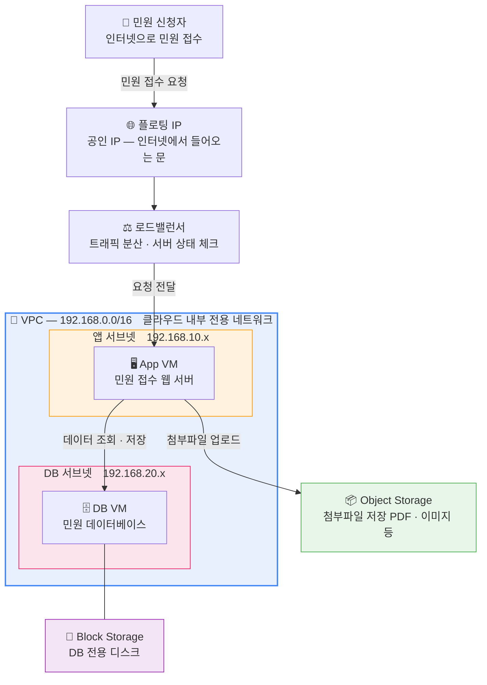

# Day 1 — 민원 서비스를 오픈하라

VM 기반으로 웹·애플리케이션 계층과 DB 계층을 분리한 2-Tier 구조를 만들고, 외부 사용자가 실제로 민원을 접수할 수 있는 서비스를 구축합니다.

## 차시별 목표

| 차시 | 주제 | 핵심 자원 |
|------|------|----------|
| 1차시 | 콘솔에 로그인하자 | IAM 계정, 조직, 프로젝트 |
| 2차시 | 어디에 올릴지 그려보자 | 리전, 서비스 활성화, 계정 역할 |
| 3차시 | 외부 사용자가 접속할 길을 만들어라 | VPC, 서브넷, 보안 그룹, LB |
| 4차시 | 민원 서비스를 실행할 서버와 DB를 준비하라 | App VM, DB VM, Block Storage |
| 5차시 | 준비된 민원 서비스를 자동으로 배포하라 | 사용자 스크립트, LB 멤버 등록 |
| 6차시 | 민원 데이터와 첨부파일을 안전하게 저장하라 | Object Storage |

## Day 1 최종 아키텍처

!!! warning "주의"
    1일차에 만든 DB VM, Block Storage, Object Storage는 2일차에도 사용합니다. 임의로 삭제하지 마세요.
