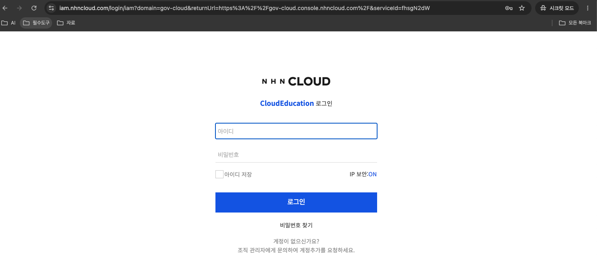
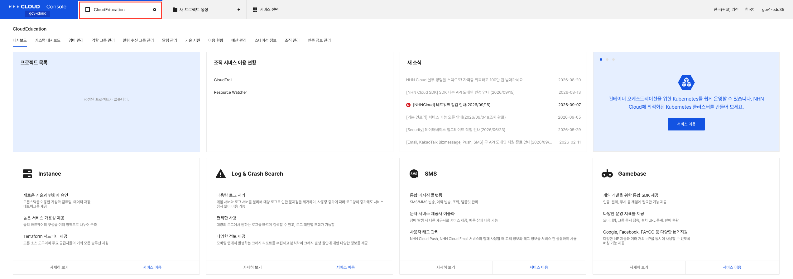
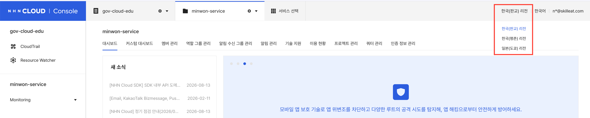
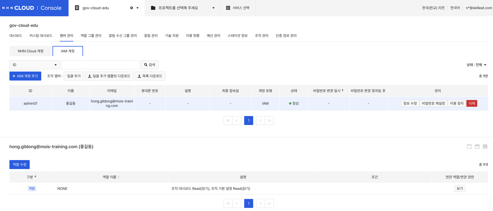

# Day 1 · 1차시 — 콘솔 로그인 & 환경 확인

**소요 시간**: 50분
**목표**: 클라우드 콘솔에 로그인하고, 조직·프로젝트·리전·계정 역할을 확인한다

---

## 학습 목표

이 차시를 마치면 다음을 할 수 있습니다.

- NHN Cloud 콘솔에 로그인하고 화면 구조를 설명할 수 있다
- 조직과 프로젝트의 차이를 구분하고 자신의 실습 환경을 확인할 수 있다
- 리전을 올바르게 선택하고, 잘못 선택했을 때 나타나는 증상을 설명할 수 있다
- NHN Cloud 계정과 IAM 계정의 차이를 설명할 수 있다

---

## 사전 준비

실습 시작 전 강사에게 다음을 받아야 합니다.

| 항목 | 예시 |
|------|------|
| IAM 계정 ID | `hong.gildong` |
| 임시 비밀번호 | 별도 전달 |
| 조직 전용 콘솔 URL | `{조직도메인}.gov-console.nhncloud.com` |
| 실습 프로젝트 이름 | `minwon-service` |

---

## STEP 01 — 콘솔 로그인

### NHN Cloud 계정 vs IAM 계정

| 구분 | NHN Cloud 계정 | IAM 계정 |
|------|---------------|---------|
| 생성 방법 | 이메일로 직접 가입 | 조직 관리자가 발급 |
| 주요 역할 | 조직 생성·결제 관리 | 프로젝트 내 작업 |
| 로그인 주소 | `console.nhncloud.com` | `{조직도메인}.gov-console.nhncloud.com` |

> 이 실습에서는 **IAM 계정**으로 로그인합니다.

### 로그인 방법

1. 강사에게 받은 **조직 전용 URL**로 접속합니다
2. IAM 계정 ID와 비밀번호를 입력합니다
3. 2단계 인증(이메일 또는 OTP)을 완료합니다



---

## STEP 02 — 조직과 프로젝트 확인

### 개념 이해

```
조직 (Organization)  ← 사람과 돈을 관리하는 최상위 단위
 └── 프로젝트        ← 실제 자원(VM·네트워크·스토리지)이 담기는 그릇
      └── 자원들
```

| 조직이 하는 일 | 프로젝트가 하는 일 |
|--------------|-----------------|
| IAM 계정 발급·삭제 | 자원 생성·삭제 |
| 결제 수단 관리 | 서비스 활성화 |
| 구성원 권한 부여 | 비용 확인 단위 |

### 실습

1. 화면 왼쪽 상단에서 **조직 이름**을 확인합니다
2. 조직 아래에서 **`minwon-service`** 프로젝트를 선택합니다



> 프로젝트가 보이지 않으면 강사에게 프로젝트 멤버 추가를 요청하세요.

### 내 환경 기록

| 항목 | 내가 확인한 값 |
|------|-------------|
| 조직 이름 | |
| 프로젝트 이름 | |

---

## STEP 03 — 리전 선택

### 리전이란?

클라우드 자원이 실제로 존재하는 지리적 위치입니다.
리전이 다르면 자원 목록도 완전히 분리됩니다.

| 리전 | 용도 |
|------|------|
| 한국(판교) | **이 실습에서 사용** |
| 한국(평촌) | 재해복구용 |
| 일본(도쿄) | 해외 서비스용 |

### 실습

1. 콘솔 오른쪽 위에서 현재 리전을 확인합니다
2. **한국(판교)** 로 선택되어 있는지 확인합니다



> **자원이 목록에 보이지 않을 때**: 삭제된 것이 아니라 다른 리전을 보고 있는 경우가 대부분입니다. 리전을 먼저 확인하세요.

---

## STEP 04 — 이번 실습에 필요한 서비스 활성화

NHN Cloud는 서비스를 **프로젝트 단위로 켜야** 사용할 수 있습니다.
활성화하지 않으면 메뉴 자체가 보이지 않습니다.

### 콘솔 경로

```
상단 메뉴 > 서비스 선택
```

### 1일차에 활성화할 서비스

| 서비스 | 분류 | 용도 |
|--------|------|------|
| Network > VPC | Network | 가상 네트워크 구성 |
| Network > Security Group | Network | 계층별 접근 규칙 |
| Network > Load Balancer | Network | 외부 진입점 |
| Network > Floating IP | Network | 공인 IP |
| Compute > Instance | Compute | App VM, DB VM |
| Storage > Block Storage | Storage | DB 데이터 디스크 |
| Storage > Object Storage | Storage | 첨부파일 저장 |

### 활성화 방법

1. 상단 **서비스 선택** 클릭
2. 분류별로 위 서비스를 찾아 **활성화** 클릭
3. 왼쪽 메뉴에 해당 서비스가 나타나면 완료

!!! info "한 번 활성화하면 프로젝트 내에서 계속 사용 가능"
    이미 활성화된 서비스는 다시 켤 필요 없습니다.
    팀원 중 한 명이 활성화하면 같은 프로젝트의 모든 멤버가 사용할 수 있습니다.

---

## STEP 05 — 내 계정 역할 확인


### 권한 계층 구조

```
조직 역할 (OWNER / ADMIN / MEMBER)
      ↓
프로젝트 역할 (ADMIN / MEMBER / BILLING VIEWER)
      ↓
실제 작업 권한 (생성 · 읽기 · 갱신 · 삭제)
```

| 프로젝트 역할 | 할 수 있는 것 |
|-------------|-------------|
| ADMIN | 자원 생성·수정·삭제, 구성원 역할 지정 |
| MEMBER | 허용된 범위에서 자원 사용 |
| BILLING VIEWER | 요금 확인만 가능 |

### IAM 계정 생성 구조 (강사 참고)

IAM 계정은 **조직 → 멤버 관리 → IAM 계정** 탭에서 생성합니다.



> 새로 만든 IAM 계정은 역할이 NONE 상태입니다. 프로젝트 역할을 따로 부여해야 자원을 다룰 수 있습니다.

### 실습

1. 오른쪽 위 계정 아이콘 → **계정 정보** 에서 내 역할을 확인합니다
2. `minwon-service` 프로젝트에서 **MEMBER** 이상인지 확인합니다

| 항목 | 내가 확인한 값 |
|------|-------------|
| 내 계정 종류 (NHN Cloud / IAM) | |
| 프로젝트 역할 | |

---

## 1차시 체크포인트

다음 5가지가 모두 확인되면 2차시를 시작할 수 있습니다.

| # | 확인 항목 | 완료 |
|---|----------|------|
| ① | 콘솔 로그인 (2단계 인증 완료) | ☐ |
| ② | 조직·프로젝트 이름 확인 | ☐ |
| ③ | 리전 — 한국(판교) 선택 | ☐ |
| ④ | 1일차 필요 서비스 7개 활성화 | ☐ |
| ⑤ | 내 계정 역할 확인 | ☐ |

---

## 자가 점검 질문

1. 내 실습 계정은 NHN Cloud 계정인가, IAM 계정인가?
2. 내가 속한 조직 이름과 프로젝트 이름은?
3. 현재 선택된 리전은?
4. 오늘 만들 자원은 어느 프로젝트에 담기는가?
5. 민원 신청자의 요청은 어떤 순서로 흘러가는가?

---

## 다음 차시 예고

**2차시**: 외부 사용자가 접속할 길을 만들어라
VPC, 서브넷, 보안 그룹, Load Balancer를 직접 구성합니다.
