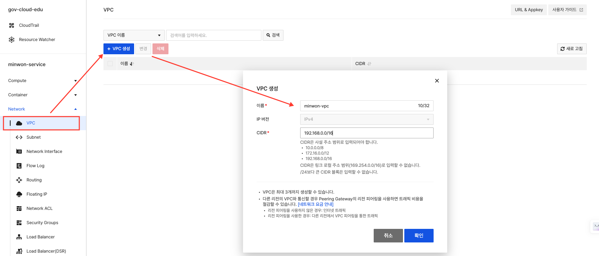
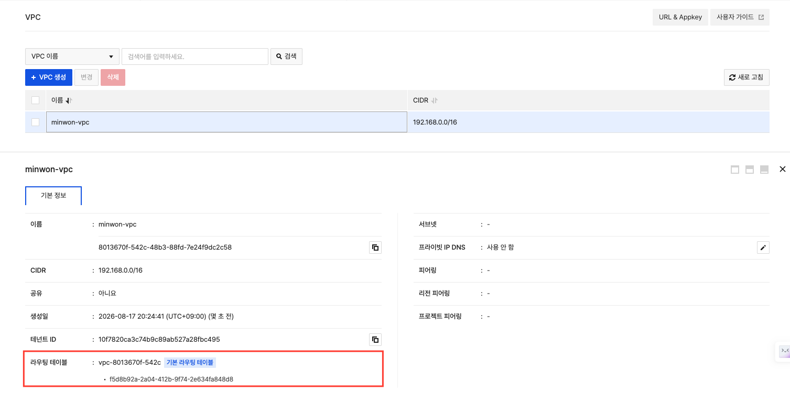

# Day 1 · 2차시 — 외부 사용자가 접속할 길을 만들어라

**소요 시간**: 50분 (11:00~11:50)
**목표**: VPC·서브넷·보안 그룹·Load Balancer를 구성해 서비스 진입점을 만든다

---

## 이번 차시에 만드는 것

| STEP | 자원 | 역할 |
|------|------|------|
| 01 | VPC | 우리만의 가상 네트워크 공간 |
| 02 | 서브넷 2개 | App / DB 계층 구획 분리 |
| 03 | 보안 그룹 2개 | 계층별 접근 규칙 |
| 04 | Load Balancer | 외부 요청 단일 진입점 |
| 05 | 플로팅 IP | LB에 연결할 공인 주소 |

!!! info "핵심 원칙"
    서버를 만들기 전에 길과 문을 먼저 만든다.

---

## 개념 — 왜 이 순서인가

```
① 네트워크 (VPC · 서브넷 · 라우팅)   ← 주소와 길
② 서버 (인스턴스 · 디스크)            ← 길 위에 올라가는 건물
③ 서비스 (앱 · DB)                    ← 건물 안에서 하는 일
```

인스턴스를 생성하려면 VPC와 서브넷을 **먼저** 지정해야 합니다. 네트워크 없이 서버를 만들 수 없습니다.

---

## 개념 — 2-Tier 분리 구조

```
인터넷 사용자
      ↓
Load Balancer · 플로팅 IP
      ↓
App Tier (192.168.0.0/24)  ← 80 포트만 허용
      ↓
DB Tier  (192.168.1.0/24)  ← App에서만 3306 허용
```

DB는 인터넷에서 직접 보이지 않습니다.
각 계층이 "누구에게서 들어오는 요청만 허용할지"를 보안 그룹으로 제어하는 것이 2-Tier 분리의 실체입니다.

---

## STEP 01 — VPC 생성

### 설정값

| 항목 | 값 |
|------|---|
| 이름 | `minwon-vpc` |
| IP 주소 범위 (CIDR) | `192.168.0.0/16` |

### 콘솔 경로

```
Network > VPC > VPC 생성
```

### CIDR 규칙

| 항목 | 내용 |
|------|------|
| 사용 가능 대역 | 10.0.0.0/8, 172.16.0.0/12, **192.168.0.0/16** |
| 최소 크기 | /24 이상 |
| 사용 불가 | 169.254.0.0/16, 공인 IP 대역 |

!!! warning "주의"
    VPC를 잘못 만들면 이후 서브넷·인스턴스가 모두 여기에 귀속됩니다.
    CIDR을 반드시 `192.168.0.0/16`으로 입력하세요.



---

## STEP 01-1 — 기본 라우팅 테이블 확인

VPC를 생성하면 **기본 라우팅 테이블이 자동으로 함께 생성**됩니다.
별도로 만들 필요 없이 자동 생성된 것을 확인만 하면 됩니다.

### 콘솔 경로

```
Network > VPC > [minwon-vpc] 클릭 > 라우팅 테이블 탭
```

### 확인 항목

| 항목 | 확인 내용 |
|------|---------|
| 라우팅 테이블 이름 | `vpc-[이름]-routingtable` 형태로 자동 생성 |
| 기본 경로 | `192.168.0.0/16 → local` (VPC 내부 통신) |
| 인터넷 게이트웨이 | 기본 VPC는 인터넷 게이트웨이가 연결된 상태 |



!!! info "라우팅 테이블이 하는 일"
    패킷의 목적지 IP를 보고 어디로 보낼지 결정합니다.
    `192.168.0.0/16 → local` 경로가 있어야 VPC 안의 서버끼리 통신할 수 있습니다.
    인터넷으로 나가는 `0.0.0.0/0` 경로는 인터넷 게이트웨이로 연결됩니다.

---

## STEP 02 — 서브넷 생성 (2개)

### 설정값

| 서브넷 | 이름 | CIDR | 배치 자원 |
|--------|------|------|----------|
| App 서브넷 | `minwon-subnet-app` | `192.168.0.0/24` | Load Balancer, App VM |
| DB 서브넷 | `minwon-subnet-db` | `192.168.1.0/24` | DB VM |

### 콘솔 경로

```
Network > VPC > 서브넷 관리 > 서브넷 생성
```

### 참고: 서브넷에서 예약되는 IP

| 주소 | 용도 |
|------|------|
| 192.168.0.0 | 네트워크 주소 |
| 192.168.0.1 | 게이트웨이 |
| 192.168.0.2~3 | DHCP 서버 |
| 192.168.0.255 | 브로드캐스트 |
| **192.168.0.4~254** | **실제 사용 가능** |

---

## STEP 03 — 보안 그룹 생성 (2개)

### 콘솔 경로

```
Network > Security Group > 보안 그룹 생성
```

### App 보안 그룹

**이름**: `minwon-sg-app`

| 방향 | 프로토콜 | 포트 | 원격(소스) | 설명 |
|------|---------|------|----------|------|
| 수신 | TCP | 8080 | `192.168.0.0/24` (App 서브넷) | LB → App 트래픽 |
| 수신 | TCP | 22 | 내 IP 또는 관리 대역 | SSH 접속 (점검 후 제거) |

### DB 보안 그룹

**이름**: `minwon-sg-db`

| 방향 | 프로토콜 | 포트 | 원격(소스) | 설명 |
|------|---------|------|----------|------|
| 수신 | TCP | 3306 | **minwon-sg-app** (보안 그룹 지정) | App → DB 트래픽 |

!!! warning "핵심 — CIDR이 아닌 보안 그룹으로 지정"
    DB 보안 그룹의 원격을 **CIDR(IP 대역)이 아닌 App 보안 그룹**으로 지정해야 합니다.
    App VM이 늘어나도 DB 규칙을 고칠 필요가 없고, IP 변경에도 자동 대응됩니다.

### 보안 그룹 동작 원리

- **허용 목록(Whitelist) 방식**: 규칙에 없는 트래픽은 모두 차단
- **Stateful**: 허용된 요청의 응답은 반대 방향 규칙 없이 자동 통과
- **자주 하는 실수**: DB 그룹에 `0.0.0.0/0` 허용 → 인터넷 전체에 DB 포트 노출

---

## STEP 04 — Load Balancer 생성

### 콘솔 경로

```
Network > Load Balancer > 로드 밸런서 생성
```

### 기본 설정

| 항목 | 값 |
|------|---|
| 이름 | `minwon-lb` |
| 타입 | 일반 |
| VPC | `minwon-vpc` |
| 서브넷 | `minwon-subnet-app` |

### 리스너 설정

| 항목 | 값 |
|------|---|
| 프로토콜 | HTTP |
| 포트 | 80 |
| 로드 밸런싱 방식 | Round Robin |

!!! warning "리스너는 생성 후 변경 불가"
    프로토콜과 포트는 생성 시점에 확정됩니다. 잘못 만들면 LB 전체를 다시 만들어야 합니다.

### 로드 밸런싱 방식 비교

| 방식 | 설명 | 선택 기준 |
|------|------|----------|
| Round Robin | 순서대로 분산 | 서버 성능이 비슷할 때 (기본값) |
| Least Connections | 연결 수가 가장 적은 서버로 | 처리 시간이 들쭉날쭉할 때 |
| Source IP | 같은 사용자는 같은 서버로 | 세션을 서버 메모리에 저장할 때 |

### 헬스체크 설정

| 항목 | 값 |
|------|---|
| 프로토콜 | HTTP |
| 포트 | 8080 |
| URL | `/health` |
| 주기 | 30초 |
| 응답 대기 | 5초 |
| 정상 응답 코드 | 200 |

```
헬스체크 흐름 (30초 주기, 재시도 3회)
  0초  → 1회 실패
  30초 → 2회 실패
  60초 → 3회 실패 → 트래픽 대상에서 제외
  복구 → 자동 재투입
```

---

## STEP 05 — 플로팅 IP 생성 및 연결

### 콘솔 경로

```
Network > Floating IP > 플로팅 IP 생성
→ 생성 후 [연결 관리] → Load Balancer 선택
```

### IP 할당 원칙

| 자원 | 사설 IP | 플로팅 IP | 이유 |
|------|--------|----------|------|
| Load Balancer | ✅ | ✅ | 외부 사용자 접속 지점 |
| App VM | ✅ | ❌ (원칙) | LB 경유로만 요청 수신 |
| DB VM | ✅ | ❌ | 외부 노출 불필요 |

---

## 2차시 체크포인트

| # | 확인 항목 | 확인 방법 |
|---|----------|---------|
| ① | VPC CIDR이 `192.168.0.0/16`인가 | Network > VPC 목록 |
| ② | App/DB 서브넷이 각각 생성되었는가 | 서브넷 관리 탭 |
| ③ | DB 보안 그룹의 원격이 CIDR이 아닌 보안 그룹인가 | 보안 그룹 규칙 상세 확인 |
| ④ | LB 리스너가 HTTP:80인가 | LB 상세 > 리스너 탭 |
| ⑤ | LB에 플로팅 IP가 연결되었는가 | LB 상세 > 기본 정보 |

!!! info "헬스체크 실패는 정상"
    아직 서버가 없으므로 헬스체크는 실패 상태가 맞습니다.
    3·4차시에 App VM을 등록하면 통과됩니다.

---

**다음 차시**: App VM과 DB VM을 생성하고 Block Storage를 연결합니다.
