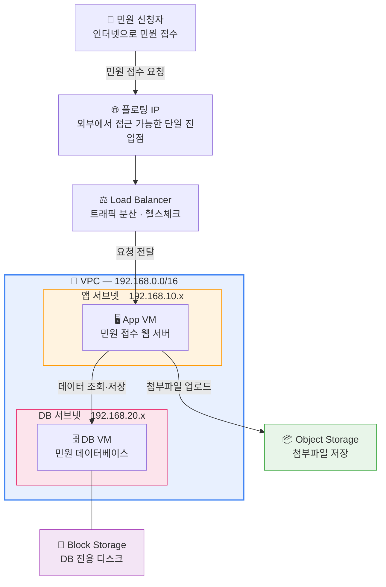
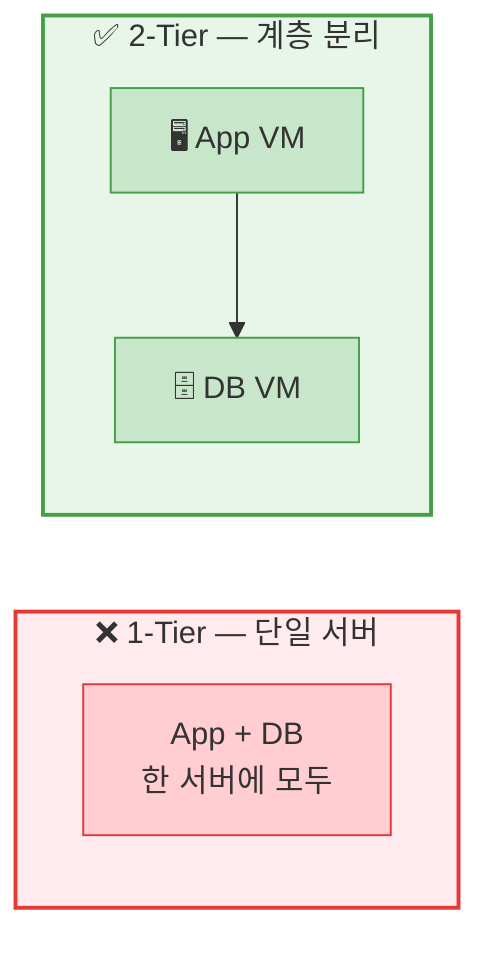
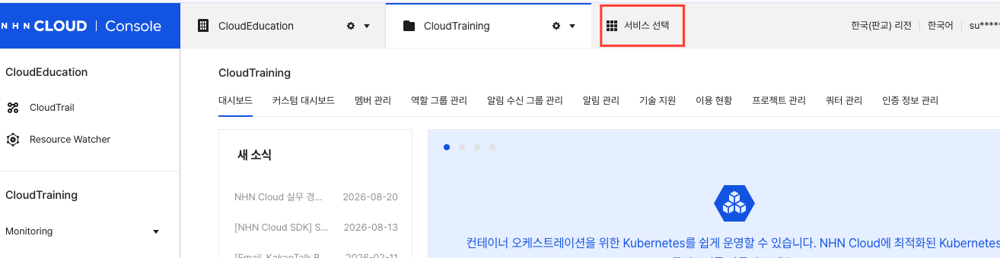
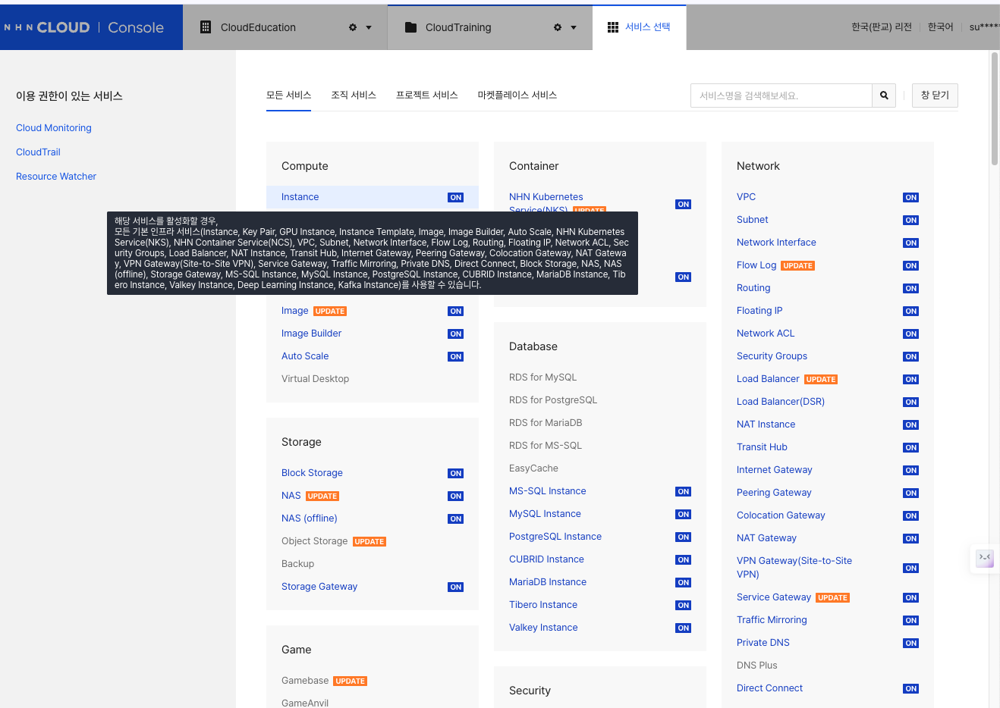
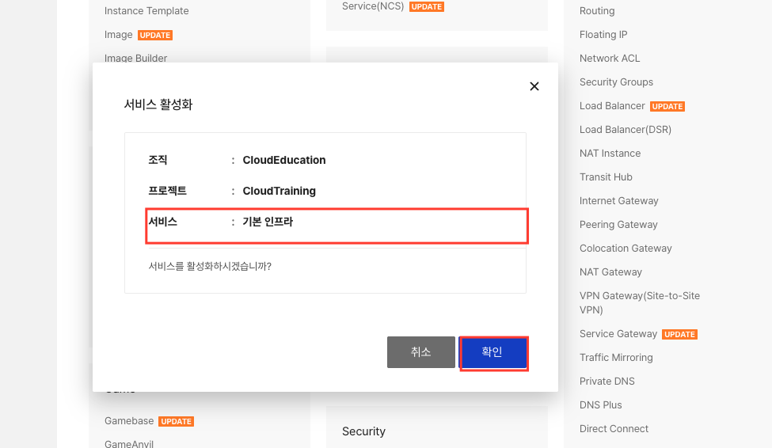
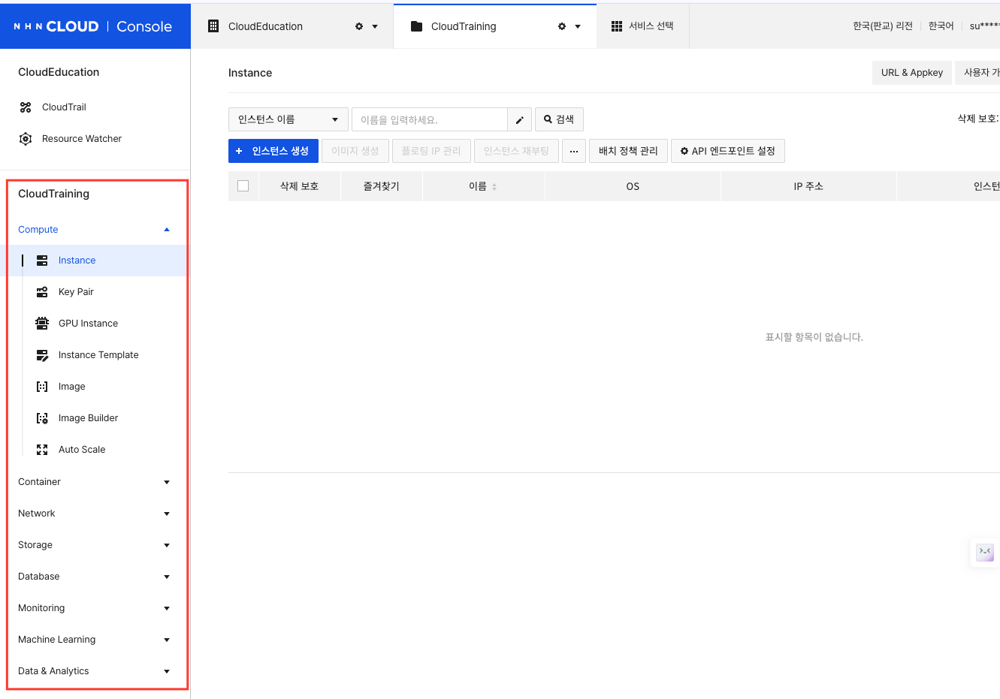
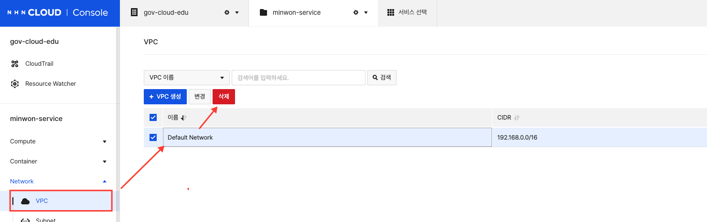
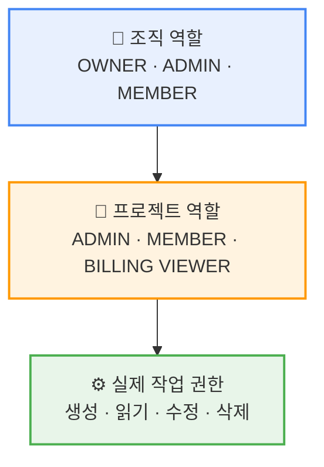

# Day 1 · 2차시 — 어디에 올릴지 그려보자

**시간**: 10:45 ~ 11:30 (45분)  
**목표**: 오늘 구축할 민원 서비스 아키텍처를 이해하고, 리전·서비스·계정 역할을 설정해 실습 환경을 완성한다

!!! warning "캡처 화면 안내"
    이 가이드의 캡처 화면은 **참고용**입니다.
    실제 화면의 문구·버튼 위치 등은 다를 수 있습니다.
    **네이밍(이름 입력)은 반드시 각 단계의 표를 기준으로 입력하세요.**

---

## 학습 목표

이 차시를 마치면 다음을 할 수 있습니다.

- 오늘 구축할 민원 서비스의 전체 아키텍처를 그림으로 설명할 수 있다
- 리전을 올바르게 선택하고, 잘못 선택했을 때 나타나는 증상을 설명할 수 있다
- 프로젝트에서 필요한 서비스를 활성화할 수 있다
- 조직 역할과 프로젝트 역할의 차이를 설명할 수 있다

---

## 이론 — 오늘 만들 서비스를 그려보자

### 민원 서비스 아키텍처 개요

오늘 하루 동안 아래 구조를 직접 만들어봅니다.



### 각 구성요소의 역할

| 구성요소 | 역할 | 이 실습에서 |
|---------|------|-----------|
| VPC | 격리된 가상 네트워크 | 192.168.0.0/16 대역 사용 |
| 보안 그룹 | 계층별 접근 규칙 | App 계층 / DB 계층 분리 |
| Load Balancer | 단일 진입점, 헬스체크 | 포트 80 수신 → App VM 8080 전달 |
| 플로팅 IP | 공인 IP | LB에 연결, 외부 접속용 |
| App VM | 민원 앱 실행 서버 | 192.168.10.x 서브넷 |
| DB VM | MySQL 데이터베이스 | 192.168.20.x 서브넷 |
| Block Storage | DB 데이터 영구 저장 | DB VM에 연결 |
| Object Storage | 민원 첨부파일 저장 | 앱에서 API로 직접 연결 |

### 왜 2-Tier 구조인가?



| | 1-Tier | 2-Tier |
|--|--------|--------|
| 장애 | 앱이 다운되면 DB도 중단 | 계층별 독립 운영·확장 |
| 보안 | 보안 경계 없음 | DB는 외부 직접 접근 차단 |

공공 서비스는 **보안**과 **가용성**이 중요합니다.  
App 계층과 DB 계층을 분리하면 각각 독립적으로 관리할 수 있고, DB에 대한 직접 접근을 네트워크 수준에서 차단할 수 있습니다.

---

## STEP 04 — 리전 확인

> **이 단계에서 할 일**: 자원이 생성될 지리적 위치(리전)를 확인하고 올바르게 설정합니다.

### 리전이란?

클라우드 자원이 실제로 존재하는 지리적 위치입니다.
리전이 다르면 자원 목록도 완전히 분리됩니다.

| 리전 | 용도 |
|------|------|
| 한국(판교) | **이 실습에서 사용** |
| 한국(평촌) | 재해복구용 |
| 일본(도쿄) | 해외 서비스용 |

### 실습

1. 콘솔 오른쪽 위에서 현재 리전을 확인합니다
2. **한국(판교)** 로 선택되어 있는지 확인합니다


> **자원이 목록에 보이지 않을 때**: 삭제된 것이 아니라 다른 리전을 보고 있는 경우가 대부분입니다. 리전을 먼저 확인하세요.

---

## STEP 05 — 이번 실습에 필요한 서비스 활성화

> **이 단계에서 할 일**: 오늘 만들 아키텍처에 필요한 서비스를 프로젝트에서 활성화합니다.

NHN Cloud는 서비스를 **프로젝트 단위로 켜야** 사용할 수 있습니다.
활성화하지 않으면 메뉴 자체가 보이지 않습니다.

### 콘솔 경로

```
상단 메뉴 > 서비스 선택
```

### 1일차에 활성화할 서비스

| 서비스 | 분류 | 용도 |
|--------|------|------|
| Network > VPC | Network | 가상 네트워크 구성 |
| Network > Security Group | Network | 계층별 접근 규칙 |
| Network > Load Balancer | Network | 외부 진입점 |
| Network > Floating IP | Network | 공인 IP |
| Compute > Instance | Compute | App VM, DB VM |
| Storage > Block Storage | Storage | DB 데이터 디스크 |
| Storage > Object Storage | Storage | 첨부파일 저장 |

### 활성화 방법

1. 상단 **서비스 선택** 클릭



2. **Compute > Instance**에 마우스를 올리면 해당 영역 전체가 한 번에 표시됩니다



3. **활성화** 버튼을 클릭하면 확인 팝업이 뜹니다 → **확인** 클릭



4. 활성화가 완료되면 **왼쪽 메뉴에 해당 서비스가 생깁니다**



5. 위 서비스 목록의 나머지 항목도 같은 방법으로 활성화합니다

!!! danger "✋ 스스로 해보세요"
    **Storage > Object Storage** 도 같은 방법으로 직접 활성화해보세요.
    활성화 후 왼쪽 메뉴에 **Storage** 항목이 나타나면 성공입니다.

!!! info "한 번 활성화하면 프로젝트 내에서 계속 사용 가능"
    이미 활성화된 서비스는 다시 켤 필요 없습니다.
    팀원 중 한 명이 활성화하면 같은 프로젝트의 모든 멤버가 사용할 수 있습니다.

---

## STEP 05-1 — Default Network(VPC) 삭제

> **이 단계에서 할 일**: 서비스 활성화 시 자동 생성되는 Default Network를 삭제합니다. 이 실습에서는 VPC를 직접 설계합니다.

### 콘솔 경로

```
왼쪽 메뉴 > Network > VPC
```

### 삭제 방법

1. 왼쪽 메뉴에서 **Network > VPC** 클릭
2. 목록에서 **Default Network** 확인
3. **삭제** 버튼 클릭 → 확인



!!! warning "삭제 전 확인"
    Default Network 안에 서브넷이나 인스턴스가 있으면 삭제되지 않습니다.
    새 프로젝트라면 바로 삭제할 수 있습니다.

!!! danger "실수로 내가 만든 VPC를 지우지 마세요"
    3차시에서 만들 `minwon-vpc`는 삭제하면 안 됩니다.
    삭제 대상은 **Default Network** 하나입니다.

---

## STEP 06 — 내 계정 역할 확인

> **이 단계에서 할 일**: 내 계정의 권한 수준을 확인하고 권한 계층 구조를 이해합니다.

### 권한 계층 구조



| 프로젝트 역할 | 할 수 있는 것 |
|-------------|-------------|
| ADMIN | 자원 생성·수정·삭제, 구성원 역할 지정 |
| MEMBER | 허용된 범위에서 자원 사용 |
| BILLING VIEWER | 요금 확인만 가능 |

### IAM 계정 생성 구조

IAM 계정은 **조직 → 멤버 관리 → IAM 계정** 탭에서 생성합니다.


> 새로 만든 IAM 계정은 역할이 NONE 상태입니다. 프로젝트 역할을 따로 부여해야 자원을 다룰 수 있습니다.

### 실습

1. 오른쪽 위 계정 아이콘 → **계정 정보** 에서 내 역할을 확인합니다
2. `minwon-service-edu{내 번호}` 프로젝트에서 **MEMBER** 이상인지 확인합니다

| 항목 | 내가 확인한 값 |
|------|-------------|
| 내 계정 종류 (NHN Cloud / IAM) | |
| 프로젝트 역할 | |

---

## 2차시 체크포인트

다음이 모두 확인되면 3차시를 시작할 수 있습니다.

| # | 확인 항목 | 완료 |
|---|----------|------|
| ① | 리전 — 한국(판교) 선택 | ☐ |
| ② | 1일차 필요 서비스 7개 활성화 | ☐ |
| ③ | Default Network(VPC) 삭제 완료 | ☐ |
| ④ | 내 계정 역할 확인 | ☐ |

---

## 자가 점검 질문

1. 리전을 잘못 선택하면 어떤 증상이 나타나는가?
2. 오늘 만들 서비스에서 App VM과 DB VM을 분리하는 이유는?
3. 민원 신청자의 요청은 어떤 순서로 흘러가는가?
4. Object Storage와 Block Storage의 차이는?

---

## 다음 차시 예고

**3차시**: 외부 사용자가 접속할 길을 만들어라  
VPC, 서브넷, 보안 그룹, Load Balancer를 직접 구성합니다.
