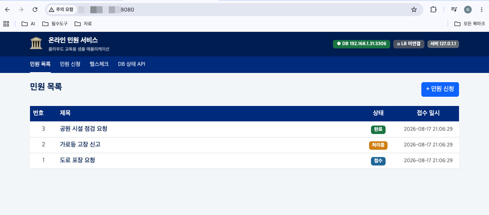

# Day 1 · 3차시 — 민원 서비스를 실행할 서버와 DB를 준비하라

**소요 시간**: 50분 (13:00~13:50)
**목표**: DB VM과 App VM을 생성하고, 사용자 스크립트로 MySQL과 앱을 자동 설치한다

---

## 이번 차시에 만드는 것

| STEP | 자원 | 역할 |
|------|------|------|
| 01 | DB VM | 민원 데이터 저장 서버 (MySQL 자동 설치) |
| 02 | Block Storage | DB 데이터 전용 디스크 |
| 03 | Block Storage 연결 및 마운트 | 데이터 디스크 준비 |
| 04 | DB VM 사설 IP 확인 | App VM 연결 정보 수집 |
| 05 | App VM | 민원 서비스 실행 서버 (앱 자동 배포) |
| 06 | 배포 확인 | 앱 정상 실행 확인 |

!!! tip "순서가 중요합니다"
    App VM의 사용자 스크립트에 **DB VM의 사설 IP**가 필요합니다.
    DB VM을 먼저 만들고 IP를 확인한 뒤 App VM을 생성합니다.

---

## 개념 — App VM vs DB VM 역할 분담

| 구분 | App VM | DB VM |
|------|--------|-------|
| 하는 일 | 민원 화면 출력, 접수 처리, 파일 업로드 | 민원 데이터 저장, 쿼리 처리 |
| 외부 노출 | LB 경유 (플로팅 IP 없음) | 없음 (사설 IP만) |
| 확장 | 여러 대로 늘릴 수 있음 | 교체해도 데이터 유지 |

!!! tip "핵심"
    App Tier는 갈아 끼울 수 있는 계층, DB Tier는 지켜야 하는 계층입니다.

---

## 개념 — 사용자 스크립트(User Data)란?

```
인스턴스 생성
      ↓
첫 부팅 시 cloud-init이 실행
      ↓
사용자 스크립트 자동 실행 (root 권한)
      ↓
패키지 설치 · DB 생성 · 앱 배포 완료
```

VM을 생성할 때 **추가 설정 > 사용자 스크립트** 란에 셸 스크립트를 붙여넣으면, 인스턴스가 처음 부팅될 때 자동으로 실행됩니다. SSH 접속 없이도 서버 환경을 완성할 수 있습니다.

---

## STEP 01 — DB VM 생성

### 콘솔 경로

```
Compute > Instance > 인스턴스 생성
```

### 설정값

| 항목 | 값 |
|------|---|
| 이름 | `minwon-db-01` |
| 이미지 | Ubuntu Server 22.04 LTS |
| 인스턴스 타입 | `t2.c1m1` (1 vCPU, 1GB RAM) |
| 가용성 영역 | 한국(판교) — **Block Storage와 같은 AZ** |
| 루트 디스크 | HDD 20GB |
| VPC | `minwon-vpc` |
| 서브넷 | `minwon-subnet-db` |
| 보안 그룹 | `minwon-sg-db` |
| 키페어 | 새로 생성 또는 기존 키페어 선택 |
| 플로팅 IP | 연결 안 함 |

이미지는 **OS > Ubuntu** 를 선택한 뒤 목록에서 **Ubuntu Server 22.04 LTS** 를 선택합니다.


!!! warning "키페어 주의"
    개인 키(.pem) 파일은 생성 시점에 **딱 한 번만** 다운로드됩니다.
    잃어버리면 SSH 접속이 불가능합니다. 반드시 보관하세요.

### 사용자 스크립트 입력

**추가 설정 > 사용자 스크립트** 란에 아래 내용을 **그대로** 붙여넣습니다.

```bash
#!/bin/bash
set -e

DB_NAME="complaints_db"
DB_USER="complaint_user"
DB_PASS="Minjeon2024!"
MYSQL_ROOT_PASS="Root2024!"

echo "===== [1/4] MySQL 8.0 설치 ====="
apt-get update -y
apt-get install -y mysql-server

echo "===== [2/4] MySQL 시작 및 자동 실행 설정 ====="
systemctl start mysql
systemctl enable mysql

echo "===== [3/4] DB / 계정 / 테이블 생성 ====="
mysql -u root <<EOF
CREATE DATABASE IF NOT EXISTS ${DB_NAME}
  CHARACTER SET utf8mb4 COLLATE utf8mb4_unicode_ci;

CREATE USER IF NOT EXISTS '${DB_USER}'@'%' IDENTIFIED BY '${DB_PASS}';
GRANT ALL PRIVILEGES ON ${DB_NAME}.* TO '${DB_USER}'@'%';
FLUSH PRIVILEGES;

USE ${DB_NAME};
CREATE TABLE IF NOT EXISTS complaints (
    id          INT AUTO_INCREMENT PRIMARY KEY,
    title       VARCHAR(200)  NOT NULL,
    content     TEXT          NOT NULL,
    status      VARCHAR(20)   NOT NULL DEFAULT '접수',
    file_path   VARCHAR(500),
    created_at  DATETIME      NOT NULL DEFAULT CURRENT_TIMESTAMP
) CHARACTER SET utf8mb4;

INSERT INTO complaints (title, content, status) VALUES
  ('도로 포장 요청', '우리 동네 골목길이 많이 파손되어 보행에 불편함이 있습니다.', '접수'),
  ('가로등 고장 신고', '○○아파트 앞 가로등이 3일째 꺼져 있습니다.', '처리중'),
  ('공원 시설 점검 요청', '어린이 공원의 시소가 파손되어 안전 위험이 있습니다.', '완료');
EOF

echo "===== [4/4] 외부 접속 허용 설정 ====="
sed -i 's/^bind-address\s*=.*/bind-address = 0.0.0.0/' /etc/mysql/mysql.conf.d/mysqld.cnf
systemctl restart mysql

echo "✅ DB 초기화 완료"
```

!!! info "스크립트 실행 확인 방법"
    VM 생성 후 SSH로 접속해서 `/var/log/cloud-init-output.log` 를 보면
    스크립트 실행 결과를 확인할 수 있습니다.
    ```bash
    sudo tail -50 /var/log/cloud-init-output.log
    ```

---

## STEP 02 — Block Storage 생성

### 콘솔 경로

```
Storage > Block Storage > 블록 스토리지 생성
```

### 설정값

| 항목 | 값 |
|------|---|
| 이름 | `minwon-db-disk` |
| 가용성 영역 | DB VM과 **동일한 AZ** |
| 타입 | HDD |
| 크기 | 20GB |

### 왜 DB 데이터를 별도 Block Storage에 두는가

| 이유 | 설명 |
|------|------|
| 데이터 보호 | DB VM을 삭제·교체해도 Block Storage는 남음 |
| 수명 주기 분리 | OS 디스크와 데이터 디스크를 따로 관리 |
| 용량 확장 | 데이터 디스크만 별도로 늘릴 수 있음 |

---

## STEP 03 — Block Storage 연결 및 마운트

### 3-1. 콘솔에서 연결

```
Storage > Block Storage > [minwon-db-disk] > 연결 추가
→ 인스턴스: minwon-db-01 선택 → 확인
```

### 3-2. DB VM에 플로팅 IP 연결

Block Storage 마운트를 위해 DB VM에 SSH로 접속해야 합니다.
DB VM에는 플로팅 IP가 없으므로 임시로 연결합니다.

```
Network > Floating IP > 플로팅 IP 연결
→ 인스턴스: minwon-db-01 선택 → 연결
```

### 3-3. SSH 접속

```bash
# 키페어 파일 권한 설정 (최초 1회)
chmod 400 MyKey.pem

# SSH 접속
ssh -i MyKey.pem ubuntu@<DB-VM-플로팅-IP>
```

접속 후 관리자(root) 권한으로 전환합니다.

```bash
# 방법 1: sudo su (이후 명령에 sudo 불필요)
sudo su -

# 방법 2: 명령마다 sudo 붙이기 (권장 — 어떤 명령이 root 권한인지 명확)
sudo <명령어>
```

!!! tip "이 실습에서는 방법 2(sudo)를 사용합니다"
    `sudo su -` 로 root로 전환하면 편하지만,
    실수로 시스템 파일을 삭제하는 사고가 생길 수 있습니다.
    명령마다 `sudo`를 붙이는 습관이 안전합니다.

### 3-4. 디스크 인식 확인

```bash
lsblk
# NAME   SIZE
# vda    20G   ← 루트 디스크
# vdb    20G   ← 방금 연결한 Block Storage
```

### 3-5. 파티션 및 파일시스템 생성

**파티션**이란 디스크를 논리적으로 나누는 구역입니다. 새 디스크는 빈 공간만 있으므로 OS가 사용할 수 있도록 구역을 먼저 만들어야 합니다.
**파일시스템**은 파티션 위에 파일을 저장하는 규칙(형식)입니다. 포맷하지 않으면 데이터를 읽고 쓸 수 없습니다.

```bash
# 파티션 생성 (디스크 전체를 하나의 파티션으로)
echo -e "n\np\n1\n\n\nw" | sudo fdisk /dev/vdb

# 파일시스템 생성 (xfs 형식으로 포맷)
sudo mkfs -t xfs /dev/vdb1
```

### 3-6. 마운트 및 자동 마운트 등록

```bash
sudo mkdir -p /mnt/data
sudo mount /dev/vdb1 /mnt/data

# 재부팅 후 자동 마운트
echo "/dev/vdb1 /mnt/data xfs defaults 0 0" | sudo tee -a /etc/fstab

# 확인
df -h | grep mnt
```

아래와 같이 출력되면 성공입니다.

```
Filesystem       Size  Used Avail Use% Mounted on
/dev/vdb1         10G  104M  9.9G   2% /mnt/data
```

---

## STEP 04 — DB VM 사설 IP 확인

App VM의 사용자 스크립트에 DB VM의 사설 IP가 필요합니다.

```
Compute > Instance > minwon-db-01 클릭
→ 상세 정보 > IP 주소 확인
```

| 항목 | 내가 확인한 값 |
|------|-------------|
| DB VM 사설 IP | 192.168.1. ___ |

!!! warning "이 IP는 다음 단계(App VM 생성)에서 바로 사용합니다"
    메모해 두세요.

---

## STEP 05 — App VM 생성

### 콘솔 경로

```
Compute > Instance > 인스턴스 생성
```

### 설정값

| 항목 | 값 |
|------|---|
| 이름 | `minwon-app-01` |
| 이미지 | Ubuntu Server 22.04 LTS |
| 인스턴스 타입 | `t2.c1m1` (1 vCPU, 1GB RAM) |
| 가용성 영역 | 한국(판교) 선택 |
| 루트 디스크 | HDD 20GB |
| VPC | `minwon-vpc` |
| 서브넷 | `minwon-subnet-app` |
| 보안 그룹 | `minwon-sg-app` |
| 키페어 | DB VM과 동일한 키페어 사용 권장 |
| 플로팅 IP | 연결 안 함 (LB 경유) |

### 인스턴스 타입 참고

| 타입 | 특성 | 용도 |
|------|------|------|
| t2 | 저비용, 낮은 워크로드 | **실습용** (이 과정에서 사용) |
| m2 | CPU·메모리 균형 | 일반 웹 서버 |
| c2 | 고성능 연산 | 배치 처리 |
| r2 | 메모리 집약 | 캐시, 대용량 처리 |

### 사용자 스크립트 입력

**추가 설정 > 사용자 스크립트** 란에 아래 내용을 붙여넣습니다.

!!! danger "DB_HOST를 반드시 수정하세요"
    아래 스크립트에서 `DB_HOST="192.168.1.10"` 부분을
    **STEP 04에서 확인한 DB VM 사설 IP**로 바꾼 뒤 붙여넣으세요.

```bash
#!/bin/bash
set -e

# ── ① 수정이 필요한 값 ─────────────────────────────
DB_HOST="192.168.1.10"        # ← STEP 04에서 확인한 DB VM 사설 IP로 변경
DB_PORT="3306"
DB_USER="complaint_user"
DB_PASSWORD="Minjeon2024!"
DB_NAME="complaints_db"
APP_PORT="8080"
GITHUB_REPO="https://github.com/skilleat-labs/cloud-native-minwon-lab.git"
APP_DIR="/opt/complaint-app"
# ──────────────────────────────────────────────────

echo "===== [1/5] 패키지 설치 ====="
apt-get update -y
apt-get install -y python3 python3-pip git

echo "===== [2/5] 소스 clone ====="
git clone "$GITHUB_REPO" /tmp/minwon-repo
mkdir -p "$APP_DIR"
cp -r /tmp/minwon-repo/app/. "$APP_DIR/"

echo "===== [3/5] 의존성 설치 ====="
pip3 install -r "$APP_DIR/requirements.txt" --break-system-packages 2>/dev/null || \
  pip3 install -r "$APP_DIR/requirements.txt"

echo "===== [4/5] 환경변수 파일 생성 ====="
cat > "$APP_DIR/.env" <<EOF
DB_HOST=${DB_HOST}
DB_PORT=${DB_PORT}
DB_USER=${DB_USER}
DB_PASSWORD=${DB_PASSWORD}
DB_NAME=${DB_NAME}
PORT=${APP_PORT}
EOF

echo "===== [5/5] systemd 서비스 등록 ====="
cat > /etc/systemd/system/complaint-app.service <<EOF
[Unit]
Description=온라인 민원 서비스
After=network.target

[Service]
WorkingDirectory=${APP_DIR}
EnvironmentFile=${APP_DIR}/.env
ExecStart=/usr/bin/python3 ${APP_DIR}/app.py
Restart=always
RestartSec=5

[Install]
WantedBy=multi-user.target
EOF

systemctl daemon-reload
systemctl enable complaint-app
systemctl start complaint-app

echo "✅ 앱 배포 완료: http://$(hostname -I | awk '{print $1}'):${APP_PORT}"
```

---

## STEP 06 — 배포 확인

App VM의 사용자 스크립트는 부팅 후 백그라운드에서 실행됩니다.
**약 2~3분 후** SSH로 접속해서 확인합니다.

```bash
# 서비스 상태 확인
sudo systemctl status complaint-app

# 로그 확인 (스크립트 실행 내역)
sudo tail -50 /var/log/cloud-init-output.log

# 앱이 정상 응답하는지 확인
curl http://localhost:8080
```

`Active: active (running)` 이 보이면 배포 성공입니다.

### App VM → DB VM 통신 확인

```bash
# DB VM 사설 IP로 포트 연결 테스트
nc -zv <DB-VM-사설-IP> 3306
# Connection to ... 3306 port succeeded! ← 성공
```

통신이 안 되면 확인 순서:

1. DB VM이 실행 중인가?
2. `minwon-sg-db`의 인바운드 규칙 — 원격이 `minwon-sg-app`으로 지정되어 있는가?
3. 두 VM이 같은 VPC 안에 있는가?

---



## 3차시 체크포인트

| # | 확인 항목 | 확인 방법 |
|---|----------|---------|
| ① | DB VM이 실행 중이고 `minwon-sg-db`가 적용되었는가 | Compute > Instance 상세 |
| ② | DB VM에서 MySQL이 실행 중인가 | `sudo systemctl status mysql` |
| ③ | Block Storage가 DB VM에 연결되고 마운트되었는가 | `df -h` 결과 확인 |
| ④ | App VM이 실행 중이고 `minwon-sg-app`이 적용되었는가 | Compute > Instance 상세 |
| ⑤ | App VM에서 민원 서비스가 실행 중인가 | `sudo systemctl status complaint-app` |
| ⑥ | App VM → DB VM 3306 포트 통신이 되는가 | `nc -zv <DB-IP> 3306` |

---

**다음 차시**: LB에 App VM을 등록하고 외부에서 접속을 확인합니다.
