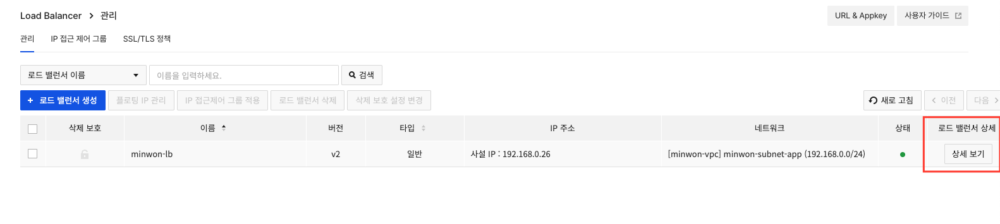
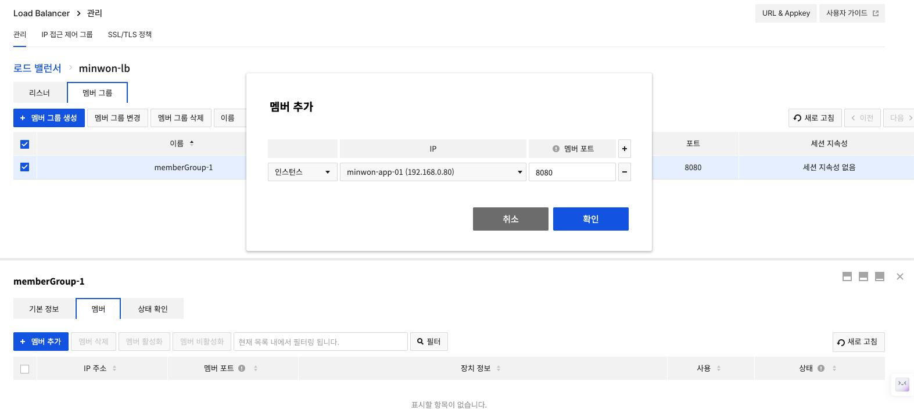

# Day 1 · 4차시 — LB에 앱 서버를 연결하고 서비스를 오픈하라

**소요 시간**: 50분 (14:00~14:50)
**목표**: 3차시에서 자동 배포된 App VM을 Load Balancer에 등록하고, 외부에서 민원 서비스에 접속한다

---

## 이번 차시에 하는 것

| STEP | 작업 |
|------|------|
| 01 | DB / 앱 서비스 정상 동작 확인 |
| 02 | App VM을 Load Balancer 멤버로 등록 |
| 03 | 헬스체크 통과 확인 |
| 04 | 브라우저에서 민원 서비스 접속 확인 |

!!! info "3차시에서 이미 완료된 것"
    - DB VM 생성 → MySQL 자동 설치·DB 초기화 (사용자 스크립트)
    - App VM 생성 → 소스 clone·앱 배포 (사용자 스크립트)

    이번 차시는 **LB 연결 및 외부 접속 확인**에 집중합니다.

---

## STEP 01 — DB / 앱 서비스 정상 동작 확인

LB에 등록하기 전에 각 VM에서 서비스가 정상 실행 중인지 확인합니다.

### DB VM 확인

```bash
# DB VM에 SSH 접속 후
sudo systemctl status mysql
# Active: active (running) ← 정상
```

### App VM 확인

```bash
# App VM에 SSH 접속 후
sudo systemctl status complaint-app
# Active: active (running) ← 정상

# 앱이 응답하는지 직접 확인
curl http://localhost:8080/health
# {"status": "ok"} ← 정상
```

!!! warning "아직 실행 중이 아니라면"
    사용자 스크립트는 부팅 후 약 2~3분 소요됩니다. 로그를 확인하세요.
    ```bash
    sudo tail -50 /var/log/cloud-init-output.log
    ```
    `✅ 앱 배포 완료` 메시지가 있으면 정상 완료입니다.

---

## STEP 02 — App VM을 Load Balancer 멤버로 등록

### 콘솔 경로

1. `Network > Load Balancer` 에서 `minwon-lb` 의 **상세 보기** 클릭



2. **멤버 그룹** 탭 → `memberGroup-1` 선택 → **멤버** 탭 → **멤버 추가** 클릭
3. 아래 설정값으로 입력 후 **확인**

### 설정값

| 항목 | 값 |
|------|---|
| 인스턴스 | `minwon-app-01` |
| 포트 | `8080` |



---

## STEP 03 — 헬스체크 통과 확인

멤버를 등록하면 LB가 `/health` 엔드포인트로 상태 확인을 시작합니다.

```
Network > Load Balancer > [minwon-lb] > 멤버 상태
→ 상태: ACTIVE ← 정상
→ 상태: ERROR  ← 아래 확인 순서 참고
```

헬스체크 실패 시 확인 순서:

| 순서 | 확인 항목 |
|------|---------|
| 1 | `sudo systemctl status complaint-app` — 앱이 실행 중인가 |
| 2 | `curl http://localhost:8080/health` — 앱이 8080 포트로 응답하는가 |
| 3 | App 보안 그룹이 `192.168.0.0/24`에서 오는 8080 요청을 허용하는가 |
| 4 | LB 헬스체크 포트가 `8080`인가 |

---

## STEP 04 — 브라우저에서 민원 서비스 접속

LB 플로팅 IP로 접속합니다.

```
http://<LB-플로팅-IP>
```

확인 항목:

- [ ] 민원 서비스 메인 화면이 표시된다
- [ ] DB 연결 상태가 "연결됨"으로 표시된다
- [ ] 샘플 민원 3건이 목록에 보인다
- [ ] 새 민원을 접수하면 목록에 추가된다

---

## App-DB 연결 오류 시 점검 순서

| 순서 | 확인할 것 | 원인 |
|------|---------|------|
| 1 | DB VM이 실행 중인가 | 인스턴스 중지 상태 |
| 2 | MySQL 프로세스가 떠 있는가 | `sudo systemctl status mysql` |
| 3 | DB 보안 그룹이 App에서의 요청을 허용하는가 | 원격이 CIDR로 잘못 지정됨 |
| 4 | `.env`의 DB_HOST가 사설 IP인가 | 공인 IP를 적었거나 오타 |
| 5 | App VM과 DB VM이 같은 VPC인가 | 서브넷·VPC 오선택 |

!!! tip "연결 실패의 90%는 보안 그룹 또는 주소·포트 오타입니다"

---

## 4차시 체크포인트

| # | 확인 항목 | 확인 방법 |
|---|----------|---------|
| ① | DB VM에서 MySQL이 실행 중이다 | `sudo systemctl status mysql` |
| ② | App VM에서 앱이 실행 중이다 | `sudo systemctl status complaint-app` |
| ③ | App VM이 LB 멤버로 등록되었다 | LB > 멤버 그룹 탭 |
| ④ | 헬스체크 상태가 ACTIVE다 | LB > 멤버 상태 |
| ⑤ | LB 플로팅 IP로 민원 서비스가 접속된다 | 브라우저 확인 |
| ⑥ | 민원을 접수하면 목록에서 조회된다 | 서비스 직접 사용 |

---

**다음 차시**: 첨부파일 저장을 Object Storage로 분리합니다.
