# Day 1 · 4차시 — 민원 서비스를 실행할 서버와 DB를 준비하라

**소요 시간**: 50분 (14:00~14:50)
**목표**: DB VM과 App VM을 생성하고, 사용자 스크립트로 MySQL과 앱을 자동 설치한다

---

## 이번 차시에 만드는 것

| STEP | 자원 | 역할 |
|------|------|------|
| 01 | DB VM | 민원 데이터 저장 서버 (MySQL 자동 설치) |
| 02 | Block Storage | DB 데이터 전용 디스크 |
| 03 | Block Storage 연결 및 마운트 | 데이터 디스크 준비 |
| 04 | DB VM 사설 IP 확인 | App VM 연결 정보 수집 |
| 05 | App VM | 민원 서비스 실행 서버 (앱 자동 배포) |
| 06 | 배포 확인 | 앱 정상 실행 확인 |

!!! tip "순서가 중요합니다"
    App VM의 사용자 스크립트에 **DB VM의 사설 IP**가 필요합니다.
    DB VM을 먼저 만들고 IP를 확인한 뒤 App VM을 생성합니다.

---

## 개념 — App VM vs DB VM 역할 분담

| 구분 | App VM | DB VM |
|------|--------|-------|
| 하는 일 | 민원 화면 출력, 접수 처리, 파일 업로드 | 민원 데이터 저장, 쿼리 처리 |
| 외부 노출 | LB 경유 (플로팅 IP 없음) | 없음 (사설 IP만) |
| 확장 | 여러 대로 늘릴 수 있음 | 교체해도 데이터 유지 |

!!! tip "핵심"
    App Tier는 갈아 끼울 수 있는 계층, DB Tier는 지켜야 하는 계층입니다.

---

## STEP 01 — DB VM 생성

### 콘솔 경로

```
Compute > Instance > 인스턴스 생성
```

### ① 기본 정보 & 이미지 설정

| 항목 | 값 |
|------|---|
| 이름 | `minwon-db-01` |
| 이미지 | Ubuntu Server 22.04 LTS |
| 인스턴스 타입 | `t2.c1m1` (1 vCPU, 1GB RAM) |
| 가용성 영역 | 한국(판교) — **Block Storage와 같은 AZ** |
| 루트 디스크 | HDD 20GB |

이미지는 **OS > Ubuntu** 를 선택한 뒤 목록에서 **Ubuntu Server 22.04 LTS** 를 선택합니다.

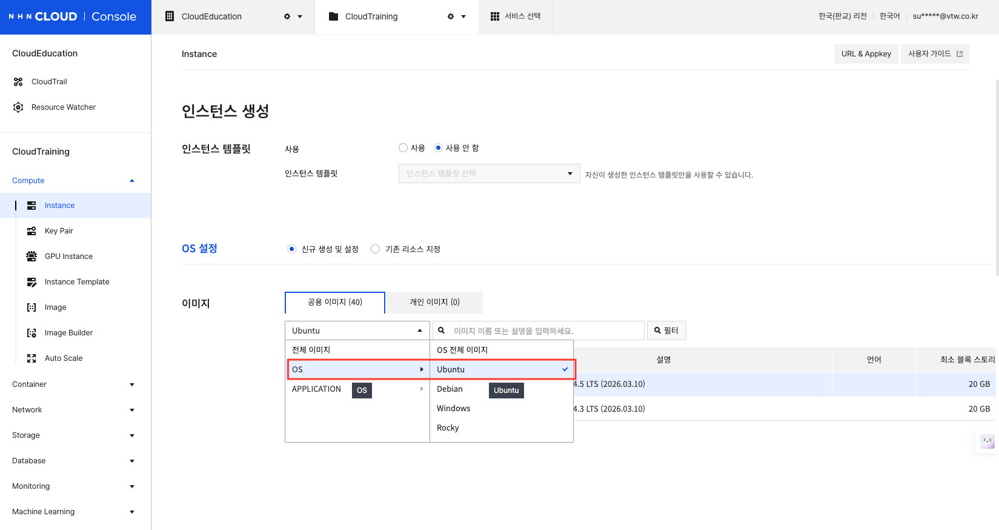

### ② 키페어 설정

| 항목 | 값 |
|------|---|
| 키페어 | 새로 생성 또는 기존 키페어 선택 |

!!! danger ""
    키페어 항목 옆 **생성** 버튼을 클릭해야 키페어를 만들 수 있는 입력 창이 나타납니다.

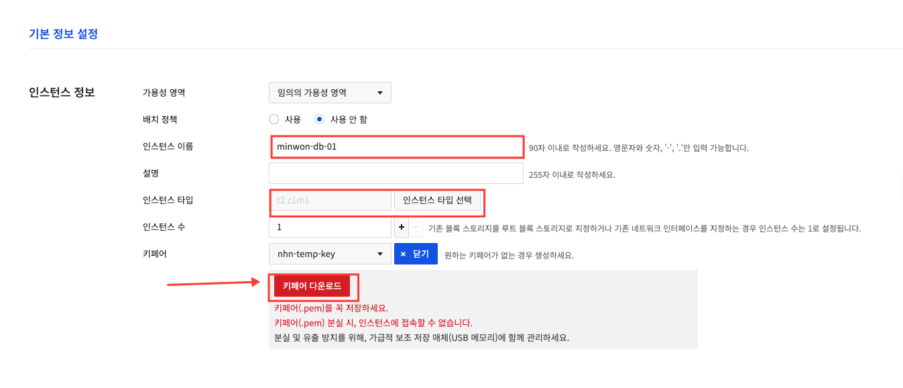

!!! danger "🔑 키페어 다운로드는 지금 이 순간뿐입니다"
    인스턴스 생성 화면에서 **키페어 다운로드** 버튼을 반드시 클릭하세요.
    `.pem` 파일은 **생성 시점에 단 한 번만** 다운로드할 수 있습니다.
    이 파일을 잃어버리면 해당 인스턴스에 SSH로 접속할 방법이 없습니다.
    다운로드 후 안전한 위치(USB 또는 로컬 폴더)에 즉시 보관하세요.

### ③ 네트워크 설정

| 항목 | 값 |
|------|---|
| VPC | `minwon-vpc` |
| 서브넷 | `minwon-subnet-db` |

오른쪽 **사용 가능한 서브넷** 목록에서 `minwon-subnet-db`를 클릭하면 왼쪽 **선택된 서브넷**으로 이동합니다.

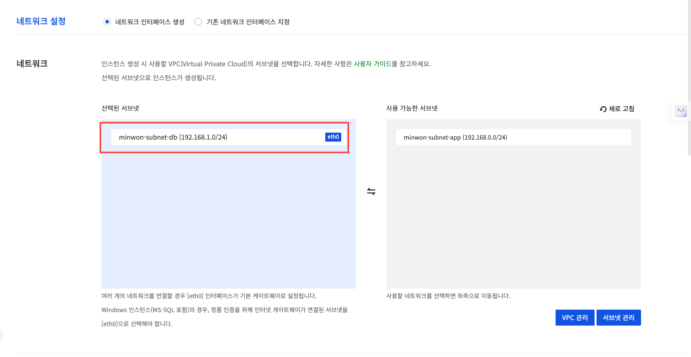

### ④ 보안 그룹 설정

!!! danger "반드시 `minwon-sg-db` 를 선택하세요"
    보안 그룹 선택 목록에서 **`minwon-sg-db`** 에만 체크하세요.
    `default` 나 `minwon-sg-app` 을 선택하면 잘못된 포트가 열리거나 DB가 외부에 노출될 수 있습니다.

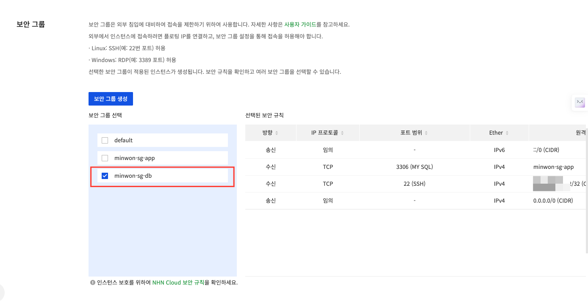

### ⑤ 플로팅 IP 설정

플로팅 IP는 **기본값(사용 안 함)** 그대로 두세요. DB VM은 외부에서 직접 접근하지 않습니다.

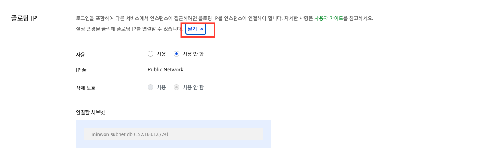

!!! info "DB VM에 플로팅 IP가 없는 이유"
    DB VM은 App VM에서만 접근하면 됩니다.
    외부 인터넷에 노출시킬 필요가 없으므로 플로팅 IP를 연결하지 않습니다.

## 개념 — 사용자 스크립트(User Data)란?

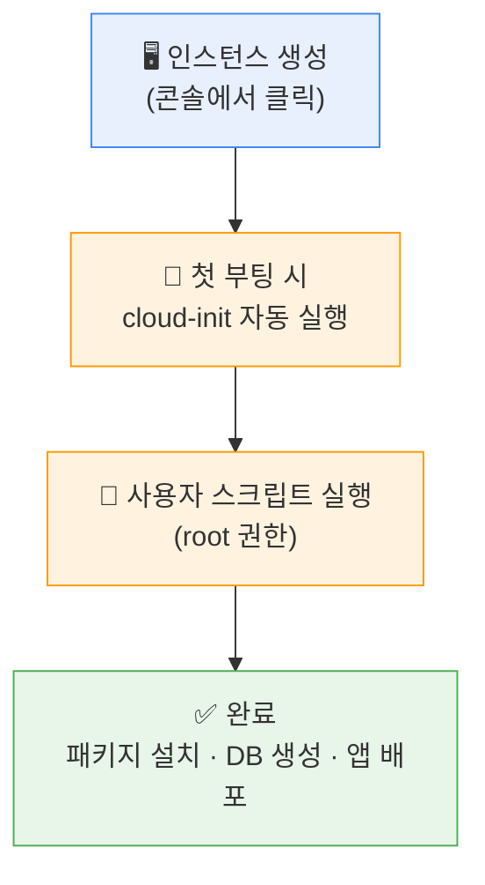

VM을 생성할 때 **추가 설정 > 사용자 스크립트** 란에 셸 스크립트를 붙여넣으면, 인스턴스가 처음 부팅될 때 자동으로 실행됩니다. SSH 접속 없이도 서버 환경을 완성할 수 있습니다.


---

### ⑥ 사용자 스크립트 입력

**추가 설정 > 사용자 스크립트** 란에 아래 내용을 **그대로** 붙여넣습니다.

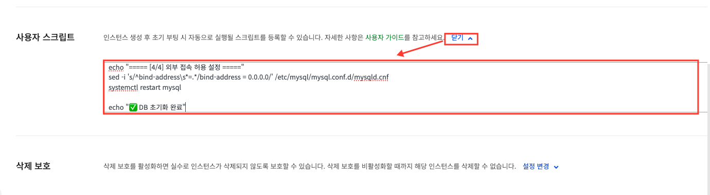

```bash
#!/bin/bash
set -e

DB_NAME="complaints_db"
DB_USER="complaint_user"
DB_PASS="Minjeon2024!"
MYSQL_ROOT_PASS="Root2024!"

echo "===== [1/4] MySQL 8.0 설치 ====="
apt-get update -y
apt-get install -y mysql-server

echo "===== [2/4] MySQL 시작 및 자동 실행 설정 ====="
systemctl start mysql
systemctl enable mysql

echo "===== [3/4] DB / 계정 / 테이블 생성 ====="
mysql -u root <<EOF
CREATE DATABASE IF NOT EXISTS ${DB_NAME}
  CHARACTER SET utf8mb4 COLLATE utf8mb4_unicode_ci;

CREATE USER IF NOT EXISTS '${DB_USER}'@'%' IDENTIFIED BY '${DB_PASS}';
GRANT ALL PRIVILEGES ON ${DB_NAME}.* TO '${DB_USER}'@'%';
FLUSH PRIVILEGES;

USE ${DB_NAME};
CREATE TABLE IF NOT EXISTS complaints (
    id          INT AUTO_INCREMENT PRIMARY KEY,
    title       VARCHAR(200)  NOT NULL,
    content     TEXT          NOT NULL,
    status      VARCHAR(20)   NOT NULL DEFAULT '접수',
    file_path   VARCHAR(500),
    created_at  DATETIME      NOT NULL DEFAULT CURRENT_TIMESTAMP
) CHARACTER SET utf8mb4;

INSERT INTO complaints (title, content, status) VALUES
  ('도로 포장 요청', '우리 동네 골목길이 많이 파손되어 보행에 불편함이 있습니다.', '접수'),
  ('가로등 고장 신고', '○○아파트 앞 가로등이 3일째 꺼져 있습니다.', '처리중'),
  ('공원 시설 점검 요청', '어린이 공원의 시소가 파손되어 안전 위험이 있습니다.', '완료');
EOF

echo "===== [4/4] 외부 접속 허용 설정 ====="
sed -i 's/^bind-address\s*=.*/bind-address = 0.0.0.0/' /etc/mysql/mysql.conf.d/mysqld.cnf
systemctl restart mysql

echo "✅ DB 초기화 완료"
```

!!! info "스크립트 실행 확인 방법"
    VM 생성 후 SSH로 접속해서 `/var/log/cloud-init-output.log` 를 보면
    스크립트 실행 결과를 확인할 수 있습니다.
    ```bash
    sudo tail -50 /var/log/cloud-init-output.log
    ```

---

---

## STEP 02 — Block Storage 생성

!!! warning "생성 전 — DB VM의 가용성 영역을 먼저 확인하세요"
    Block Storage는 **인스턴스와 같은 가용성 영역(AZ)** 에 있어야 연결할 수 있습니다.
    아래 경로에서 `minwon-db-01` 의 가용성 영역을 확인한 뒤 Block Storage를 생성하세요.

    ```
    Compute > Instance → 목록에서 minwon-db-01 의 가용성 영역 확인
    ```

    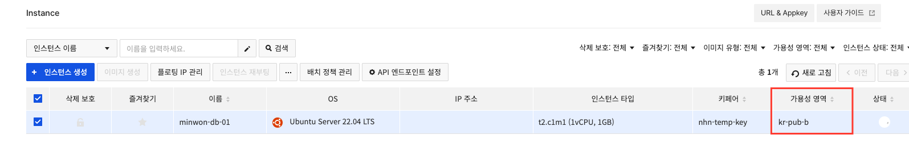

    캡처 예시에서는 가용성 영역이 **`kr-pub-b`** 입니다. 본인 화면의 값을 아래에 기록해두세요.

    | 항목 | 내가 확인한 값 |
    |------|-------------|
    | DB VM 가용성 영역 | |

### 콘솔 경로

```
Storage > Block Storage > 블록 스토리지 생성
```

### 설정값

| 항목 | 값 |
|------|---|
| 이름 | `minwon-db-disk` |
| 가용성 영역 | DB VM과 **동일한 AZ** (앞서 확인한 값 입력) |
| 타입 | HDD |
| 크기 | 10GB |

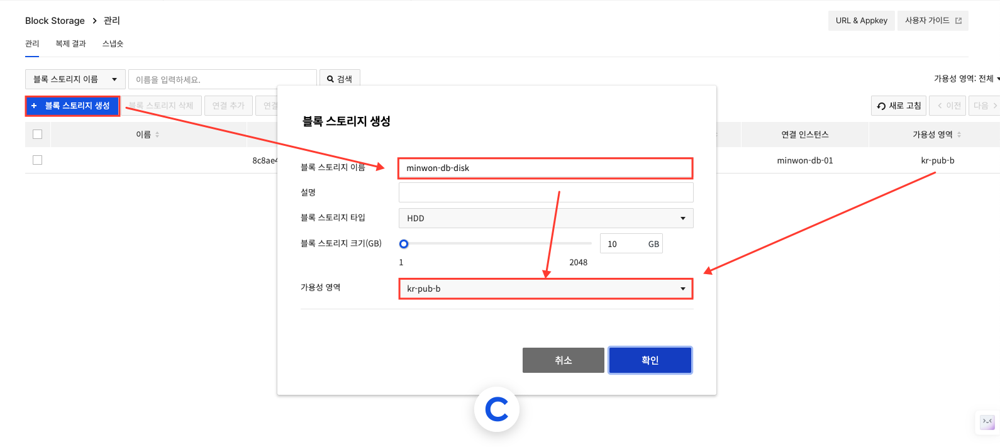

### 왜 DB 데이터를 별도 Block Storage에 두는가

| 이유 | 설명 |
|------|------|
| 데이터 보호 | DB VM을 삭제·교체해도 Block Storage는 남음 |
| 수명 주기 분리 | OS 디스크와 데이터 디스크를 따로 관리 |
| 용량 확장 | 데이터 디스크만 별도로 늘릴 수 있음 |

---

## STEP 03 — Block Storage 연결 및 마운트

### 3-1. 콘솔에서 연결

1. `minwon-db-disk` 를 체크한 뒤 **연결 추가** 버튼 클릭
2. **찾아보기** 를 눌러 `minwon-db-01` 인스턴스 선택
3. 삭제 정책은 **인스턴스 삭제 시 유지** 로 두고 **연결** 클릭

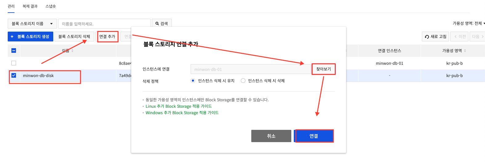

### 3-2. DB VM에 플로팅 IP 연결

Block Storage 마운트를 위해 DB VM에 SSH로 접속해야 합니다.
DB VM에는 플로팅 IP가 없으므로 임시로 연결합니다.

1. `Compute > Instance` 에서 `minwon-db-01` 을 체크합니다
2. 상단 **플로팅 IP 관리** 버튼을 클릭합니다

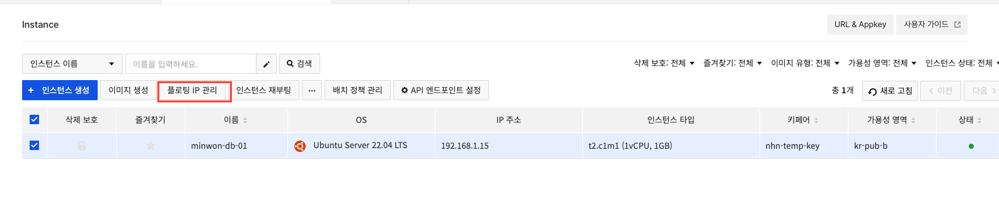

3. 사용 가능한 플로팅 IP를 선택해 **연결** 클릭합니다

### 3-3. SSH 접속 (Windows PowerShell)

#### SSH란? — 내 컴퓨터에서 클라우드 서버를 제어하는 방법

클라우드 서버는 **모니터·키보드가 없습니다.** 대신 네트워크를 통해 명령어를 전송해서 제어합니다.
이때 사용하는 프로토콜이 **SSH(Secure Shell)** 입니다.

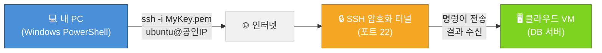

!!! info "키페어(.pem)가 필요한 이유"
    SSH는 비밀번호 대신 **공개키/개인키 쌍**으로 인증합니다.
    내가 가진 `.pem` 파일(개인키)과 VM에 등록된 공개키가 맞아야만 접속이 허용됩니다.
    비밀번호보다 훨씬 강력하고 안전한 인증 방식입니다.

!!! info "Windows 사용자는 PowerShell로 접속합니다"
    Windows 10/11에는 SSH가 기본 내장되어 있습니다. 별도 프로그램 설치 없이 PowerShell에서 바로 접속할 수 있습니다.
    PowerShell은 Windows에 기본 설치된 명령줄 도구로, 리눅스의 터미널과 같은 역할을 합니다.

**① PowerShell 열기**

`시작 메뉴` → **PowerShell** 검색 → 실행

**② 키페어 파일이 있는 폴더로 이동**

```powershell
cd C:\Users\사용자이름\Downloads
```

> 키페어 `.pem` 파일을 다운로드한 폴더로 이동합니다. 대부분 `Downloads` 폴더에 있습니다.

**③ 키페어 권한 설정 (Windows 필수)**

Windows는 `.pem` 파일을 다운로드하면 권한이 열려있어서 SSH가 거부됩니다.  
접속 전에 반드시 아래 명령을 실행하세요.

```powershell
icacls "MyKey.pem" /inheritance:r /grant:r "$($env:USERNAME):(R)"
```

!!! danger "이 단계를 건너뛰면 아래 오류가 발생합니다"
    ```
    @@@@@@@@@@@@@@@@@@@@@@@@@@@@@@@@@@@@@@@@@@@@@@@@@@@@@@@@@@@
    @         WARNING: UNPROTECTED PRIVATE KEY FILE!          @
    @@@@@@@@@@@@@@@@@@@@@@@@@@@@@@@@@@@@@@@@@@@@@@@@@@@@@@@@@@@
    Permissions 0644 for 'MyKey.pem' are too open.
    Load key "MyKey.pem": bad permissions
    Permission denied (publickey).
    ```

**④ SSH 접속**

```powershell
ssh -i MyKey.pem ubuntu@<DB-VM-플로팅-IP>
```

> `<DB-VM-플로팅-IP>` 자리에 앞서 연결한 플로팅 IP를 입력합니다. (예: `133.186.xxx.xxx`)

!!! warning "처음 접속 시 경고 메시지가 뜨면?"
    `Are you sure you want to continue connecting (yes/no)?` 메시지가 나오면 **yes** 를 입력하고 Enter를 누르세요.

접속에 성공하면 아래와 같은 화면이 나타납니다.

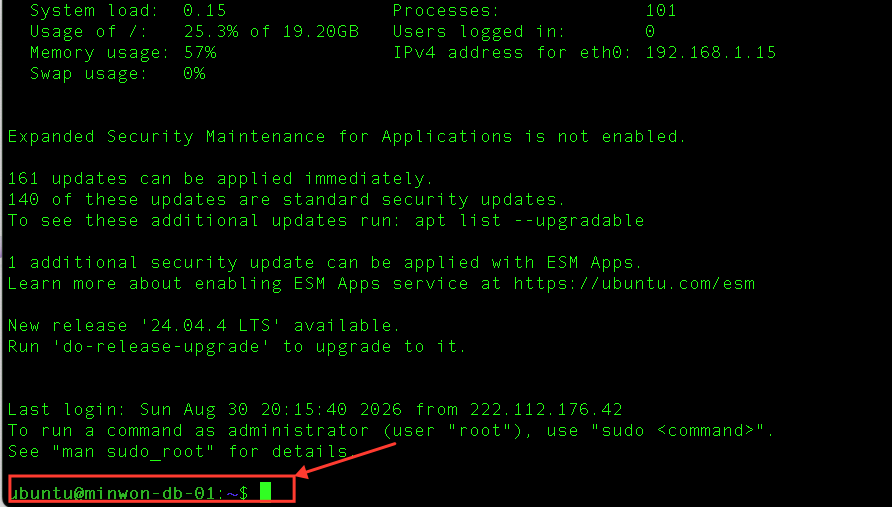

!!! info "프롬프트 기호로 현재 권한을 확인하세요"
    | 프롬프트 | 의미 |
    |---------|------|
    | `ubuntu@minwon-db-01:~$` | 일반 사용자 권한 — **sudo 필요** |
    | `root@minwon-db-01:~#` | root(관리자) 권한 |

    접속 직후에는 `$` 표시가 나타납니다. **관리자 권한이 아닌 상태**입니다.
    이 실습에서는 이 상태에서 명령마다 `sudo` 를 붙여 실행합니다.

**④ 접속 후 권한 설정**

이 실습에서는 명령마다 `sudo` 를 붙여 실행합니다.

```bash
# 예시: 파일 목록 확인
sudo ls /var/lib/mysql
```

!!! tip "sudo su - 는 사용하지 않습니다"
    `sudo su -` 로 root 전환하면 편하지만, 실수로 시스템 파일을 삭제하는 사고가 생길 수 있습니다.
    명령마다 `sudo` 를 붙이는 습관이 안전합니다.

### 3-4. 디스크 인식 확인

```bash
sudo lsblk
```

명령 실행 후 아래처럼 `vdb` 디스크가 보이면 Block Storage가 정상 연결된 것입니다.

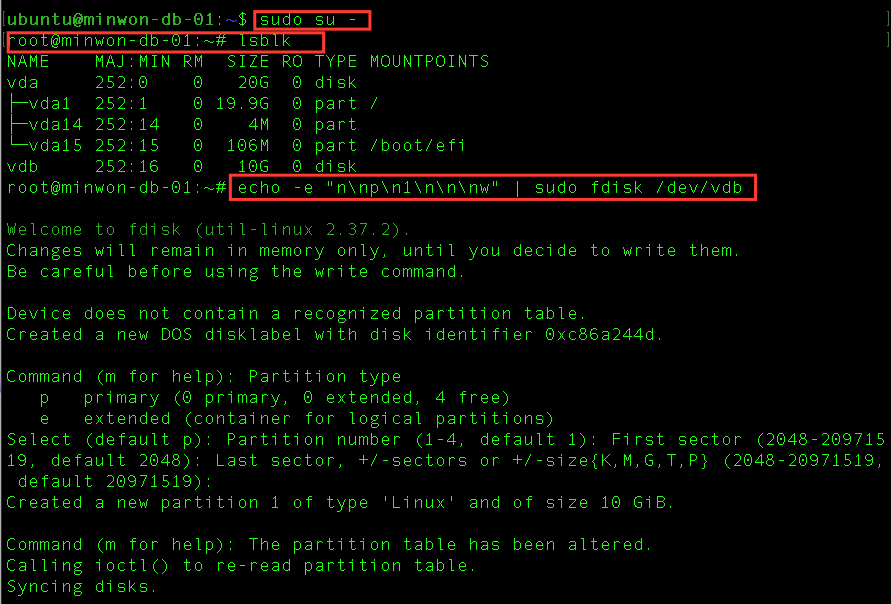

| 디스크 | 크기 | 역할 |
|--------|------|------|
| `vda` | 20G | 루트 디스크 (OS) |
| `vdb` | 10G | 방금 연결한 Block Storage |

### 3-5. 파티션 및 파일시스템 생성

**파티션**이란 디스크를 논리적으로 나누는 구역입니다. 새 디스크는 빈 공간만 있으므로 OS가 사용할 수 있도록 구역을 먼저 만들어야 합니다.
**파일시스템**은 파티션 위에 파일을 저장하는 규칙(형식)입니다. 포맷하지 않으면 데이터를 읽고 쓸 수 없습니다.

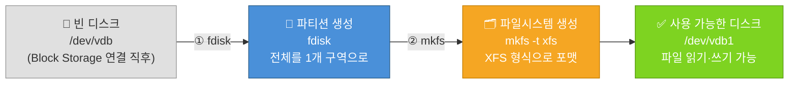

```bash
# 파티션 생성 (디스크 전체를 하나의 파티션으로)
echo -e "n\np\n1\n\n\nw" | sudo fdisk /dev/vdb

# 파일시스템 생성 (xfs 형식으로 포맷)
sudo mkfs -t xfs /dev/vdb1
```

### 3-6. 마운트 및 자동 마운트 등록

**마운트**란 디스크를 특정 폴더 경로에 연결하는 작업입니다. 마운트 후에는 `/mnt/data` 경로에 파일을 저장하면 Block Storage에 저장됩니다.


```bash
# 마운트 포인트 생성
sudo mkdir -p /mnt/data

# 마운트
sudo mount /dev/vdb1 /mnt/data

# 재부팅 후 자동 마운트 등록
echo "/dev/vdb1 /mnt/data xfs defaults 0 0" | sudo tee -a /etc/fstab

# 마운트 확인
df -h | grep mnt
```

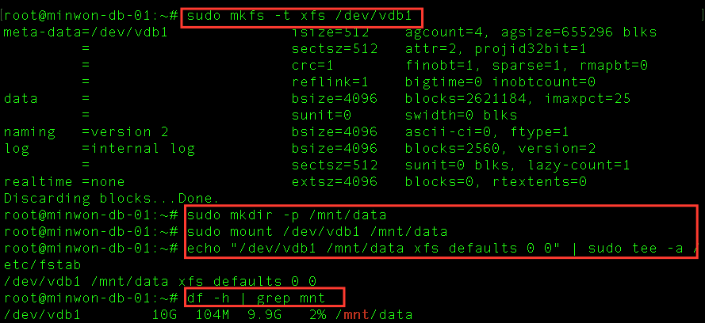

아래와 같이 출력되면 성공입니다.

```
Filesystem       Size  Used Avail Use% Mounted on
/dev/vdb1         10G  104M  9.9G   2% /mnt/data
```

---

## STEP 04 — DB VM 사설 IP 확인

App VM의 사용자 스크립트에 DB VM의 사설 IP가 필요합니다.

```
Compute > Instance > minwon-db-01 클릭
→ 상세 정보 > IP 주소 확인
```

| 항목 | 내가 확인한 값 |
|------|-------------|
| DB VM 사설 IP | 192.168.1. ___ |

!!! warning "이 IP는 다음 단계(App VM 생성)에서 바로 사용합니다"
    메모해 두세요.

---

## STEP 05 — App VM 생성 ✋ 스스로 해보기

!!! tip "이번 STEP은 캡처 없이 직접 해보는 시간입니다"
    DB VM을 만들었던 순서와 동일합니다.
    아래 설정값 표를 보면서 **천천히, 하나씩** 진행해보세요.
    DB VM과 다른 항목은 **굵게** 표시했습니다.

### 콘솔 경로

```
Compute > Instance > 인스턴스 생성
```

### 설정값

| 항목 | 값 | 주의 |
|------|---|------|
| 이름 | **`minwon-app-01`** | |
| 이미지 | Ubuntu Server 22.04 LTS | OS > Ubuntu 선택 |
| 인스턴스 타입 | `t2.c1m1` (1 vCPU, 1GB RAM) | |
| 가용성 영역 | 한국(판교) 선택 | |
| 루트 디스크 | HDD 20GB | |
| VPC | `minwon-vpc` | |
| 서브넷 | **`minwon-subnet-app`** | ⚠️ DB와 다름 |
| 보안 그룹 | **`minwon-sg-app`** | ⚠️ DB와 다름 |
| 키페어 | DB VM과 동일한 키페어 사용 | 키페어 다운로드 이미 완료 |
| 플로팅 IP | **사용** | ⚠️ DB와 다름 — App은 공인 IP 직접 연결 |

!!! danger "❌ 이 3가지를 틀리면 서비스가 절대 동작하지 않습니다"
    1. **서브넷** → 반드시 `minwon-subnet-app` (DB 서브넷 선택 금지)
    2. **보안 그룹** → 반드시 `minwon-sg-app` (DB 보안 그룹 선택 금지)
    3. **플로팅 IP** → 반드시 **사용** 으로 설정 (App VM은 공인 IP로 직접 접속)

### 사용자 스크립트 입력

**추가 설정 > 사용자 스크립트** 란에 아래 내용을 붙여넣습니다.

!!! danger "스크립트에서 딱 한 줄만 수정합니다"
    스크립트 전체 중 **수정할 곳은 단 한 줄**입니다.

    **수정 전 (그대로 붙여넣으면 안 됨)**
    ```
    DB_HOST="192.168.1.10"
    ```

    **수정 후 (STEP 04에서 확인한 내 DB VM 사설 IP로 교체)**
    ```
    DB_HOST="192.168.1.XX"   ← 내 DB VM IP로 변경
    ```

    ⚠️ `DB_PORT`, `DB_USER`, `DB_PASSWORD` 등 **나머지 줄은 절대 수정하지 마세요.**

    아래 캡처는 예시입니다. **반드시 본인의 DB VM IP를 직접 확인해서 입력하세요.**
    옆 사람 IP를 그대로 따라 쓰면 내 서비스가 동작하지 않습니다.

    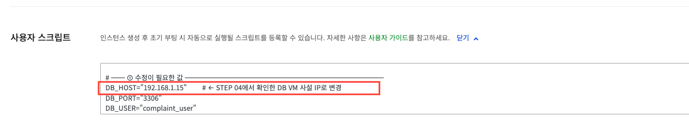

```bash
#!/bin/bash
set -e

# ── ① 이 줄만 수정하세요 ───────────────────────────
DB_HOST="192.168.1.10"        # ← 내 DB VM 사설 IP로 변경 (나머지는 수정 금지)
DB_PORT="3306"
DB_USER="complaint_user"
DB_PASSWORD="Minjeon2024!"
DB_NAME="complaints_db"
APP_PORT="8080"
GITHUB_REPO="https://github.com/skilleat-labs/cloud-native-minwon-lab.git"
APP_DIR="/opt/complaint-app"
# ──────────────────────────────────────────────────

echo "===== [1/5] 패키지 설치 ====="
apt-get update -y
apt-get install -y python3 python3-pip git

echo "===== [2/5] 소스 clone ====="
git clone "$GITHUB_REPO" /tmp/minwon-repo
mkdir -p "$APP_DIR"
cp -r /tmp/minwon-repo/app/. "$APP_DIR/"

echo "===== [3/5] 의존성 설치 ====="
pip3 install -r "$APP_DIR/requirements.txt" --break-system-packages 2>/dev/null || \
  pip3 install -r "$APP_DIR/requirements.txt"

echo "===== [4/5] 환경변수 파일 생성 ====="
cat > "$APP_DIR/.env" <<EOF
DB_HOST=${DB_HOST}
DB_PORT=${DB_PORT}
DB_USER=${DB_USER}
DB_PASSWORD=${DB_PASSWORD}
DB_NAME=${DB_NAME}
PORT=${APP_PORT}
EOF

echo "===== [5/5] systemd 서비스 등록 ====="
cat > /etc/systemd/system/complaint-app.service <<EOF
[Unit]
Description=온라인 민원 서비스
After=network.target

[Service]
WorkingDirectory=${APP_DIR}
EnvironmentFile=${APP_DIR}/.env
ExecStart=/usr/bin/python3 ${APP_DIR}/app.py
Restart=always
RestartSec=5

[Install]
WantedBy=multi-user.target
EOF

systemctl daemon-reload
systemctl enable complaint-app

# hostname이 127.0.1.1로 매핑되는 Ubuntu 기본값을 실제 사설 IP로 교체
PRIVATE_IP=$(hostname -I | awk '{print $1}')
sed -i "s/127.0.1.1/$PRIVATE_IP/" /etc/hosts

systemctl start complaint-app

echo "✅ 앱 배포 완료: http://$(hostname -I | awk '{print $1}'):${APP_PORT}"
```

---

## STEP 06 — App 보안 그룹 수정 (8080 포트 오픈)

브라우저에서 `공인IP:8080` 으로 직접 접속하려면 보안 그룹에서 8080 포트를 인터넷에 열어야 합니다.

### 콘솔 경로

```
Network > Security Group > minwon-sg-app 클릭
→ 보안 규칙 탭 > 수신 TCP 8080 규칙 > 변경
```

### 변경 내용

| 항목 | 기존 | 변경 후 |
|------|------|--------|
| 방향 | 수신 | 수신 |
| 프로토콜 | TCP | TCP |
| 포트 | 8080 | 8080 |
| 원격 | `192.168.0.0/24` (App 서브넷) | `0.0.0.0/0` (인터넷 전체) |

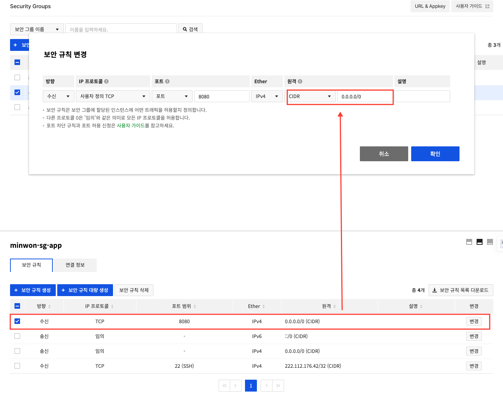

!!! warning "실습 전용 설정입니다"
    `0.0.0.0/0` 은 전 세계 누구나 8080 포트로 접근 가능합니다.
    실습이 끝나면 다시 제한하거나 인스턴스를 삭제하세요.

---

## STEP 07 — 배포 확인

App VM의 사용자 스크립트는 부팅 후 백그라운드에서 자동 실행됩니다.
**인스턴스 생성 후 약 2~3분 기다렸다가** SSH로 접속해 확인합니다.

### 6-1. App VM 플로팅 IP 확인

!!! info "배포 확인을 위해 App VM에 SSH로 접속해야 합니다"
    STEP 05에서 App VM 생성 시 플로팅 IP를 **사용**으로 설정했습니다.
    콘솔에서 할당된 공인 IP를 확인하세요.

    ```
    Compute > Instance → minwon-app-01 클릭 → IP 주소 확인
    ```

    | 항목 | 확인 위치 |
    |------|---------|
    | 공인 IP (플로팅 IP) | 인스턴스 상세 > IP 주소 항목 |

### 6-2. PowerShell로 App VM에 SSH 접속

**① PowerShell 열기**

`시작 메뉴` → **PowerShell** 검색 → 실행

**② 키페어 파일이 있는 폴더로 이동**

```powershell
cd C:\Users\사용자이름\Downloads
```

**③ App VM에 SSH 접속**

```powershell
ssh -i MyKey.pem ubuntu@<App-VM-플로팅-IP>
```

> `<App-VM-플로팅-IP>` 자리에 6-1에서 확인한 공인 IP를 입력합니다.

접속 성공 시 `ubuntu@minwon-app-01:~$` 프롬프트가 나타납니다.

### 6-3. 배포 상태 확인

접속 후 아래 명령어를 순서대로 실행합니다.

**① 서비스 실행 상태 확인**

```bash
sudo systemctl status complaint-app
```

`Active: active (running)` 이 보이면 배포 성공입니다.

**② 설치 로그 확인** (서비스가 아직 시작 안 됐을 때)

```bash
sudo tail -50 /var/log/cloud-init-output.log
```

> 스크립트가 아직 실행 중이면 1~2분 더 기다린 뒤 다시 확인하세요.

**③ 앱 응답 확인**

```bash
curl http://localhost:8080
```

HTML 코드가 출력되면 앱이 정상 동작 중입니다.

### 6-4. DB VM 서비스 확인 (새 터미널에서)

!!! tip "App VM 터미널은 그대로 두고 PowerShell 창을 새로 여세요"
    App VM에 접속 중인 터미널을 닫지 말고,
    **PowerShell 창을 하나 더 열어서** DB VM에 별도로 접속합니다.

**새 PowerShell 창에서 DB VM 접속**

```powershell
cd C:\Users\사용자이름\Downloads
ssh -i MyKey.pem ubuntu@<DB-VM-플로팅-IP>
```

**DB VM에서 MySQL 상태 확인**

```bash
sudo systemctl status mysql
```

`Active: active (running)` 이 보이면 MySQL 정상 실행 중입니다.

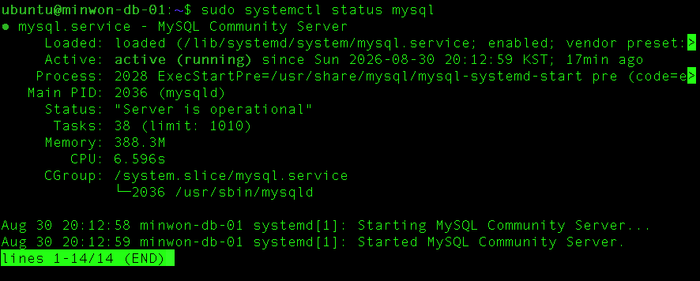

### 6-5. App VM에서 DB VM 통신 확인

App VM 터미널(기존 창)로 돌아와서 실행합니다.

```bash
nc -zv <DB-VM-사설-IP> 3306
```

`Connection to ... 3306 port [tcp/mysql] succeeded!` 가 나오면 성공입니다.


!!! warning "통신이 안 되면 이 순서로 확인하세요"
    1. `Compute > Instance` 에서 DB VM이 **실행 중** 상태인가?
    2. `minwon-sg-db` 인바운드 규칙 — 원격이 `minwon-sg-app` **보안 그룹**으로 지정되어 있는가?
    3. 두 VM이 모두 `minwon-vpc` 안에 있는가?

### 6-6. 브라우저에서 서비스 확인

모든 확인이 끝났으면 브라우저 주소창에 아래와 같이 입력합니다.

```
http://<App-VM-플로팅-IP>:8080
```

아래와 같이 **온라인 민원 서비스** 화면이 보이면 배포 완료입니다! 🎉

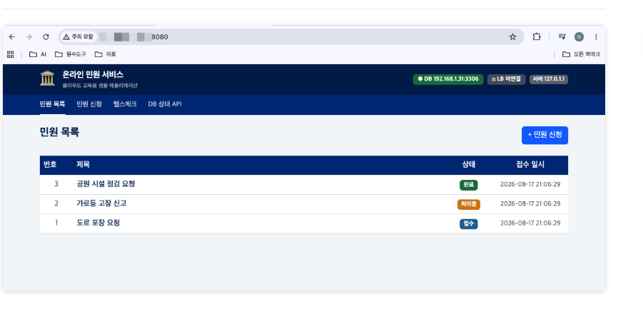

## 4차시 체크포인트

| # | 확인 항목 | 확인 방법 |
|---|----------|---------|
| ① | DB VM이 실행 중이고 `minwon-sg-db`가 적용되었는가 | Compute > Instance 상세 |
| ② | DB VM에서 MySQL이 실행 중인가 | `sudo systemctl status mysql` |
| ③ | Block Storage가 DB VM에 연결되고 마운트되었는가 | `df -h` 결과 확인 |
| ④ | App VM이 실행 중이고 `minwon-sg-app`이 적용되었는가 | Compute > Instance 상세 |
| ⑤ | App VM에서 민원 서비스가 실행 중인가 | `sudo systemctl status complaint-app` |
| ⑥ | App VM → DB VM 3306 포트 통신이 되는가 | `nc -zv <DB-IP> 3306` |

---

**다음 차시**: LB에 App VM을 등록하고 외부에서 접속을 확인합니다.
