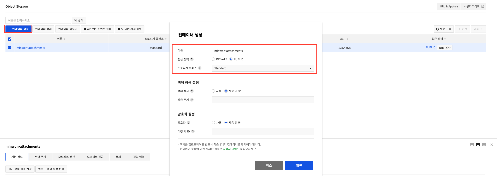
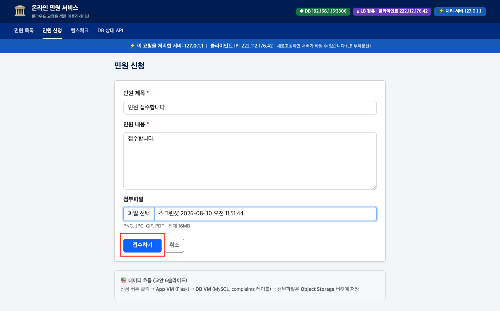

# Day 1 · 5차시 — 민원 데이터와 첨부파일을 안전하게 저장하라

**소요 시간**: 50분 (15:00~15:50)
**목표**: Object Storage 컨테이너를 만들고, 첨부파일이 버킷에 저장되는 흐름을 확인한다

---

## 이번 차시에 하는 것

| STEP | 작업 |
|------|------|
| 01 | 컨테이너(버킷) 생성 |
| 02 | Object Storage 접근 정보 확인 |
| 03 | 앱에 Object Storage 연결 (임시 플로팅 IP 생성 → SSH → 해제) |
| 04 | 첨부파일 업로드 후 저장 결과 확인 |

!!! info "Object Storage 서비스 활성화는 1차시에서 이미 완료했습니다"
    왼쪽 메뉴에 **Storage > Object Storage** 가 보이면 바로 시작하세요.

---

## 개념 — 왜 첨부파일을 Object Storage에 저장하는가

### App VM 로컬에 저장하면 생기는 문제

```
App VM 1 (파일 저장)     App VM 2
      ↑                       ↑
  사용자 A                사용자 B
  "내 파일 어디 갔지?"
```

- App VM이 2대 이상이면 파일이 **한 서버에만** 저장됨
- LB가 다른 서버로 보내면 파일을 찾을 수 없음
- App VM을 삭제하면 파일도 사라짐

### Object Storage를 쓰면

```
App VM 1 ──┐
           ├──→ Object Storage (공용 버킷)
App VM 2 ──┘
```

- 몇 대의 서버든 같은 버킷에서 파일 접근 가능
- 서버를 삭제해도 파일은 유지
- 용량 제한 없음

---

## 개념 — 3가지 스토리지 선택 기준

| 항목 | Block Storage | NAS | Object Storage |
|------|-------------|-----|---------------|
| 연결 방식 | 디스크로 직접 연결 | 네트워크 마운트 | HTTP REST API |
| 동시 접근 | 1대만 가능 | 여러 대 동시 가능 | 제한 없음 |
| 위치 제약 | 같은 AZ만 | 프로젝트 네트워크 안 | 리전 어디서나 |
| 실습 용도 | **DB 데이터** | (개념 비교용) | **첨부파일** |

!!! tip "선택 기준"
    - 한 서버 전용 → **Block Storage**
    - 여러 서버 공유 → **NAS**
    - 웹에서 HTTP로 접근 → **Object Storage**

---

## 개념 — 저장 위치별 역할

| 저장 위치 | 저장하는 것 | 이유 |
|---------|-----------|------|
| DB (Block Storage) | 민원 번호, 제목, 내용, 상태, **파일 경로** | 검색·정렬이 필요한 구조화 데이터 |
| Object Storage | 첨부 이미지, PDF **파일 본문** | 크기가 크고, 여러 서버 동시 접근 필요 |
| App VM 로컬 | 저장하지 않음 | 서버 증가·교체 시 파일 소실 위험 |

**업로드 흐름:**
```
사용자 (첨부파일 선택)
      ↓
App VM (파일 수신)
      ↓
Object Storage ← 파일 본문 저장
DB VM          ← 파일 경로(URL)만 기록
```

---

## STEP 01 — 컨테이너(버킷) 생성

### 콘솔 경로

```
Storage > Object Storage > 컨테이너 생성
```

### 콘솔 경로

```
Storage > Object Storage > 컨테이너 생성
```

### 설정값

| 항목 | 값 |
|------|---|
| 이름 | `minwon-attachments` |
| 접근 정책 | **PRIVATE** |
| 스토리지 클래스 | Standard |



### 접근 정책 비교

| 정책 | 설명 | 언제 사용 |
|------|------|---------|
| PRIVATE | 프로젝트 사용자만 접근 (인증 토큰 필요) | **민원 첨부파일 (기본값)** |
| PUBLIC | URL만 알면 인증 없이 접근 가능 | 공개 안내 자료, 정적 파일 |

!!! warning "민원 첨부파일은 반드시 PRIVATE"
    개인정보가 포함될 수 있는 파일을 PUBLIC으로 설정하면 누구나 URL로 접근 가능합니다.

---

## STEP 02 — Object Storage 접근 정보 확인

앱에서 Object Storage에 연결하려면 아래 4가지 정보가 필요합니다.

```
Storage > Object Storage > API 엔드포인트 설정 버튼 클릭
```

| 항목 | 값 | 확인 위치 |
|------|---|---------|
| Object Storage URL | `https://kr1-api-object-storage.nhncloudservice.com/v1/AUTH_{TenantID}` | API 엔드포인트 설정 |
| Tenant ID | `AUTH_` 뒤의 문자열 | API 엔드포인트 설정 |
| username | **NHN Cloud 로그인 이메일** | 내 계정 정보 |
| API 비밀번호 | Object Storage 전용 비밀번호 | API 엔드포인트 설정에서 직접 설정 |

!!! warning "API 비밀번호 ≠ NHN Cloud 로그인 비밀번호"
    API 비밀번호는 Object Storage 전용으로 별도 설정하는 값입니다.
    **API 엔드포인트 설정** 창에서 직접 입력하고 저장해야 합니다.

!!! warning "Tenant ID는 Object Storage 전용"
    Object Storage의 Tenant ID는 일반 인프라 서비스의 Tenant ID와 다릅니다.
    반드시 Object Storage > API 엔드포인트 설정에서 확인하세요.

---

## STEP 03 — 앱에 Object Storage 연결

!!! info "SSH 접속을 위해 플로팅 IP를 임시로 생성합니다"
    4차시에서 App VM의 플로팅 IP를 LB로 옮겼기 때문에, 지금 App VM에는 공인 IP가 없습니다.
    .env 파일 수정을 위해 **새 플로팅 IP를 생성 → App VM에 임시 연결 → 수정 완료 후 해제·삭제** 합니다.

### 3-0. App VM에 플로팅 IP 임시 연결

1. `Network > Floating IP` → **플로팅 IP 생성** 클릭 → **확인**
2. 생성된 IP 선택 → **연결** 클릭
   - 네트워크 인터페이스: `minwon-app-01`
3. App VM에 연결된 공인 IP 주소를 메모해 두세요

### 3-1. App VM SSH 접속 후 .env 수정

아래 명령에서 `여기에...` 부분만 **본인 값으로 바꾼 뒤 전체를 복사해서 붙여넣기** 하세요.

```bash
sudo tee -a /opt/complaint-app/.env << 'EOF'
OBJECT_STORAGE_URL=https://kr1-api-object-storage.nhncloudservice.com/v1/AUTH_여기에TenantID입력
OBJECT_STORAGE_CONTAINER=minwon-attachments
OS_USERNAME=여기에로그인이메일입력
OS_PASSWORD=여기에API비밀번호입력
EOF
```

!!! warning "붙여넣기 전에 반드시 값을 먼저 수정하세요"
    - `여기에TenantID입력` → Object Storage API 엔드포인트 설정에서 복사한 Tenant ID
    - `여기에로그인이메일입력` → NHN Cloud 로그인 이메일 (예: `hong@korea.kr`)
    - `여기에API비밀번호입력` → API 엔드포인트 설정에서 설정한 API 전용 비밀번호

입력이 완료되면 아래처럼 추가된 내용이 그대로 출력됩니다.

```
OBJECT_STORAGE_URL=https://kr1-api-object-storage.nhncloudservice.com/v1/AUTH_abc123...
OBJECT_STORAGE_CONTAINER=minwon-attachments
OS_USERNAME=hong@korea.kr
OS_PASSWORD=mypassword
```

**② 앱 재시작**

```bash
sudo systemctl restart complaint-app
sudo systemctl status complaint-app
```

`Active: active (running)` 이 보이면 성공입니다.


### 3-2. 임시 플로팅 IP 해제 및 삭제

SSH 작업이 끝났으면 임시로 만든 플로팅 IP를 정리합니다.

1. `Network > Floating IP` 에서 임시 생성한 IP 체크
2. **연결 해제** 후 **플로팅 IP 삭제**

!!! warning "플로팅 IP는 연결하지 않아도 과금됩니다"
    사용이 끝난 즉시 삭제하세요.

---

## STEP 04 — 첨부파일 업로드 및 확인

### 5-1. 민원 접수 시 첨부파일 업로드

1. 브라우저에서 `http://<LB-플로팅-IP>` 접속
2. **민원 신청** 탭 클릭
3. 민원 제목·내용 입력
4. **첨부파일** 선택 (PNG, JPG, GIF, PDF · 최대 16MB)
5. **접수하기** 클릭



### 5-2. Object Storage에서 파일 확인

```
Storage > Object Storage > [minwon-attachments]
→ 업로드한 파일이 목록에 보이면 성공
```

### 5-3. DB에는 파일 경로(URL)만 저장되는지 확인

```
민원 상세 화면 → 첨부파일 링크 클릭 → 파일이 열리면 성공
```

---

## Object Storage 주요 기능 (운영 관점)

| 기능 | 설명 |
|------|------|
| 버전 관리 | 오브젝트 업데이트 이력 관리, 이전 버전 복원 |
| 객체 잠금 (WORM) | 지정 기간 동안 덮어쓰기·삭제 방지 (보존 의무 자료) |
| 수명 주기 제어 | 보관 기간 지정 후 자동 삭제 |
| 컨테이너 복제 | 다른 리전으로 자동 복제 (재해 대비) |
| 서버 측 암호화 | 저장 시 자동 암호화 |
| S3 호환 API | AWS SDK 및 서드파티 도구 사용 가능 |

---

## 5차시 체크포인트

| # | 확인 항목 | 확인 방법 |
|---|----------|---------|
| ① | `minwon-attachments` 컨테이너가 PRIVATE으로 생성되었다 | 컨테이너 상세 확인 |
| ② | 민원 신청 시 첨부파일이 버킷에 저장된다 | Object Storage 오브젝트 목록 |
| ③ | DB에는 파일 본문이 아닌 경로(URL)가 저장된다 | 민원 상세에서 첨부파일 링크 동작 확인 |

---

## 1일차 최종 확인 — 외부에서 전체 흐름 테스트

1. 브라우저에서 `http://<LB-플로팅-IP>` 접속
2. 새 민원 접수 (제목, 내용 입력)
3. 첨부파일 업로드 (이미지 또는 PDF)
4. 민원 목록에서 접수된 내용 확인
5. 첨부파일 링크 클릭 후 파일 열기

모두 확인되면 **1일차 미션 완료**입니다.

!!! warning "2일차를 위해 반드시 남겨두세요"
    | 자원 | 이유 |
    |------|------|
    | DB VM | 2일차에도 기존 민원 데이터 그대로 사용 |
    | Block Storage | DB VM에 연결된 상태 유지 |
    | Object Storage 컨테이너 | 기존 첨부파일 유지 |
    | VPC, 서브넷 | Kubernetes 클러스터도 같은 네트워크 사용 |
