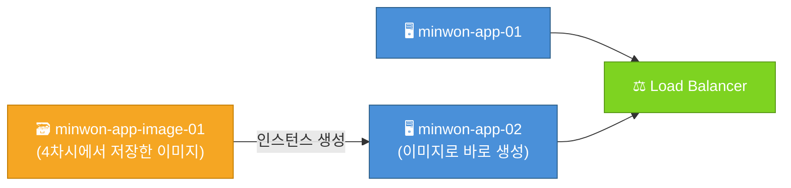
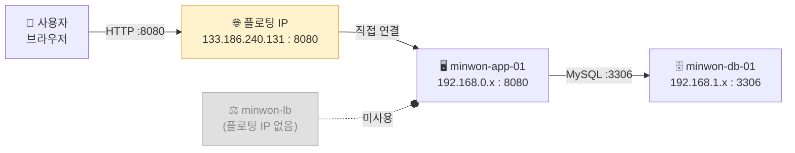
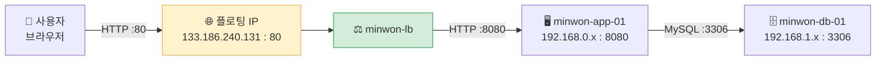
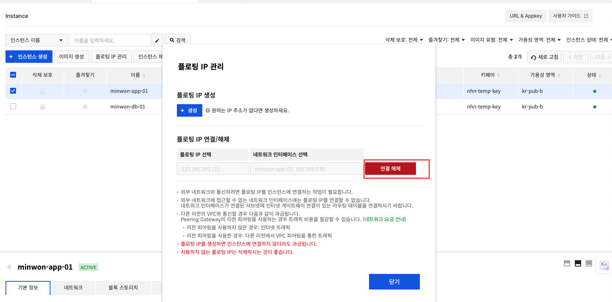
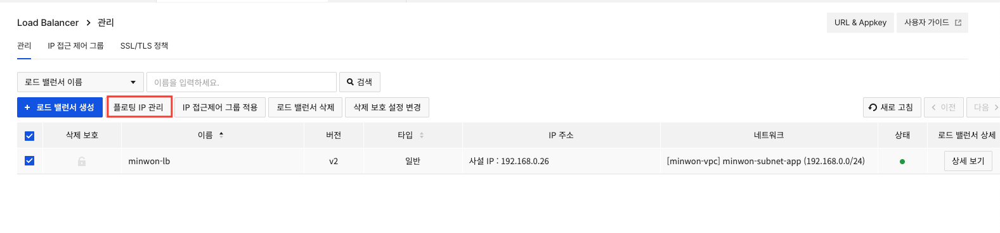
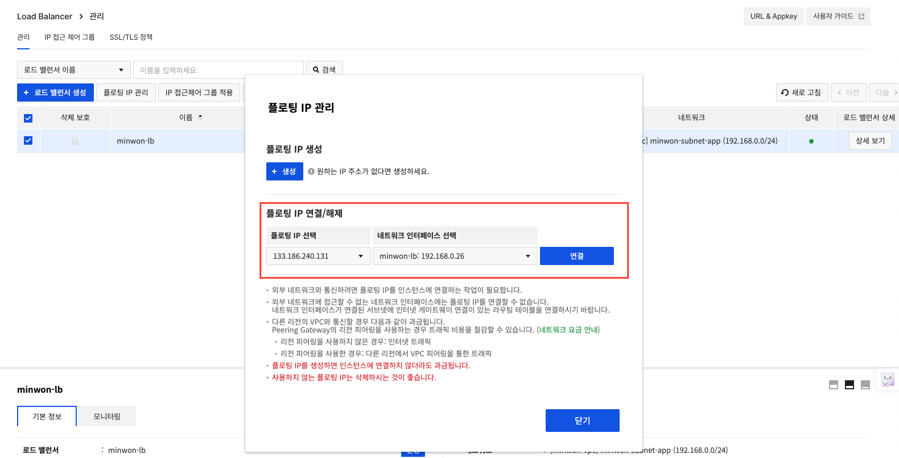
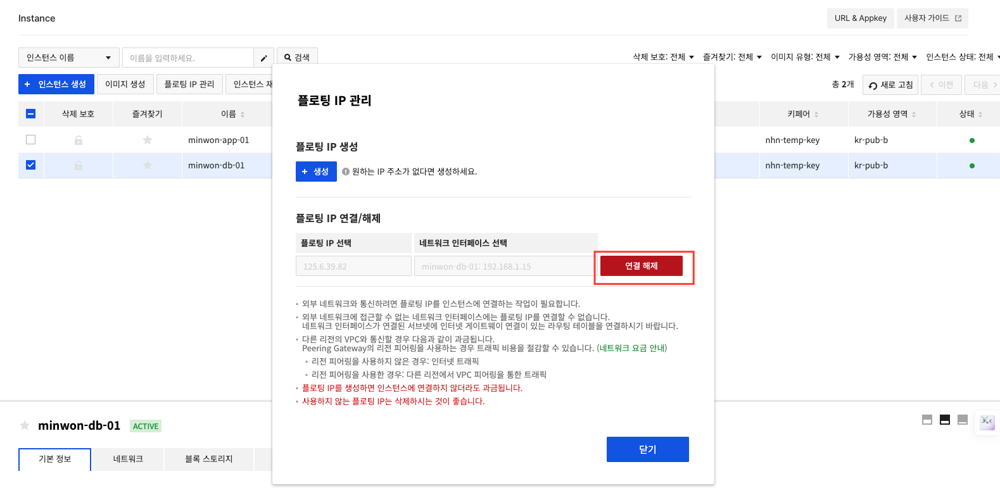
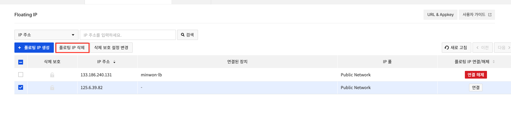

# Day 1 · 5차시 — LB에 앱 서버를 연결하고 서비스를 오픈하라

**소요 시간**: 50분 (14:00~14:50)
**목표**: 4차시에서 자동 배포된 App VM을 Load Balancer에 등록하고, 플로팅 IP를 LB로 이동해 외부에서 민원 서비스에 접속한다

---

## 이번 차시에 하는 것

| STEP | 작업 |
|------|------|
| 01 | 이미지로 App VM 복제 생성 (강사 진행) |
| 02 | App VM을 Load Balancer 멤버로 등록 |
| 03 | App VM 플로팅 IP → LB로 이동 |
| 04 | 헬스체크 통과 확인 |
| 05 | 브라우저에서 민원 서비스 접속 확인 |
| 06 | DB VM 플로팅 IP 해제 및 정리 |

!!! info "4차시에서 이미 완료된 것"
    - DB VM 생성 → MySQL 자동 설치·DB 초기화 (사용자 스크립트)
    - App VM 생성 → 소스 clone·앱 배포 (사용자 스크립트)
    - App VM에 플로팅 IP가 연결된 상태 (직접 접속 테스트용)

    이번 차시는 **LB 연결, 플로팅 IP 이동, 외부 접속 확인**에 집중합니다.

---

## STEP 01 — 이미지로 App VM 복제 생성

!!! tip "이 단계는 강사와 함께 진행합니다"
    개인별로 진행하지 않고 강사가 시범을 보이며 함께 따라합니다.

### 왜 복제하나요?

4차시에서 `minwon-app-01` 이미지를 저장했습니다. 이 이미지에는 패키지 설치·앱 배포·환경변수 설정까지 **모든 것이 완성된 상태**가 담겨 있습니다.

이 이미지로 새 VM을 만들면 처음부터 설정할 필요 없이 **완성된 앱 서버가 즉시 실행**됩니다. 이렇게 만든 두 번째 서버를 LB 아래에 연결하면 트래픽이 두 서버로 분산됩니다.



### 생성 방법

1. `Compute > Instance` 에서 **인스턴스 생성** 클릭
2. 이미지 선택 화면에서 **개인 이미지** 탭 클릭
3. `minwon-app-image-01` 선택
4. 나머지 설정은 `minwon-app-01` 과 동일하게 입력

| 항목 | 값 |
|------|----|
| 이름 | `minwon-app-02` |
| 가용성 영역 | `kr-pub-b` (app-01과 다른 AZ) |
| Flavor | `t2.c1m1` |
| 서브넷 | `minwon-subnet-app` |
| 보안 그룹 | `minwon-sg-app` |
| 키페어 | 기존 키페어 선택 |
| 플로팅 IP | **사용 안 함** (LB를 통해서만 접근) |

!!! info "사용자 스크립트는 넣지 않아도 됩니다"
    이미지에 이미 앱이 배포된 상태이므로 사용자 스크립트 없이도 바로 실행됩니다.

---

## STEP 02 — App VM을 Load Balancer 멤버로 등록

### 콘솔 경로

1. `Network > Load Balancer` 에서 `minwon-lb` 의 **상세 보기** 클릭


2. **멤버 그룹** 탭 → `memberGroup-1` 선택 → **멤버** 탭 → **멤버 추가** 클릭
3. 아래 설정값으로 입력 후 **확인**

### 설정값

| 항목 | 값 |
|------|---|
| 인스턴스 | `minwon-app-01` |
| 포트 | `8080` |


---

## STEP 03 — App VM 플로팅 IP → LB로 이동

4차시에서 직접 접속 테스트를 위해 App VM에 연결했던 플로팅 IP를 **LB로 이동**합니다.
이후부터는 LB를 통해서만 민원 서비스에 접속할 수 있습니다.

### 이전 (4차시) — 플로팅 IP가 App VM에 직접 연결



### 이후 (5차시) — 플로팅 IP를 LB로 이동, LB를 통해 접속



### 3-1. App VM에서 플로팅 IP 해제

1. `Compute > Instance` 에서 **`minwon-app-01`** 체크
2. 상단 **플로팅 IP 관리** 클릭
3. **연결 해제** 클릭



### 3-2. LB에 플로팅 IP 연결

1. `Network > Load Balancer` 에서 **`minwon-lb`** 체크
2. 상단 **플로팅 IP 관리** 클릭



3. **플로팅 IP 연결/해제** 영역에서:
   - 플로팅 IP 선택: `133.186.240.131` (방금 해제한 IP)
   - 네트워크 인터페이스 선택: `minwon-lb: 192.168.0.26`
4. **연결** 클릭



!!! tip "플로팅 IP가 목록에 보이지 않는다면"
    App VM에서 연결 해제가 완료된 후 약 10~20초 뒤에 LB 플로팅 IP 관리 화면을 새로 열어보세요.

---

## STEP 04 — 헬스체크 통과 확인

멤버를 등록하면 LB가 `/health` 엔드포인트로 상태 확인을 시작합니다.

```
Network > Load Balancer > [minwon-lb] > 멤버 상태
→ 상태: ACTIVE ← 정상
→ 상태: ERROR  ← 아래 확인 순서 참고
```

헬스체크 실패 시 확인 순서:

| 순서 | 확인 항목 |
|------|---------|
| 1 | `sudo systemctl status complaint-app` — 앱이 실행 중인가 |
| 2 | `curl http://localhost:8080/health` — 앱이 8080 포트로 응답하는가 |
| 3 | App 보안 그룹이 `192.168.0.0/24`에서 오는 8080 요청을 허용하는가 |
| 4 | LB 헬스체크 포트가 `8080`인가 |

---

## STEP 05 — 브라우저에서 민원 서비스 접속

LB 플로팅 IP의 **80번 포트**로 접속합니다.

```
http://<LB-플로팅-IP>
```

확인 항목:

- [ ] 민원 서비스 메인 화면이 표시된다
- [ ] DB 연결 상태가 "연결됨"으로 표시된다
- [ ] 샘플 민원 3건이 목록에 보인다
- [ ] 새 민원을 접수하면 목록에 추가된다

---

## STEP 06 — DB VM 플로팅 IP 해제 및 정리

민원 서비스가 LB를 통해 정상 접속되는 것을 확인했으면, **DB VM의 플로팅 IP도 해제**합니다.
DB는 내부 통신만 하면 되므로 공인 IP가 필요 없습니다.

### 6-1. DB VM 플로팅 IP 해제

1. `Compute > Instance` 에서 **`minwon-db-01`** 체크
2. 상단 **플로팅 IP 관리** 클릭
3. **연결 해제** 클릭



### 6-2. 사용하지 않는 플로팅 IP 삭제

플로팅 IP는 연결하지 않아도 **과금**됩니다.

1. `Network > Floating IP` 에서 연결된 장치가 `-` 인 IP 체크
2. **플로팅 IP 삭제** 클릭



!!! warning "삭제 전 반드시 확인"
    `133.186.240.131` → `minwon-lb` 에 연결된 IP는 **삭제하지 마세요.**
    연결 장치가 `-` 인 IP만 삭제합니다.

---

## App-DB 연결 오류 시 점검 순서

| 순서 | 확인할 것 | 원인 |
|------|---------|------|
| 1 | DB VM이 실행 중인가 | 인스턴스 중지 상태 |
| 2 | MySQL 프로세스가 떠 있는가 | `sudo systemctl status mysql` |
| 3 | DB 보안 그룹이 App에서의 요청을 허용하는가 | 원격이 CIDR로 잘못 지정됨 |
| 4 | `.env`의 DB_HOST가 사설 IP인가 | 공인 IP를 적었거나 오타 |
| 5 | App VM과 DB VM이 같은 VPC인가 | 서브넷·VPC 오선택 |

!!! tip "연결 실패의 90%는 보안 그룹 또는 주소·포트 오타입니다"

---

## 5차시 체크포인트

| # | 확인 항목 | 확인 방법 |
|---|----------|---------|
| ① | DB VM에서 MySQL이 실행 중이다 | `sudo systemctl status mysql` |
| ② | App VM에서 앱이 실행 중이다 | `sudo systemctl status complaint-app` |
| ③ | App VM이 LB 멤버로 등록되었다 | LB > 멤버 그룹 탭 |
| ④ | 헬스체크 상태가 ACTIVE다 | LB > 멤버 상태 |
| ⑤ | LB 플로팅 IP로 민원 서비스가 접속된다 | 브라우저 확인 |
| ⑥ | 민원을 접수하면 목록에서 조회된다 | 서비스 직접 사용 |
| ⑦ | App VM과 DB VM의 플로팅 IP가 해제되었다 | Instance 목록 확인 |

---

**다음 차시**: 첨부파일 저장을 Object Storage로 분리합니다.
