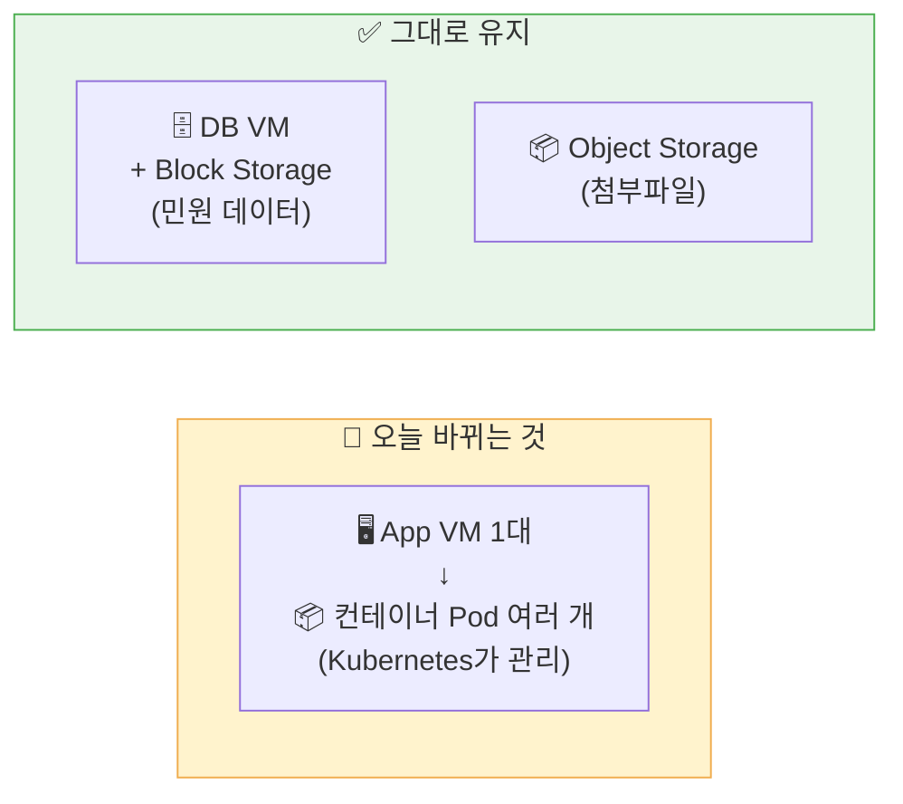
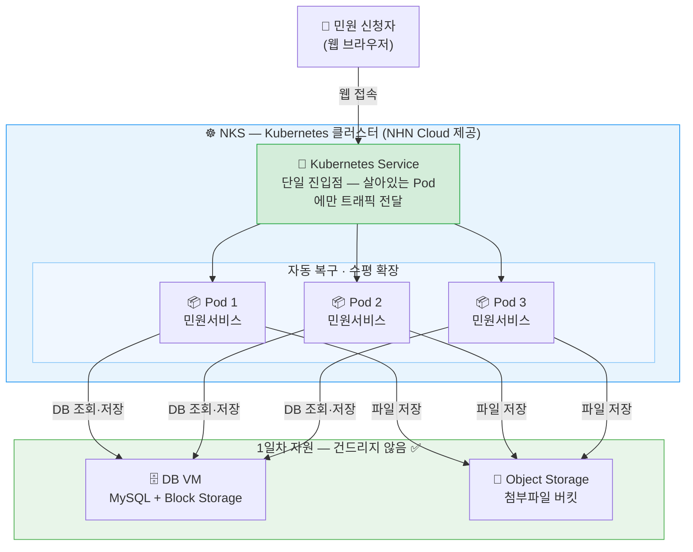
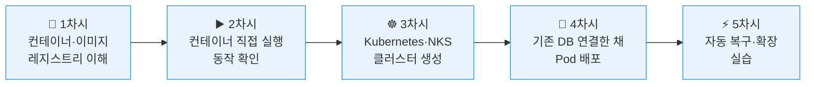

# Day 2 — 멈추지 않게 운영하라

## 오늘의 미션

> 1일차에 만든 민원 서비스가 **서버 한 대**에서 돌아가고 있습니다.
> 이 서버가 죽으면? 서비스도 죽습니다.
>
> 오늘은 **자동으로 살아나고, 트래픽이 몰려도 버티는** 구조로 바꿉니다.

1일차에 만든 **DB와 Object Storage는 그대로 두고**,
민원 앱만 **컨테이너 → Kubernetes** 환경으로 옮깁니다.

---

## 오늘 배울 핵심 개념 3가지

| 개념 | 한 줄 설명 |
|------|-----------|
| 🐳 **컨테이너** | 앱과 실행 환경을 하나로 묶은 상자. 어디서든 똑같이 실행됨 |
| 📦 **이미지** | 컨테이너를 만드는 설계도. 한 번 만들면 어디서나 꺼내 쓸 수 있음 |
| ☸️ **Kubernetes** | 컨테이너를 자동으로 실행·복구·확장해주는 관리자 |

---

## 바뀌는 것 vs 그대로 유지되는 것

| 구분 | 1일차 | 2일차 |
|------|-------|-------|
| App | VM 한 대에서 실행 | **컨테이너 여러 개**로 실행 |
| DB | VM + Block Storage | **그대로** |
| 첨부파일 | Object Storage | **그대로** |

---

## 2일차 최종 아키텍처

---

## 1일차 vs 2일차 — 무엇이 달라지나

| 상황 | 1일차 (VM 방식) | 2일차 (Kubernetes 방식) |
|------|--------------|----------------------|
| 서버가 갑자기 죽으면 | ❌ 서비스 중단, 운영자가 직접 재시작 | ✅ Kubernetes가 자동으로 새 Pod 실행 |
| 민원이 폭주하면 | ❌ 서버 추가 후 LB에 수동 등록 | ✅ 숫자 하나 바꾸면 Pod 자동 추가 |
| 새 버전 배포 시 | ❌ 서버 접속 → 코드 업데이트 → 재시작 | ✅ 이미지 태그만 바꾸면 순차 교체 |
| 앱 실행 환경 | ❌ 서버마다 달라질 수 있음 | ✅ 이미지로 묶어서 항상 동일 |

---

## 오늘 하루 흐름

| 시간 | 차시 | 내용 |
|------|------|------|
| 10:00~10:50 | [1차시](session1.md) | 컨테이너·이미지·레지스트리란 무엇인가 |
| 11:00~11:50 | [2차시](session2.md) | 이미지를 받아서 컨테이너로 직접 실행해보기 |
| 13:00~13:50 | [3차시](session3.md) | Kubernetes란? NKS 클러스터 생성 |
| 14:00~14:50 | [4차시](session4.md) | 기존 DB VM을 연결한 채 Pod 배포 |
| 15:00~15:50 | [5차시](session5.md) | Pod 자동 복구 & 수평 확장 실습 |

---

!!! warning "시작 전 확인 — 1일차 자원이 살아있어야 합니다"
    | 자원 | 확인 방법 |
    |------|---------|
    | DB VM (`minwon-db-01`) | Compute > Instance → 실행 중 ● |
    | Block Storage | DB VM 상세 > 블록 스토리지 탭 → 연결됨 |
    | Object Storage | Storage > Object Storage → `minwon-attachments` 존재 |
