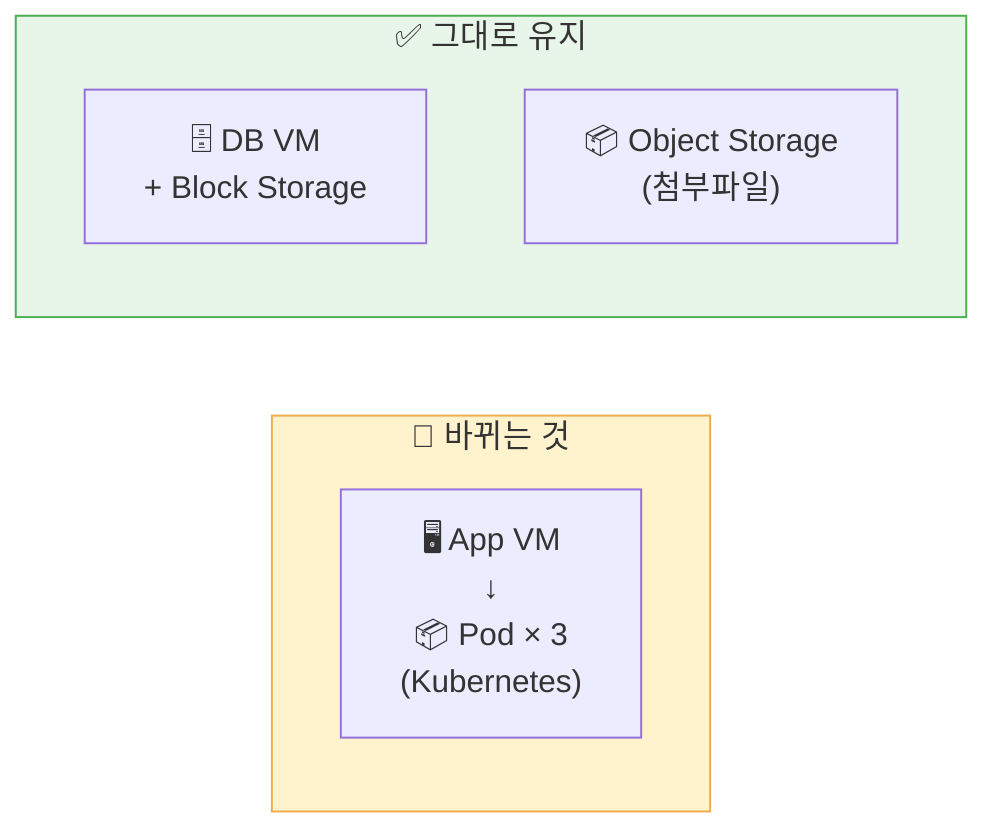
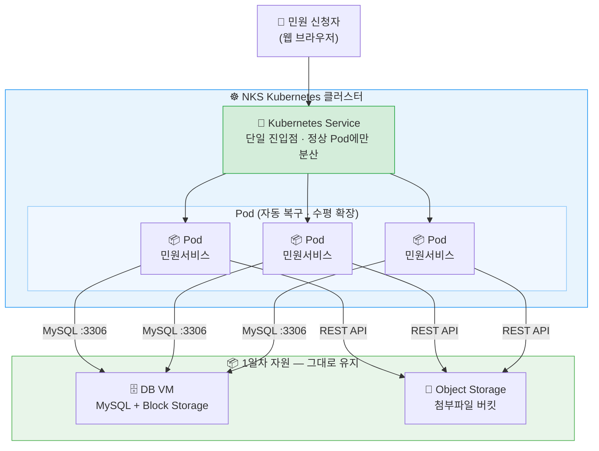

# Day 2 — 멈추지 않게 운영하라

## 오늘의 미션

1일차에 만든 **DB와 Object Storage는 유지하고**, 민원 서비스를 처리하는 App Tier만 컨테이너와 Kubernetes 환경으로 전환합니다.

## 바뀌는 것 vs 바뀌지 않는 것

| 구분 | 오늘 어떻게 되는가 |
|------|-----------------|
| App Tier | 컨테이너 이미지로 만들어 Kubernetes에서 Pod로 실행 — **완전히 바뀜** |
| DB Tier | 1일차의 DB VM과 Block Storage를 그대로 사용 — **바뀌지 않음** |
| 첨부파일 | 1일차의 Object Storage 컨테이너를 그대로 사용 — **바뀌지 않음** |

## 2일차 최종 아키텍처

## 1일차 vs 2일차 비교

| 구분 | 1일차 | 2일차 |
|------|-------|-------|
| 진입점 | Load Balancer | Kubernetes Service |
| App Tier | App VM 1대 | Pod 여러 개 |
| 배포 방식 | VM에 자동 설치 | 이미지 + YAML 배포 |
| 장애 대응 | 운영자가 직접 확인 | Pod 자동 복구 |
| 확장 방식 | 서버 추가 + LB 등록 | replicas 숫자 변경 |

## 타임테이블

| 시간 | 차시 |
|------|------|
| 10:00~10:50 | 1차시 — 수정 버전이 나왔는데 서버마다 환경이 다르다 |
| 11:00~11:50 | 2차시 — 같은 민원 서비스를 어디서나 동일하게 실행하라 |
| 13:00~13:50 | 3차시 — 컨테이너가 많아지면 누가 관리하지? |
| 14:00~14:50 | 4차시 — 기존 DB를 유지한 채 서비스를 배포하라 |
| 15:00~15:50 | 5차시 — 민원 폭주와 장애에 대응하라 |
