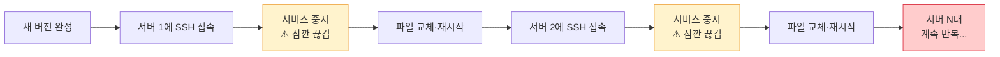
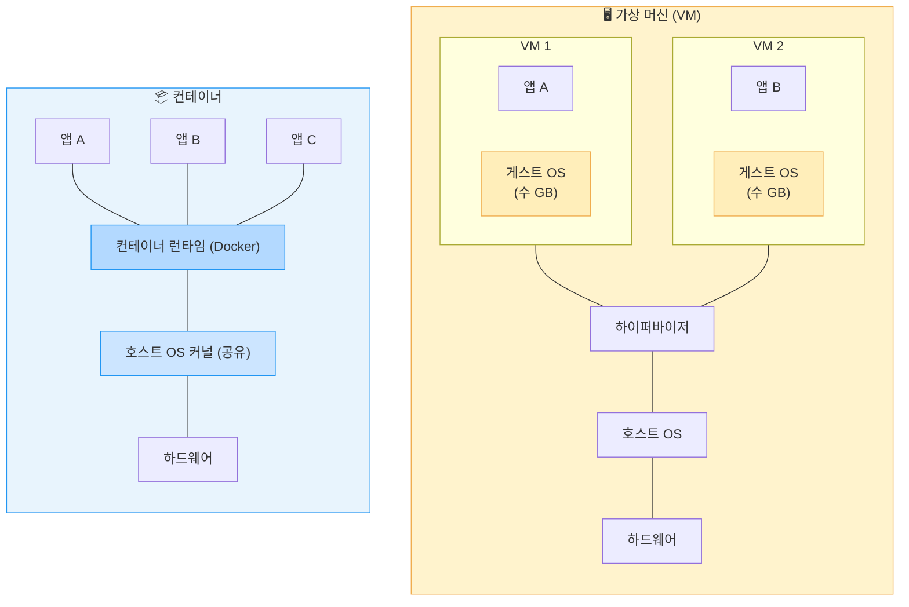
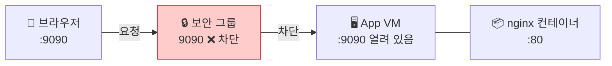
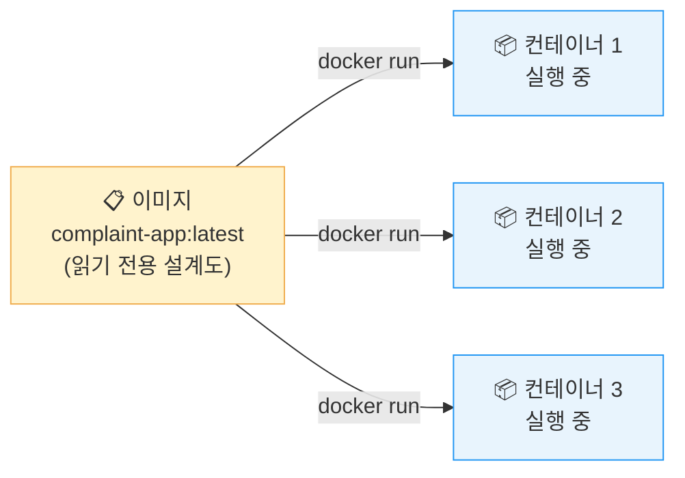
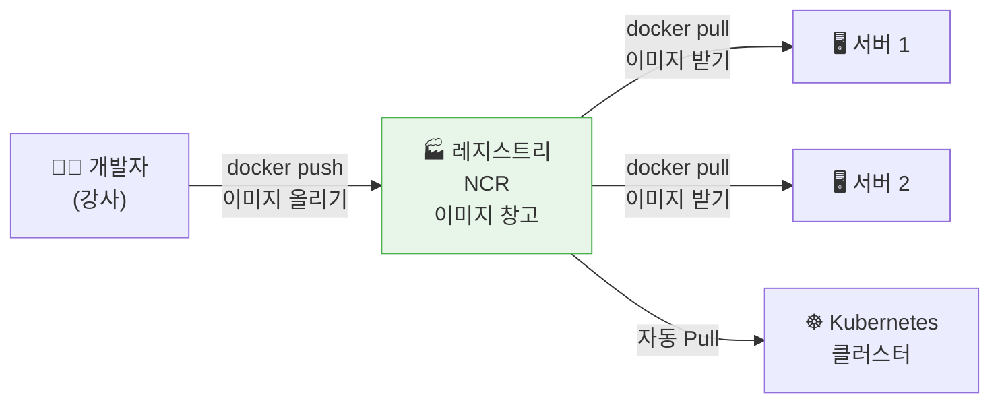
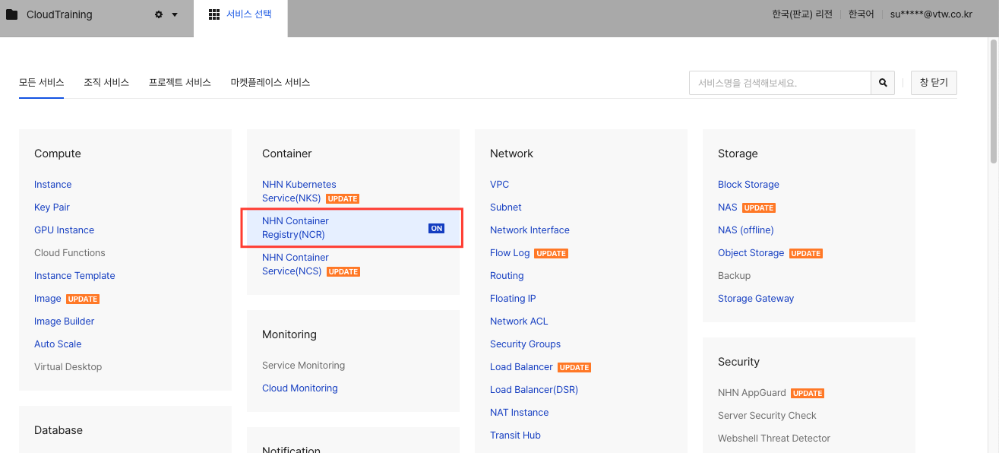
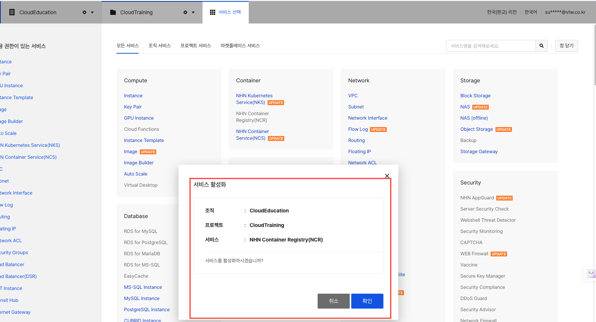
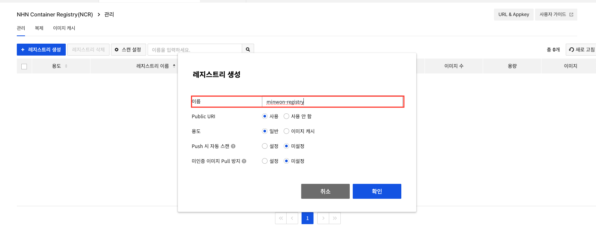
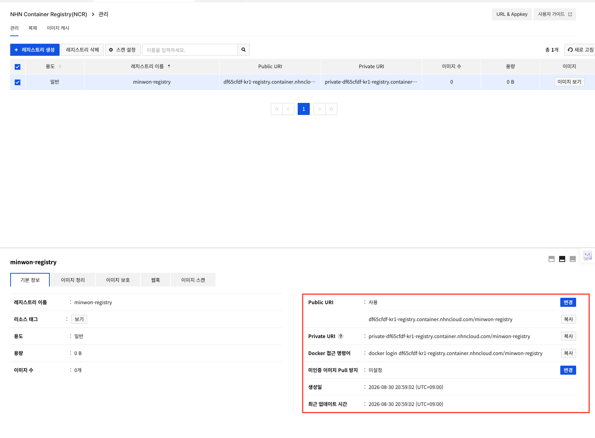

# Day 2 · 1차시 — 수정 버전이 나왔는데 서버마다 환경이 다르다

**소요 시간**: 45분 (10:00~10:45)
**목표**: 어제 방식의 한계를 확인하고, 컨테이너·이미지·레지스트리가 무엇인지 이해한다

---

## 이번 차시에 하는 것

| STEP | 내용 |
|------|------|
| 01 | Docker 설치 |
| 02 | 컨테이너 맛보기 — nginx · httpd 실행 |
| 03 | 나만의 nginx 이미지 만들기 |
| 04 | NCR 서비스 활성화 |
| 05 | 레지스트리 생성 |
| 06 | 레지스트리 접근 정보 확인 |
| 07 | 강사 레지스트리에서 이미지 주소 확인 |

---

## 개념 — 어제 방식에서 생기는 문제

### 새 버전을 배포하면 어떤 일이 생기나요?



| 문제 | 이유 |
|------|------|
| 서버마다 결과가 다르다 | OS 버전, 라이브러리가 서버마다 조금씩 다름 |
| 배포 시간이 서버 수에 비례한다 | 한 대씩 접속해서 같은 작업 반복 |
| 배포 중 서비스가 끊긴다 | 중지 → 교체 → 재시작 사이에 빈 시간 발생 |
| 되돌리기가 어렵다 | 이전 상태가 어떤 모습이었는지 정확히 남아 있지 않음 |
| 서버가 죽으면 사람이 알아채야 한다 | 자동으로 다시 살려주는 장치가 없음 |

!!! warning "\"내 서버에선 되는데요\""
    이 말이 나오는 순간, 실행 환경이 통제되지 않고 있다는 신호입니다.

---

## 개념 — 컨테이너란?

### VM과 컨테이너의 차이



| 비교 항목 | 가상 머신 | 컨테이너 |
|---------|:-------:|:-------:|
| 포함하는 것 | 게스트 OS 전체 + 앱 | 앱 + 필요한 라이브러리만 |
| 시작 속도 | 수 분 (OS 부팅) | 수 초 (프로세스 실행) |
| 크기 | 수 GB | 수십~수백 MB |
| OS 공유 | ❌ 각자 OS 보유 | ✅ 호스트 커널 공유 |

---

## STEP 01 — Docker 설치

App VM 터미널에서 아래 명령을 **순서대로** 실행합니다.

**① Docker 설치**

```bash
curl -fsSL https://get.docker.com | sudo sh
```

설치에 1~2분 소요됩니다.

---

**② 현재 사용자에게 Docker 권한 부여**

```bash
sudo usermod -aG docker $USER
newgrp docker
```

---

**③ 설치 확인**

```bash
docker --version
```

```
Docker version 29.8.0, build 88096ef ← 이렇게 나오면 정상
```

---

## STEP 02 — 컨테이너 맛보기

> 명령어 한 줄이면 서버가 뜹니다. 직접 확인해봅니다.

### nginx 실행

```bash
docker run -d -p 9090:80 --name nginx-test nginx
```

| 옵션 | 의미 |
|------|------|
| `-d` | 백그라운드로 실행 |
| `-p 9090:80` | 호스트 9090포트 → 컨테이너 80포트 연결 |
| `--name nginx-test` | 컨테이너 이름 지정 |
| `nginx` | Docker Hub에서 가져올 이미지 이름 |

처음 실행 시 이미지를 자동으로 다운로드합니다:

```
Unable to find image 'nginx:latest' locally
latest: Pulling from library/nginx
...
Status: Downloaded newer image for nginx:latest
```

---

### 실행 중인 컨테이너 확인

```bash
docker ps
```

```
CONTAINER ID   IMAGE   COMMAND                  CREATED         STATUS         PORTS                  NAMES
a1b2c3d4e5f6   nginx   "/docker-entrypoint.…"   5 seconds ago   Up 4 seconds   0.0.0.0:9090->80/tcp   nginx-test
```

`Up` 상태가 보이면 컨테이너는 정상입니다.

---

### httpd(Apache) 추가 실행

```bash
docker run -d -p 9091:80 --name httpd-test httpd
```

다시 `docker ps`로 두 컨테이너가 동시에 뜬 것을 확인합니다:

```bash
docker ps
```

```
CONTAINER ID   IMAGE   ...   PORTS                  NAMES
b2c3d4e5f6a7   httpd   ...   0.0.0.0:9091->80/tcp   httpd-test
a1b2c3d4e5f6   nginx   ...   0.0.0.0:9090->80/tcp   nginx-test
```

!!! tip "포인트"
    이미지가 다르면 포트만 다르게 지정해서 **같은 서버에서 동시에 여러 서비스**를 실행할 수 있습니다.

---

### 브라우저에서 접속해봅니다

브라우저 주소창에 아래 주소를 입력해봅니다.

```
http://<App-VM-플로팅-IP>:9090
http://<App-VM-플로팅-IP>:9091
```

**접속이 안 됩니다.** 컨테이너는 정상적으로 실행 중인데 왜 안 될까요?

!!! warning "컨테이너는 떴는데 왜 안 열리지?"
    `docker ps`에서 `Up` 상태를 확인했으니 컨테이너 자체는 정상입니다.
    문제는 **NHN Cloud 보안 그룹**이 9090, 9091 포트를 막고 있기 때문입니다.

    클라우드에서는 VM 방화벽(OS)과 별도로 **보안 그룹**이라는 네트워크 레벨 방화벽이 존재합니다.
    허용 규칙을 추가하지 않으면 포트를 열어도 외부에서 접근할 수 없습니다.



**보안 그룹에서 9090, 9091 포트를 허용하면 접속됩니다.**

```
Network > Security Groups > minwon-sg > + 규칙 추가
```

| 방향 | 프로토콜 | 포트 범위 |
|------|---------|---------|
| 수신 | TCP | 9090 |
| 수신 | TCP | 9091 |

규칙 추가 후 브라우저를 새로고침하면 nginx 기본 페이지와 httpd 기본 페이지가 각각 보입니다.

---

### 이미지 목록 확인

```bash
docker images
```

```
REPOSITORY   TAG       IMAGE ID       CREATED        SIZE
httpd        latest    xxxxxxxxxxxx   2 weeks ago    148MB
nginx        latest    xxxxxxxxxxxx   3 weeks ago    192MB
```

수백 MB짜리 웹 서버가 명령어 한 줄로 수 초 만에 실행되었습니다.

---

### 컨테이너 정리

실습이 끝나면 정리합니다.

```bash
docker stop nginx-test httpd-test
docker rm nginx-test httpd-test
```

```bash
docker ps   # 아무것도 안 나오면 정상
```

!!! info "stop vs rm"
    - `stop`: 컨테이너 중지 (이미지는 남아 있음)
    - `rm`: 컨테이너 삭제 (이미지는 남아 있음, `docker images`로 확인 가능)

---

## 개념 — 이미지와 컨테이너

> **이미지** = 붕어빵 **틀** (설계도, 변하지 않음)
> **컨테이너** = 붕어빵 (이미지를 실행한 것, 여러 개 찍어낼 수 있음)



| 개념 | 설명 |
|------|------|
| 이미지 | 변하지 않는 읽기 전용 패키지. 같은 이미지는 어디서나 동일 |
| 컨테이너 | 이미지를 실행한 상태. 여러 개 만들 수 있고 언제든 교체 가능 |
| 태그 | 이미지의 버전 (예: `complaint-app:1.0`, `complaint-app:latest`) |

!!! tip "어제와 달라지는 점"
    - 어제: "서버에 들어가서 파일을 바꿨습니다"
    - 오늘부터: "새 이미지로 컨테이너를 교체합니다"

### 이미지는 층(레이어)으로 쌓여 있어요

```
민원 서비스 앱 코드          ← 자주 바뀌는 층
앱이 쓰는 Python 라이브러리
Python 3.11 런타임
Ubuntu 기본 파일              ← 거의 안 바뀌는 층
```

새 버전을 배포할 때 바뀐 층만 전송하기 때문에 빠릅니다.

---

## STEP 03 — 나만의 nginx 이미지 만들기

> 컨테이너 안에서 직접 파일을 수정하고, 그 상태를 새 이미지로 저장해봅니다.

### ① nginx 컨테이너 실행

```bash
docker run -d -p 9090:80 --name my-nginx nginx
```

---

### ② 컨테이너 안으로 들어가기

```bash
docker exec -it my-nginx bash
```

프롬프트가 `root@컨테이너ID:/#` 로 바뀌면 컨테이너 안에 있는 상태입니다.

---

### ③ 기본 페이지 수정

아래 명령에서 이름 부분만 본인 이름으로 바꿔서 실행합니다:

```bash
echo '<h1>안녕하세요! 홍길동의 민원 서비스입니다</h1>' > /usr/share/nginx/html/index.html
```

잘 저장됐는지 확인합니다:

```bash
cat /usr/share/nginx/html/index.html
```

```
<h1>안녕하세요! 홍길동의 민원 서비스입니다</h1>
```

!!! info "왜 nano 대신 echo를 쓰나요?"
    Docker 컨테이너는 기본적으로 한글 로케일이 설정되어 있지 않아
    nano 같은 편집기에서 한글이 깨져 보입니다.
    `echo`로 직접 파일에 쓰면 이 문제를 피할 수 있습니다.

!!! tip "터미널에 `\354\225\210...` 같은 문자가 보여도 정상입니다"
    컨테이너 터미널은 한글 폰트가 없어서 한글 UTF-8 바이트를 8진수(`\354\225\210` 등)로 표시합니다.
    **파일에는 정상적인 한글이 저장되어 있으며**, 브라우저에서 접속하면 올바르게 보입니다.

---

### ⑤ 컨테이너에서 나오기

```bash
exit
```

---

### ⑥ 컨테이너를 이미지로 저장

```bash
docker commit my-nginx my-nginx-custom:v1
```

| 부분 | 의미 |
|------|------|
| `docker commit` | 컨테이너의 현재 상태를 이미지로 저장하는 명령 |
| `my-nginx` | 저장할 **컨테이너 이름** (방금 실행한 컨테이너) |
| `my-nginx-custom` | 새로 만들 **이미지 이름** |
| `:v1` | 이미지 **태그** (버전 구분용, 생략하면 `:latest`) |

```bash
docker images
```

```
REPOSITORY        TAG      IMAGE ID       CREATED         SIZE
my-nginx-custom   v1       xxxxxxxxxxxx   5 seconds ago   197MB
nginx             latest   xxxxxxxxxxxx   3 weeks ago     192MB
```

`my-nginx-custom:v1` 이미지가 새로 생겼습니다.

!!! tip "docker commit 이란?"
    실행 중인 컨테이너의 **현재 상태를 스냅샷으로 찍어 이미지로 저장**합니다.
    원본 `nginx` 이미지는 그대로이고, 내 변경사항이 담긴 새 이미지가 만들어집니다.

---

### ⑦ 원본 컨테이너 제거 후 새 이미지로 실행

```bash
docker stop my-nginx && docker rm my-nginx
docker run -d -p 9090:80 --name my-nginx-v2 my-nginx-custom:v1
```

브라우저에서 `http://<App-VM-플로팅-IP>:9090` 에 접속하면 내가 수정한 페이지가 보입니다.

!!! success "핵심 확인"
    - 원본 `nginx` 이미지는 변하지 않았습니다
    - `my-nginx-custom:v1` 은 nano + 수정된 index.html이 담긴 **나만의 이미지**입니다
    - 이 이미지를 다른 서버에서 `docker run` 해도 **동일한 페이지**가 뜹니다

---

## 개념 — 레지스트리

> 이미지를 보관하고 꺼내쓰는 **창고**



**NHN Container Registry (NCR)** 가 이 역할을 합니다.

---

## STEP 04 — NCR 서비스 활성화

1. 콘솔 상단 **서비스 선택** 클릭
2. **Container** 분류에서 **NHN Container Registry(NCR)** 클릭


> 📌 위 화면은 참고용입니다. 실제 화면 구성이 다를 수 있으니 **텍스트 지시를 기준으로** 진행하세요.

3. 활성화 확인 팝업에서 **확인** 클릭


> 📌 위 화면은 참고용입니다. 실제 화면 구성이 다를 수 있으니 **텍스트 지시를 기준으로** 진행하세요.

4. 왼쪽 메뉴에 **Container > NHN Container Registry(NCR)** 가 나타나면 완료

---

## STEP 05 — 레지스트리 생성

```
Container > NHN Container Registry(NCR) > + 레지스트리 생성
```

| 항목 | 값 |
|------|---|
| 이름 | `minwon-registry` |
| Public URI | 사용 |
| 용도 | 일반 |


> 📌 위 화면은 참고용입니다. 실제 화면 구성이 다를 수 있으니 **텍스트 지시를 기준으로** 진행하세요.

---

## STEP 06 — 레지스트리 접근 정보 확인

`minwon-registry` 클릭 → **기본 정보** 탭에서 아래 정보를 확인합니다.


> 📌 위 화면은 참고용입니다. 실제 화면 구성이 다를 수 있으니 **텍스트 지시를 기준으로** 진행하세요.

| 항목 | 설명 |
|------|------|
| Public URI | 이미지를 올리고 받을 주소 |
| Docker 접근 명령어 | `docker login` 시 사용할 주소 |

!!! tip "복사 버튼 활용"
    각 항목 옆의 **복사** 버튼을 누르면 클립보드에 바로 복사됩니다.

---

## STEP 07 — 강사 이미지 주소 확인

이번 실습에서는 강사가 미리 만들어 둔 이미지를 사용합니다.

!!! info "이미지 빌드는 이 과정 범위 밖입니다"
    Dockerfile 작성, `docker build`는 다루지 않습니다.
    완성된 민원 서비스 이미지가 강사 레지스트리에 올라가 있습니다.

| 항목 | 값 |
|------|---|
| 이미지 주소 | `43c329ba-kr1-registry.container.nhncloud.com/minwon-registry/complaint-app:latest` |

!!! warning "이미지를 받으려면 로그인이 필요합니다"
    강사에게 받은 아이디/비밀번호로 로그인 후 pull할 수 있습니다.
    (2차시 STEP 03에서 진행합니다)

---

## 1차시 체크포인트

| # | 확인 항목 |
|---|---------|
| ① | 어제 방식에서 서버마다 결과가 달라지는 이유를 말할 수 있다 |
| ② | 이미지와 컨테이너의 차이를 설명할 수 있다 |
| ③ | App VM에 Docker가 설치되었다 (`docker --version` 확인) |
| ④ | nginx · httpd 컨테이너를 실행하고 `docker ps`로 확인했다 |
| ⑤ | `docker commit`으로 나만의 이미지를 만들고 실행했다 |
| ⑥ | NCR 레지스트리가 생성되었다 |
| ⑦ | 강사 이미지 주소를 확인했다 |

---

## 정리 — 어제 vs 오늘

| 상황 | 어제 (VM 방식) | 오늘 (컨테이너 방식) |
|------|-------------|-------------------|
| 앱 설치 | 서버마다 직접 설치 | 이미지에 미리 담겨 있음 |
| 새 버전 배포 | 서버에 접속해 파일 교체 | 새 이미지로 컨테이너 교체 |
| 환경 차이 | 서버마다 달라질 수 있음 | 이미지가 같으면 항상 동일 |
| 되돌리기 | 어렵다 | 이전 이미지 태그로 교체 |

---

**다음 차시**: 준비된 이미지를 직접 받아서 컨테이너로 실행해봅니다.
