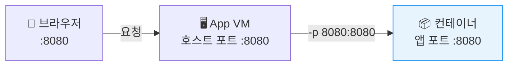
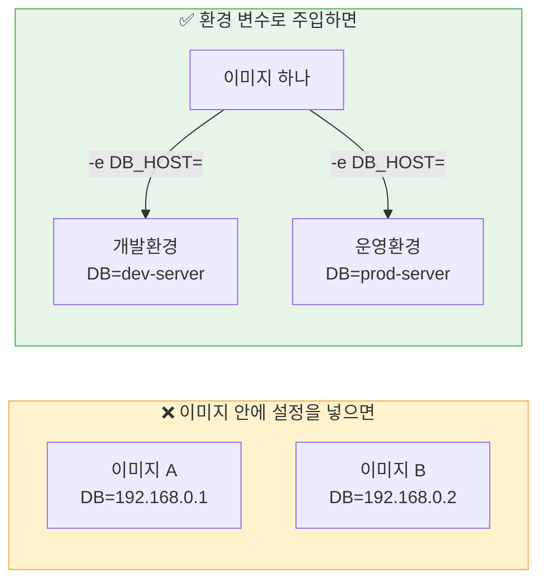

# Day 2 · 2차시 — 같은 민원 서비스를 어디서나 동일하게 실행하라

**소요 시간**: 50분 (11:00~11:50)
**목표**: 준비된 이미지를 컨테이너로 실행하고, 포트와 환경 변수 주입 방식을 이해한다

---

## 이번 차시에 하는 것

| STEP | 내용 |
|------|------|
| 01 | App VM에 SSH 접속 |
| 02 | Docker 설치 |
| 03 | 이미지 Pull & 컨테이너 실행 |
| 04 | 동작 확인 |
| 05 | 컨테이너 삭제 후 재실행 — 상태 관찰 |

---

## 개념 — 컨테이너를 실행할 때 정해야 하는 세 가지

| 결정 사항 | 내용 | 예시 |
|---------|------|------|
| 무엇을 실행할 것인가 | 이미지 이름과 태그 | `complaint-app:latest` |
| 어떤 포트로 들어올 것인가 | 호스트 포트 → 컨테이너 포트 | `80 → 8080` |
| 어떤 설정으로 동작할 것인가 | 환경 변수로 주입 | DB 주소, 계정, 버킷 정보 |

---

## 개념 — 포트 연결 구조



컨테이너는 자기만의 네트워크 공간을 가집니다.
`-p 호스트포트:컨테이너포트` 로 연결해줘야 외부에서 접속할 수 있습니다.

---

## 개념 — 설정을 이미지 밖으로 빼는 이유



!!! tip "핵심"
    이미지는 어디서나 같고, 설정은 환경마다 다르다.

---

## STEP 01 — App VM에 SSH 접속

**① Windows PowerShell 열기**

시작 메뉴에서 **PowerShell** 검색 후 실행

---

**② 키파일 위치 확인**

1일차에서 다운로드한 `nhn-temp-key.pem` 파일 위치를 확인합니다.
보통 `C:\Users\사용자이름\Downloads\` 에 있습니다.

---

**③ SSH 접속**

```powershell
ssh -i C:\Users\사용자이름\Downloads\nhn-temp-key.pem ubuntu@<App-VM-플로팅-IP>
```

!!! warning "App VM 플로팅 IP 확인"
    4차시에서 App VM의 플로팅 IP를 LB로 옮겼습니다.
    접속을 위해 **새 플로팅 IP를 임시로 생성**해서 App VM에 연결하세요.

    `Compute > Instance > minwon-app-01 체크 > 플로팅 IP 관리 > 생성 후 연결`

처음 접속 시 아래 메시지가 나오면 `yes` 입력 후 Enter:
```
Are you sure you want to continue connecting? yes
```

`ubuntu@minwon-app-01:~$` 가 보이면 접속 성공입니다.

---

## STEP 02 — Docker 설치

App VM 터미널에서 아래 명령을 **순서대로** 실행합니다.

**① Docker 설치**

```bash
curl -fsSL https://get.docker.com | sudo sh
```

설치에 1~2분 소요됩니다.

---

**② 현재 사용자에게 Docker 권한 부여**

```bash
sudo usermod -aG docker $USER
newgrp docker
```

---

**③ 설치 확인**

```bash
docker --version
```

```
Docker version 24.x.x ← 이렇게 나오면 정상
```

---

## STEP 03 — 이미지 Pull & 컨테이너 실행

### 3-1. 이미지 받기

로그인 없이 바로 Pull 가능합니다.

```bash
docker pull 43c329ba-kr1-registry.container.nhncloud.com/minwon-registry/complaint-app:latest
```

레이어를 다운로드하는 메시지가 나오고 `Pull complete` 가 보이면 완료입니다.

---

### 3-2. 컨테이너 실행

1일차에서 이미 `.env` 파일을 만들어뒀습니다. 그 파일을 그대로 사용하면 됩니다.

```bash
docker run -d \
  --name complaint-app \
  -p 8080:8080 \
  --env-file /opt/complaint-app/.env \
  43c329ba-kr1-registry.container.nhncloud.com/minwon-registry/complaint-app:latest
```

`--env-file` 은 `.env` 파일 안의 모든 설정값을 컨테이너에 한 번에 주입합니다.
DB 주소, Object Storage 정보 등을 따로 입력할 필요가 없어요.

!!! info ".env 파일 내용 확인하고 싶다면"
    ```bash
    cat /opt/complaint-app/.env
    ```

컨테이너 ID(긴 문자열)가 출력되면 정상 실행된 것입니다.

---

## STEP 04 — 동작 확인

**① 컨테이너 실행 상태 확인**

```bash
docker ps
```

```
CONTAINER ID   IMAGE             STATUS         PORTS
abc123...      complaint-app     Up 10 seconds  0.0.0.0:8080->8080/tcp
```

`Up` 상태가 보이면 정상입니다.

---

**② 앱 응답 확인**

```bash
curl http://localhost:8080/health
```

```json
{"status": "ok"} ← 정상
```

---

**③ 로그 확인**

```bash
docker logs complaint-app
```

오류 메시지 없이 `Running on ...` 이 보이면 성공입니다.

---

**④ 브라우저에서 접속**

```
http://<App-VM-플로팅-IP>:8080
```

1일차 민원 데이터가 그대로 보이면 완벽합니다.

!!! warning "접속이 안 된다면"
    App 보안 그룹에서 **8080 포트**가 열려 있는지 확인하세요.
    `Network > Security Groups > minwon-sg-app > 규칙 확인`

---

## STEP 05 — 컨테이너 삭제 후 재실행 관찰

컨테이너를 지우면 **컨테이너 안의 데이터는 사라지지만, DB와 Object Storage는 그대로**임을 확인합니다.

### 5-1. 컨테이너 안에 파일 만들기

```bash
docker exec complaint-app touch /tmp/my-test-file.txt
docker exec complaint-app ls /tmp/
# my-test-file.txt ← 존재함
```

### 5-2. 컨테이너 삭제

```bash
docker rm -f complaint-app
```

### 5-3. 같은 명령으로 다시 실행

```bash
docker run -d \
  --name complaint-app \
  -p 8080:8080 \
  --env-file /opt/complaint-app/.env \
  43c329ba-kr1-registry.container.nhncloud.com/minwon-registry/complaint-app:latest
```

### 5-4. 결과 확인

```bash
# 아까 만든 파일이 사라졌는가?
docker exec complaint-app ls /tmp/
# (파일 없음) ← 컨테이너가 새로 만들어졌기 때문

# DB의 민원 데이터는 남아 있는가?
curl http://localhost:8080/health
# {"status": "ok"} ← 앱은 정상, 데이터도 그대로
```

| 관찰 항목 | 결과 | 이유 |
|---------|------|------|
| 컨테이너 안 파일 | **사라짐** | 컨테이너는 새로 만들어진 것 |
| DB의 민원 데이터 | **그대로** | DB는 컨테이너 밖(VM)에 있음 |
| Object Storage 첨부파일 | **그대로** | Object Storage는 컨테이너 밖 |

!!! tip "핵심"
    컨테이너는 언제든 사라질 수 있다고 가정하고 설계한다.
    저장해야 하는 것은 모두 컨테이너 밖(DB, Object Storage)에 두어야 한다.

---

## 2차시 체크포인트

| # | 확인 항목 | 확인 방법 |
|---|---------|---------|
| ① | Docker가 설치되었다 | `docker --version` |
| ② | 이미지가 Pull 되었다 | `docker images` |
| ③ | 컨테이너가 실행 중이다 | `docker ps` |
| ④ | 브라우저에서 민원 서비스가 접속된다 | 브라우저 확인 |
| ⑤ | 컨테이너를 지워도 DB 데이터는 남는다 | 재실행 후 데이터 확인 |

---

**다음 차시**: 컨테이너가 여러 개가 되면 누가 관리할까요? Kubernetes로 넘어갑니다.
