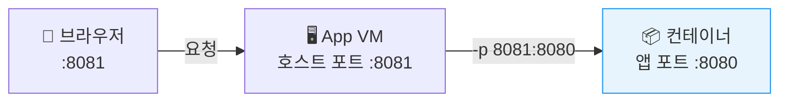
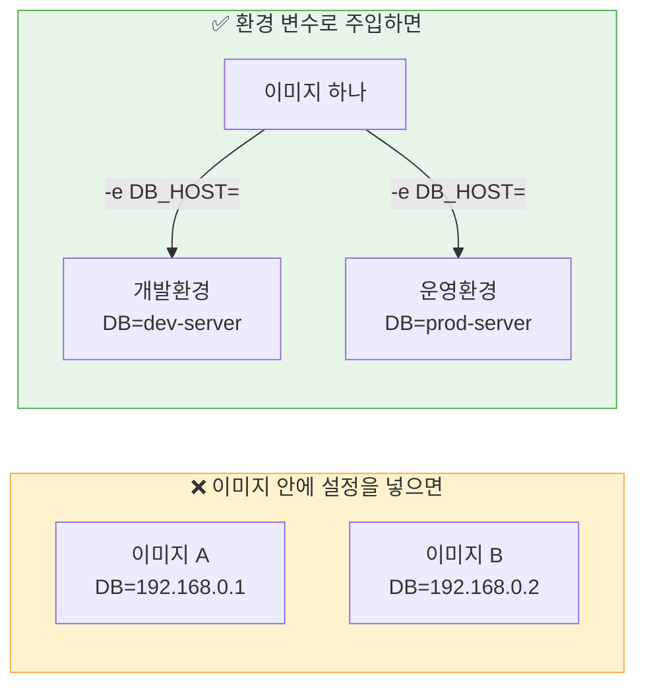
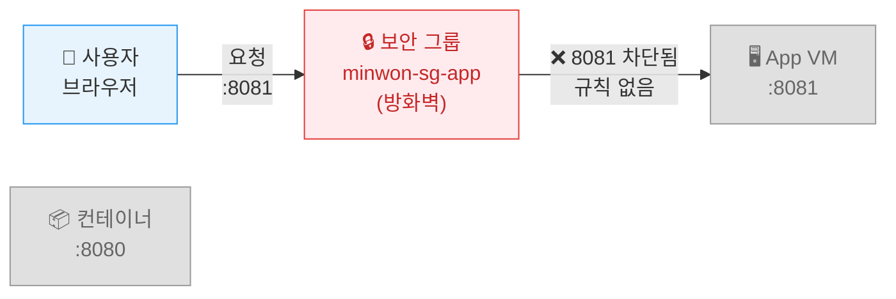
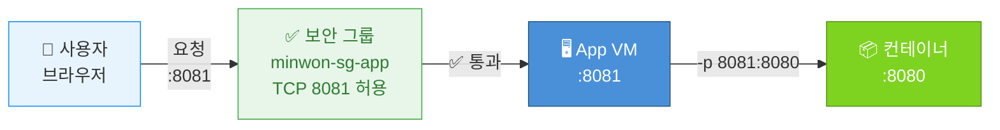
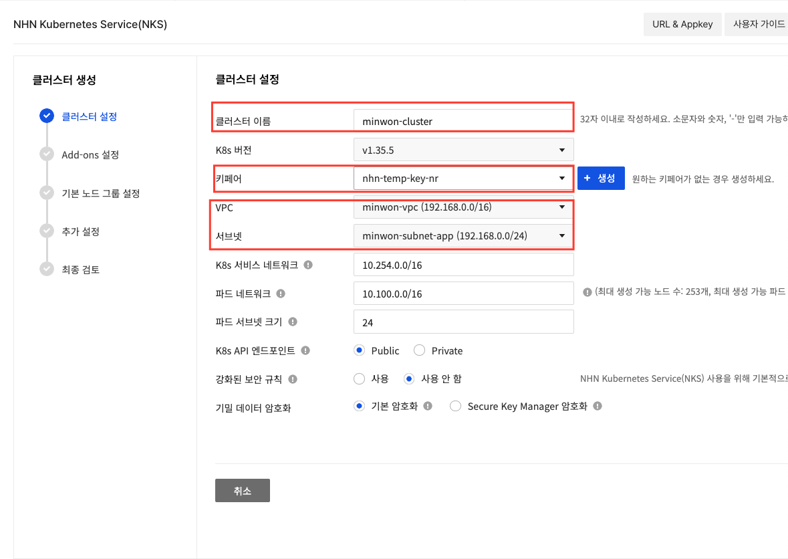

# Day 2 · 2차시 — 같은 민원 서비스를 어디서나 동일하게 실행하라

**소요 시간**: 45분 (10:45~11:30)
**목표**: 준비된 이미지를 컨테이너로 실행하고, 포트와 환경 변수 주입 방식을 이해한다

---

## 이번 차시에 하는 것

| STEP | 내용 |
|------|------|
| 01 | App VM에 SSH 접속 |
| 02 | Docker 설치 |
| 03 | NCR 로그인 |
| 04 | 강사 이미지 주소 확인 |
| 05 | 이미지 Pull & 컨테이너 실행 |
| 06 | 보안 그룹 8081 포트 오픈 |
| 07 | 동작 확인 |
| 08 | 컨테이너 삭제 후 재실행 — 상태 관찰 |

---

## 개념 — 컨테이너를 실행할 때 정해야 하는 세 가지

| 결정 사항 | 내용 | 예시 |
|---------|------|------|
| 무엇을 실행할 것인가 | 이미지 이름과 태그 | `complaint-app:latest` |
| 어떤 포트로 들어올 것인가 | 호스트 포트 → 컨테이너 포트 | `8081 → 8080` |
| 어떤 설정으로 동작할 것인가 | 환경 변수로 주입 | DB 주소, 계정, 버킷 정보 |

---

## 개념 — 포트 연결 구조



컨테이너는 자기만의 네트워크 공간을 가집니다.
`-p 호스트포트:컨테이너포트` 로 연결해줘야 외부에서 접속할 수 있습니다.

---

## 개념 — 설정을 이미지 밖으로 빼는 이유



!!! tip "핵심"
    이미지는 어디서나 같고, 설정은 환경마다 다르다.

---

## STEP 01 — App VM에 SSH 접속

**① Windows PowerShell 열기**

시작 메뉴에서 **PowerShell** 검색 후 실행

---

**② 키파일 위치 확인**

1일차에서 다운로드한 `nhn-temp-key.pem` 파일 위치를 확인합니다.
보통 `C:\Users\사용자이름\Downloads\` 에 있습니다.

---

**③ SSH 접속**

```powershell
ssh -i C:\Users\사용자이름\Downloads\nhn-temp-key.pem ubuntu@<App-VM-플로팅-IP>
```

!!! warning "App VM 플로팅 IP 확인"
    4차시에서 App VM의 플로팅 IP를 LB로 옮겼습니다.
    접속을 위해 **새 플로팅 IP를 임시로 생성**해서 App VM에 연결하세요.

    `Compute > Instance > minwon-app-01 체크 > 플로팅 IP 관리 > 생성 후 연결`

처음 접속 시 아래 메시지가 나오면 `yes` 입력 후 Enter:
```
Are you sure you want to continue connecting? yes
```

`ubuntu@minwon-app-01:~$` 가 보이면 접속 성공입니다.

---

## STEP 02 — Docker 설치

App VM 터미널에서 아래 명령을 **순서대로** 실행합니다.

**① Docker 설치**

```bash
curl -fsSL https://get.docker.com | sudo sh
```

설치에 1~2분 소요됩니다.

---

**② 현재 사용자에게 Docker 권한 부여**

```bash
sudo usermod -aG docker $USER
newgrp docker
```

---

**③ 설치 확인**

```bash
docker --version
```

```
Docker version 29.8.0, build 88096ef ← 이렇게 나오면 정상
```

---

## STEP 03 — NCR 로그인

강사에게 받은 아이디와 비밀번호로 로그인합니다.

```bash
docker login 43c329ba-kr1-registry.container.nhncloud.com
```

```
Username: (강사 제공)
Password: (강사 제공)
```

`Login Succeeded` 가 나오면 성공입니다.

---

## STEP 04 — 강사 이미지 주소 확인

이번 실습에서는 강사가 미리 만들어 둔 이미지를 사용합니다.

!!! info "이미지 빌드는 이 과정 범위 밖입니다"
    Dockerfile 작성, `docker build` 는 다루지 않습니다.
    완성된 민원 서비스 이미지가 강사 레지스트리에 올라가 있습니다.

이미지 전체 주소는 아래와 같습니다.

```
43c329ba-kr1-registry.container.nhncloud.com/minwon-registry/complaint-app:latest
```

이 주소를 가져오려면 로그인이 필요합니다 (STEP 03에서 완료했습니다).

---

## STEP 05 — 이미지 Pull & 컨테이너 실행

### 5-1. 이미지 받기

```bash
docker pull 43c329ba-kr1-registry.container.nhncloud.com/minwon-registry/complaint-app:latest
```

레이어를 다운로드하는 메시지가 나오고 `Pull complete` 가 보이면 완료입니다.

아래 명령으로 이미지가 정상적으로 받아졌는지 확인합니다.

```bash
docker images
```

```
REPOSITORY                                                               TAG      IMAGE ID       SIZE
43c329ba-kr1-registry.container.nhncloud.com/minwon-registry/complaint-app   latest   abc123...   150MB
```

목록에 이미지가 보이면 정상입니다.

---

### 5-2. 컨테이너 실행

1일차에서 이미 `.env` 파일을 만들어뒀습니다. 그 파일을 그대로 사용하면 됩니다.

!!! info "포트를 8081로 쓰는 이유"
    1일차에 설치한 민원 앱 서비스(`complaint-app`)가 이미 **8080 포트**를 점유하고 있습니다.
    Docker 컨테이너는 호스트 포트 **8081**로 띄워서 충돌을 피합니다.
    (`-p 8081:8080` = 호스트 8081 → 컨테이너 8080)

```bash
docker run -d \
  --name complaint-app \
  -p 8081:8080 \
  --env-file /opt/complaint-app/.env \
  43c329ba-kr1-registry.container.nhncloud.com/minwon-registry/complaint-app:latest
```

`--env-file` 은 `.env` 파일 안의 모든 설정값을 컨테이너에 한 번에 주입합니다.
DB 주소, Object Storage 정보 등을 따로 입력할 필요가 없어요.

!!! info ".env 파일 내용 확인하고 싶다면"
    ```bash
    cat /opt/complaint-app/.env
    ```

컨테이너 ID(긴 문자열)가 출력되면 정상 실행된 것입니다.

---

## STEP 06 — 보안 그룹 8081 포트 오픈

컨테이너는 실행됐지만 외부에서 접속하려면 **보안 그룹(방화벽)이 8081 포트를 허용**해야 합니다.



8081 규칙을 추가하면:



**보안 그룹에 8081 규칙 추가**

```
Network > Security Groups > minwon-sg-app
→ 규칙 관리 > 규칙 추가
```

| 항목 | 값 |
|------|---|
| 방향 | 수신 |
| 프로토콜 | TCP |
| 포트 | 8081 |
| CIDR | 0.0.0.0/0 |

---

## STEP 07 — 동작 확인

**① 컨테이너 실행 상태 확인**

```bash
docker ps
```

```
CONTAINER ID   IMAGE             STATUS         PORTS
abc123...      complaint-app     Up 10 seconds  0.0.0.0:8081->8080/tcp
```

`Up` 상태가 보이면 정상입니다.

---

**② 앱 응답 확인**

```bash
curl http://localhost:8081/health
```

```json
{"status": "ok"} ← 정상
```

---

**③ 로그 확인**

```bash
docker logs complaint-app
```

오류 메시지 없이 `Running on ...` 이 보이면 성공입니다.

---

**④ 브라우저에서 접속**

```
http://<App-VM-플로팅-IP>:8081
```

1일차 민원 데이터가 그대로 보이면 완벽합니다.

!!! warning "접속이 안 된다면"
    App 보안 그룹에서 **8081 포트**가 열려 있는지 확인하세요.
    `Network > Security Groups > minwon-sg-app > 수신 TCP 8081 규칙 추가`

---

## STEP 08 — 컨테이너 삭제 후 재실행 관찰

컨테이너를 지우면 **컨테이너 안의 데이터는 사라지지만, DB와 Object Storage는 그대로**임을 확인합니다.

### 8-1. 컨테이너 안에 파일 만들기

```bash
docker exec complaint-app touch /tmp/my-test-file.txt
docker exec complaint-app ls /tmp/
# my-test-file.txt ← 존재함
```

### 8-2. 컨테이너 삭제

```bash
docker rm -f complaint-app
```

### 8-3. 같은 명령으로 다시 실행

```bash
docker run -d \
  --name complaint-app \
  -p 8081:8080 \
  --env-file /opt/complaint-app/.env \
  43c329ba-kr1-registry.container.nhncloud.com/minwon-registry/complaint-app:latest
```

### 8-4. 결과 확인

```bash
# 아까 만든 파일이 사라졌는가?
docker exec complaint-app ls /tmp/
# (파일 없음) ← 컨테이너가 새로 만들어졌기 때문

# DB의 민원 데이터는 남아 있는가?
curl http://localhost:8081/health
# {"status": "ok"} ← 앱은 정상, 데이터도 그대로
```

| 관찰 항목 | 결과 | 이유 |
|---------|------|------|
| 컨테이너 안 파일 | **사라짐** | 컨테이너는 새로 만들어진 것 |
| DB의 민원 데이터 | **그대로** | DB는 컨테이너 밖(VM)에 있음 |
| Object Storage 첨부파일 | **그대로** | Object Storage는 컨테이너 밖 |

!!! tip "핵심"
    컨테이너는 언제든 사라질 수 있다고 가정하고 설계한다.
    저장해야 하는 것은 모두 컨테이너 밖(DB, Object Storage)에 두어야 한다.

---

## 2차시 체크포인트

| # | 확인 항목 | 확인 방법 |
|---|---------|---------|
| ① | Docker가 설치되었다 | `docker --version` |
| ② | 이미지가 Pull 되었다 | `docker images` |
| ③ | 컨테이너가 실행 중이다 | `docker ps` |
| ④ | 브라우저에서 민원 서비스가 접속된다 | 브라우저 확인 |
| ⑤ | 컨테이너를 지워도 DB 데이터는 남는다 | 재실행 후 데이터 확인 |

---

## 🕐 2차시 마무리 — NKS 클러스터 미리 생성하기

2차시 실습이 끝났다면 **지금 바로 NKS 클러스터 생성을 시작하세요.**

!!! tip "왜 지금 만드나요?"
    NKS 클러스터 생성은 **약 10분** 소요됩니다.
    3차시가 시작되면 강사가 Kubernetes 개념을 설명하는 동안
    클러스터가 백그라운드에서 만들어집니다.
    설명이 끝났을 때 클러스터가 이미 완성되어 있으면 바로 실습에 들어갈 수 있습니다.

**생성 경로**

```
Containers > NHN Kubernetes Service(NKS) > + 클러스터 생성
```

설정값은 아래와 같이 입력합니다.

| 항목 | 값 |
|------|---|
| 클러스터 이름 | `minwon-cluster` |
| Kubernetes 버전 | `v1.35.5` |
| 키페어 | 1일차와 동일한 키페어 |
| VPC | `minwon-vpc` |
| 서브넷 | `minwon-subnet-app` |
| K8s API 엔드포인트 | Public |
| 강화된 보안 규칙 | 사용 안 함 |



**다음** 클릭 → **Add-ons 설정** 기본값 그대로 **다음** 클릭

**기본 노드 그룹 설정** (아래 항목만 변경, 나머지는 기본값)

| 항목 | 값 | 비고 |
|------|---|------|
| 이미지 | `Ubuntu Server 22.04 LTS` | |
| 인스턴스 타입 | `c2.m4` | 기본값에서 변경 |
| 루트 블록 스토리지 | HDD **50GB** | 기본값(20GB)에서 변경 |
| 키페어 | 1일차와 동일한 키페어 | |

!!! warning "인스턴스 타입과 블록 스토리지는 반드시 변경하세요"
    기본값으로 두면 실습 중 리소스 부족이 발생할 수 있습니다.

**다음** 클릭 → **추가 설정** 기본값 그대로 **다음** 클릭 → **최종 검토** 확인 후 **생성** 클릭

생성 버튼을 누른 후 상태가 **`CREATE_IN_PROGRESS`** 로 바뀌면 정상입니다.
그 상태로 두고 3차시 강의를 들으면 됩니다.

!!! info "클러스터 생성에는 약 10분이 소요됩니다"
    상태가 `CREATE_COMPLETE`가 될 때까지 기다립니다.
    3차시에서 강사가 Kubernetes 개념을 설명하는 동안 백그라운드에서 만들어집니다.

!!! tip "노드는 결국 인스턴스"
    노드 그룹 설정은 1일차에서 만든 App VM과 똑같은 개념입니다.
    이미지, 인스턴스 타입, 키페어, 블록 스토리지 — 모두 익숙한 설정입니다.

---

**다음 차시**: 컨테이너가 여러 개가 되면 누가 관리할까요? Kubernetes로 넘어갑니다.
