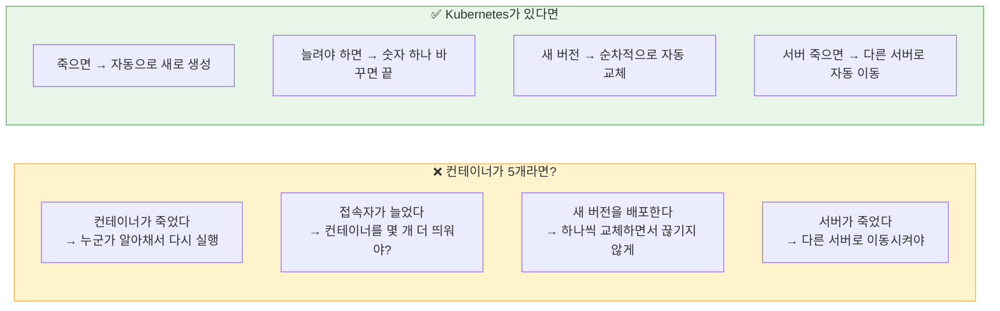
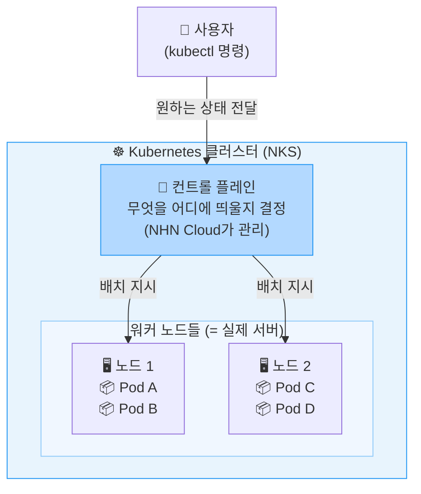
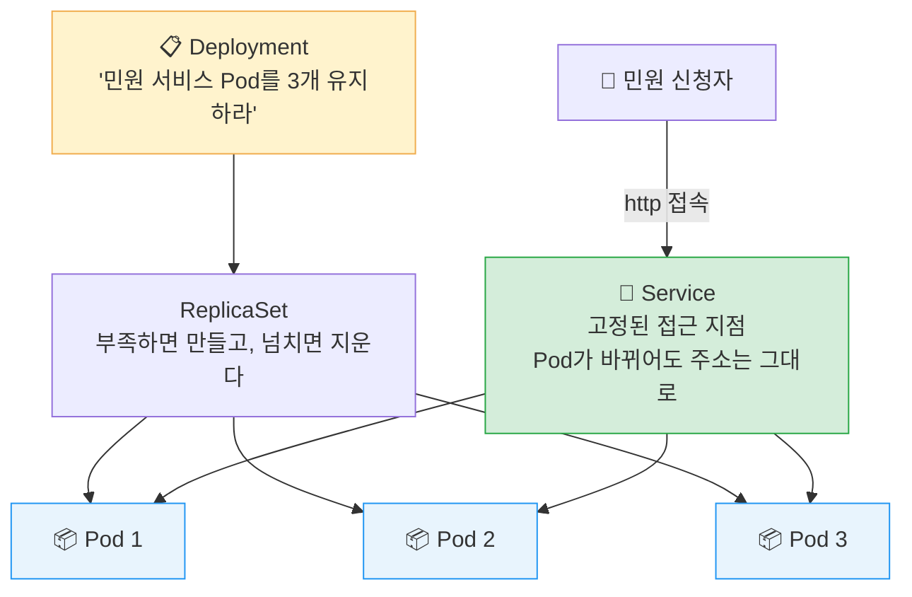

# Day 2 · 3차시 — 컨테이너가 많아지면 누가 관리하지?

**소요 시간**: 50분 (13:00~13:50)
**목표**: Kubernetes의 구조를 이해하고, NKS 클러스터를 생성해 kubectl로 연결한다

---

## 이번 차시에 하는 것

| STEP | 내용 |
|------|------|
| 01 | NKS 서비스 활성화 & 클러스터 생성 |
| 02 | App VM SSH 접속 및 kubectl 확인 |
| 03 | kubeconfig 적용 |
| 04 | 클러스터 연결 확인 |

!!! info "kubectl은 App VM에서 실행합니다"
    2차시에서 접속했던 App VM(Ubuntu)에 kubectl을 설치합니다.
    내 PC에 별도 프로그램을 설치할 필요가 없습니다.

---

## 개념 — 왜 Kubernetes가 필요한가

컨테이너가 여러 개가 되면 사람이 해야 할 일이 폭발적으로 늘어납니다.



---

## 개념 — 클러스터 구조



| 구성 요소 | 역할 | 1일차 대응 개념 |
|---------|------|--------------|
| 컨트롤 플레인 | 전체 관리 — 무엇을 어디에 띄울지 결정 | 운영자의 판단 |
| 노드 | 컨테이너가 실제로 실행되는 서버 | App VM |
| Pod | 컨테이너를 담는 최소 단위 | App VM 위의 프로세스 |

---

## 개념 — Pod / Deployment / Service



| 개념 | 설명 | 비유 |
|------|------|------|
| **Pod** | 컨테이너를 담는 가장 작은 배포 단위 | 붕어빵 한 개 |
| **Deployment** | 몇 개를 어떤 이미지로 유지할지 선언 | "붕어빵 항상 3개 있어야 해" |
| **Service** | 변하지 않는 접근 지점, 정상 Pod로 분산 | 가게 입구 (안에 직원이 바뀌어도 입구는 같음) |

---

## 개념 — NKS란?

NKS(NHN Kubernetes Service)는 NHN Cloud가 제공하는 **관리형 Kubernetes**입니다.

| 관리 주체 | 담당 영역 |
|---------|---------|
| **NHN Cloud** | 컨트롤 플레인 (설치·구성·운영·고가용성 보장) |
| **내가 할 일** | 노드 사양/수, 앱 배포, 복제본 수 |

복잡한 Kubernetes 설치 없이, 콘솔에서 몇 가지 선택만 하면 클러스터가 생깁니다.

---

## STEP 01 — NKS 클러스터 생성

!!! info "NKS는 별도 활성화가 필요 없습니다"
    NHN Cloud에서 NKS는 기본 인프라에 포함되어 있습니다.
    서비스 활성화 없이 바로 `Containers > NHN Kubernetes Service(NKS)` 에서 클러스터를 생성할 수 있습니다.

### 1-1. 클러스터 생성

```
Containers > NHN Kubernetes Service(NKS) > + 클러스터 생성
```

**클러스터 기본 설정**

| 항목 | 값 |
|------|---|
| 클러스터 이름 | `minwon-cluster` |
| Kubernetes 버전 | `v1.35.5` |
| 키페어 | 1일차와 동일한 키페어 |
| VPC | `minwon-vpc` |
| 서브넷 | `minwon-subnet-app` |
| K8s API 엔드포인트 | Public |
| 강화된 보안 규칙 | 사용 안 함 |
| 기밀 데이터 암호화 | 기본 암호화 |


**기본 노드 그룹 설정**

| 항목 | 값 |
|------|---|
| 이미지 | Ubuntu Server 22.04 LTS |
| 가용성 영역 | 한국(판교) |
| 인스턴스 타입 | `m2.c2m4` (2 vCPU, 4GB RAM) |
| 노드 수 | 2 |
| 키페어 | 1일차와 동일한 키페어 |
| 블록 스토리지 | HDD 20GB |

**생성** 버튼 클릭

!!! info "클러스터 생성에는 약 10분이 소요됩니다"
    상태가 `CREATE_COMPLETE`가 될 때까지 기다립니다.
    기다리는 동안 STEP 02를 먼저 진행할 수 있습니다.

!!! tip "노드는 결국 인스턴스"
    노드 그룹 설정은 1일차에서 만든 App VM과 똑같은 개념입니다.
    이미지, 인스턴스 타입, 키페어, 블록 스토리지 — 모두 익숙한 설정입니다.

---

## STEP 02 — App VM SSH 접속

kubectl은 App VM 생성 시 사용자 스크립트로 자동 설치되어 있습니다.
PowerShell을 열고 App VM에 접속합니다.

```powershell
ssh -i C:\Users\사용자이름\Downloads\nhn-temp-key.pem ubuntu@<App-VM-플로팅-IP>
```

접속 후 설치 여부를 확인합니다.

```bash
kubectl version --client
```

```
Client Version: v1.x.x  ← 이렇게 나오면 정상
```

!!! info "kubectl이 없다고 나온다면"
    사용자 스크립트 실행 중 네트워크 문제로 설치가 실패했을 수 있습니다.
    아래 명령으로 수동 설치하세요.
    ```bash
    curl -LO "https://dl.k8s.io/release/$(curl -Ls https://dl.k8s.io/release/stable.txt)/bin/linux/amd64/kubectl"
    chmod +x kubectl && sudo mv kubectl /usr/local/bin/
    ```

---

## STEP 03 — kubeconfig 적용

kubeconfig는 **클러스터에 접근하기 위한 인증 정보**가 담긴 파일입니다.

### 3-1. 콘솔에서 kubeconfig 내용 확인

```
Containers > NHN Kubernetes Service(NKS) > [minwon-cluster]
→ 기본 정보 탭 > 설정 파일 다운로드 버튼 클릭
```

다운로드된 파일을 **메모장(Notepad)**으로 엽니다.
`Ctrl+A` → `Ctrl+C` 로 전체 내용을 복사합니다.

---

### 3-2. App VM에 kubeconfig 파일 생성

App VM 터미널에서 아래 명령을 입력합니다.

```bash
mkdir -p ~/.kube
cat > ~/.kube/config << 'KUBECONFIG_EOF'
```

엔터를 누른 뒤, **복사해 둔 kubeconfig 내용을 붙여넣기** 합니다.

마지막 줄에 아래를 입력하고 엔터:

```
KUBECONFIG_EOF
```

---

### 3-3. 파일 권한 설정

```bash
chmod 600 ~/.kube/config
```

---

## STEP 04 — 클러스터 연결 확인

NKS 클러스터 상태가 `CREATE_COMPLETE`인지 먼저 확인하세요.

**① 클러스터 기본 정보 확인**

```bash
kubectl cluster-info
```

```
Kubernetes control plane is running at https://...  ← 이렇게 나오면 성공
```

---

**② 노드 목록 확인**

```bash
kubectl get nodes
```

```
NAME           STATUS   ROLES    AGE
node-xxxxx     Ready    <none>   5m
node-yyyyy     Ready    <none>   5m
```

모든 노드가 `Ready` 상태이면 준비 완료입니다.

---

**③ 시스템 Pod 확인**

```bash
kubectl get pods -A
```

kube-system 네임스페이스의 Pod들이 `Running` 상태이면 정상입니다.

---

## 3차시 체크포인트

| # | 확인 항목 | 확인 방법 |
|---|---------|---------|
| ① | NKS 클러스터가 `CREATE_COMPLETE` 상태다 | 콘솔 > NKS 목록 |
| ② | App VM에 kubectl이 설치되었다 | `kubectl version --client` |
| ③ | kubeconfig가 적용되었다 | `kubectl cluster-info` |
| ④ | 노드가 `Ready` 상태다 | `kubectl get nodes` |

---

## 핵심 개념 정리

| 용어 | 한 문장 정의 |
|------|-----------|
| Cluster | Kubernetes가 관리하는 전체 묶음 |
| Control Plane | 무엇을 어디에 띄울지 결정하고 상태를 유지 |
| Node | 실제로 컨테이너가 실행되는 서버 |
| Pod | 컨테이너를 담는 가장 작은 배포 단위 |
| Deployment | 몇 개를 어떤 이미지로 유지할지 선언 |
| Service | 변하지 않는 접근 지점, 정상 Pod로 분산 |

---

**다음 차시**: 1일차 DB와 Object Storage를 연결해 Pod로 민원 서비스를 배포합니다.
