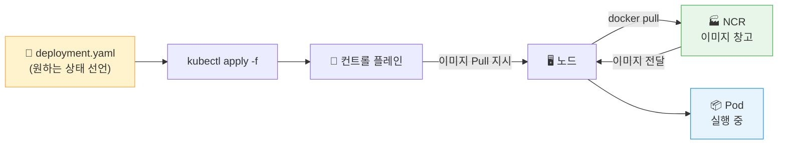
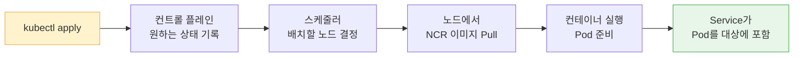

# Day 2 · 4차시 — 기존 DB를 유지한 채 서비스를 배포하라

**소요 시간**: 50분 (14:00~14:50)
**목표**: NCR 인증 Secret을 만들고, DB 연결 정보를 주입해 Pod에서 1일차 DB와 연결한다

---

## 이번 차시에 하는 것

| STEP | 내용 |
|------|------|
| 01 | NCR 이미지 Pull Secret 생성 |
| 02 | deployment.yaml 값 수정 |
| 03 | 배포 적용 (`kubectl apply`) |
| 04 | Pod 정상 실행 확인 |
| 05 | 브라우저에서 기존 데이터 연결 확인 |

!!! info "모든 명령은 App VM 터미널에서 실행합니다"
    3차시에서 접속해 둔 App VM SSH 터미널을 그대로 사용합니다.

---

## 개념 — Secret으로 연결 정보를 분리하는 이유

| 방식 | 문제 |
|------|------|
| YAML에 직접 작성 | 파일을 보는 모든 사람이 비밀번호를 알게 됨 |
| 이미지 안에 포함 | 이미지를 Pull하면 비밀번호가 노출됨 |
| **Secret으로 분리** | 배포 정의와 비밀 값을 따로 관리 가능 |

DB 비밀번호가 바뀌어도 이미지를 다시 만들 필요 없이 **Secret 값만 교체**하면 됩니다.

---

## 개념 — kubectl apply 흐름



---

## STEP 01 — NCR 이미지 Pull Secret 생성

Kubernetes 노드가 NCR에서 이미지를 받아오려면 **로그인 정보**가 필요합니다.
이 정보를 Secret으로 저장해 둡니다.

App VM 터미널에서 아래 명령을 실행합니다.
`(강사 제공)` 부분을 강사에게 받은 아이디/비밀번호로 교체하세요.

```bash
kubectl create secret docker-registry ncr-secret \
  --docker-server=43c329ba-kr1-registry.container.nhncloud.com \
  --docker-username=(강사 제공 아이디) \
  --docker-password=(강사 제공 비밀번호)
```

!!! tip "한 줄로 입력해도 됩니다"
    줄바꿈(\)이 불편하다면 아래처럼 한 줄로 입력하세요.
    ```bash
    kubectl create secret docker-registry ncr-secret --docker-server=43c329ba-kr1-registry.container.nhncloud.com --docker-username=(강사 제공 아이디) --docker-password=(강사 제공 비밀번호)
    ```

생성 확인:

```bash
kubectl get secrets
```

```
NAME           TYPE                             DATA   AGE
ncr-secret     kubernetes.io/dockerconfigjson   1      10s
```

`ncr-secret` 이 보이면 성공입니다.

---

## STEP 02 — deployment.yaml 값 수정

레포지토리에 준비된 YAML 파일을 받아서 값을 수정합니다.

### 2-1. 레포지토리 clone

```bash
git clone https://github.com/skilleat-labs/cloud-native-minwon-lab.git
cd cloud-native-minwon-lab
```

이미 clone이 되어 있다면:

```bash
cd cloud-native-minwon-lab
git pull
```

---

### 2-2. DB VM 사설 IP 확인

1일차 DB VM(`minwon-db-01`)의 **사설 IP**가 필요합니다.

```
콘솔 > Compute > Instance > minwon-db-01 클릭 > 기본 정보 탭 > IP 주소
```

예: `192.168.0.20` (본인 값으로 확인)

---

### 2-3. deployment.yaml 수정

아래 명령에서 `여기에DB사설IP입력` 을 **본인 DB VM의 사설 IP로 바꾼 뒤** 실행합니다.

```bash
sed -i 's|192.168.0.20|여기에DB사설IP입력|g' app/deployment.yaml
```

예시 (DB IP가 192.168.0.15인 경우):

```bash
sed -i 's|192.168.0.20|192.168.0.15|g' app/deployment.yaml
```

---

### 2-4. imagePullSecrets 추가

Kubernetes가 NCR에서 이미지를 받을 때 아까 만든 Secret을 사용하도록 설정합니다.

아래 명령을 **그대로** 실행합니다.

```bash
sed -i '/      containers:/i\      imagePullSecrets:\n      - name: ncr-secret' app/deployment.yaml
```

---

### 2-5. 수정 결과 확인

```bash
cat app/deployment.yaml
```

아래 세 곳이 올바르게 바뀌어 있는지 확인합니다.

| 확인 항목 | 올바른 값 |
|---------|---------|
| `DB_HOST` | 본인 DB VM 사설 IP |
| `image:` | `43c329ba-kr1-registry.container.nhncloud.com/minwon-registry/complaint-app:latest` |
| `imagePullSecrets:` | `- name: ncr-secret` 포함 |

---

## STEP 03 — 배포 적용

```bash
kubectl apply -f app/deployment.yaml
```

아래와 같이 출력되면 정상입니다.

```
secret/complaint-db-secret created
deployment.apps/complaint-app created
service/complaint-service created
```

### 배포 순서



---

## STEP 03-1 — Object Storage 연결 (선택)

1일차에서 Object Storage를 설정한 경우, 배포 직후 아래 명령으로 Secret에 추가합니다.

아래 명령을 **그대로 복사해서 실행**하면 됩니다.

```bash
source /opt/complaint-app/.env

kubectl patch secret complaint-db-secret --type=merge -p "{
  \"stringData\": {
    \"OBJECT_STORAGE_URL\": \"$OBJECT_STORAGE_URL\",
    \"OBJECT_STORAGE_CONTAINER\": \"$OBJECT_STORAGE_CONTAINER\",
    \"OS_USERNAME\": \"$OS_USERNAME\",
    \"OS_PASSWORD\": \"$OS_PASSWORD\"
  }
}"
```

!!! info "1일차 .env 파일의 값을 자동으로 읽어옵니다"
    `source` 명령으로 `/opt/complaint-app/.env` 를 불러온 뒤, 그 변수를 그대로 Secret에 적용합니다.
    1일차에서 Object Storage를 설정하지 않은 경우 이 단계는 건너뜁니다.

!!! warning "kubectl apply 이후에 실행하세요"
    `complaint-db-secret` 은 STEP 03에서 `kubectl apply` 를 실행해야 생성됩니다.
    그 전에 실행하면 `secrets not found` 오류가 납니다.

---

## STEP 04 — Pod 정상 실행 확인

**① Pod 상태 확인**

```bash
kubectl get pods
```

```
NAME                             READY   STATUS    RESTARTS   AGE
complaint-app-7d4b9c8f6-xxxxx   1/1     Running   0          1m
```

`Running` 이 보이면 성공입니다. 처음엔 `ContainerCreating` 상태로 보일 수 있습니다.

---

**② Deployment 확인**

```bash
kubectl get deployments
```

```
NAME            READY   UP-TO-DATE   AVAILABLE
complaint-app   1/1     1            1
```

---

**③ Service 확인 (EXTERNAL-IP 대기)**

```bash
kubectl get services
```

```
NAME                TYPE           CLUSTER-IP    EXTERNAL-IP      PORT(S)
complaint-service   LoadBalancer   10.x.x.x     <pending>        80:xxxxx/TCP
```

`EXTERNAL-IP` 가 `<pending>` 이면 아직 생성 중입니다. 1~2분 후 다시 확인합니다.

```bash
kubectl get services
```

```
NAME                TYPE           CLUSTER-IP    EXTERNAL-IP      PORT(S)
complaint-service   LoadBalancer   10.x.x.x     203.x.x.x       80:xxxxx/TCP
```

공인 IP 주소가 나오면 완료입니다.

---

### Pod가 뜨지 않을 때 확인 순서

```bash
# Pod 상세 이벤트 확인
kubectl describe pod <Pod-이름>

# Pod 로그 확인
kubectl logs <Pod-이름>
```

| 증상 | 원인 | 해결 |
|------|------|------|
| `ImagePullBackOff` | NCR 인증 실패 또는 이미지 주소 오류 | STEP 01 Secret 재확인, 이미지 주소 재확인 |
| `CrashLoopBackOff` | 앱 실행 오류 | `kubectl logs <Pod명>`으로 원인 확인 |
| `Pending` | 노드에 자원 여유 없음 | 노드 상태 확인 |

---

## STEP 05 — 기존 데이터 연결 확인

Service의 `EXTERNAL-IP`로 브라우저에서 접속합니다.

```
http://<EXTERNAL-IP>
```

확인 항목:

- [ ] 민원 서비스 메인 화면이 표시된다
- [ ] 1일차에 등록한 민원 데이터가 목록에 보인다
- [ ] 1일차에 올린 첨부파일이 열린다
- [ ] 새 민원을 등록하면 목록에 추가된다

!!! tip "데이터가 보이면 설계가 옳았다는 증명"
    Pod를 새로 만들었음에도 1일차 데이터가 그대로 보이는 것은,
    데이터 계층(DB)과 애플리케이션 계층(Pod)을 분리한 설계 덕분입니다.

---

## 4차시 체크포인트

| # | 확인 항목 | 확인 방법 |
|---|---------|---------|
| ① | `ncr-secret` 이 생성되었다 | `kubectl get secrets` |
| ② | `complaint-db-secret` 이 생성되었다 | `kubectl get secrets` |
| ③ | Pod가 `Running` 상태다 | `kubectl get pods` |
| ④ | Service의 EXTERNAL-IP가 생겼다 | `kubectl get services` |
| ⑤ | 브라우저에서 민원 서비스가 접속된다 | 브라우저 확인 |
| ⑥ | 1일차 민원 데이터가 보인다 | 민원 목록 확인 |

---

**다음 차시**: 일부러 Pod를 삭제해서 자동 복구를 관찰하고, 복제본을 3개로 늘려 수평 확장을 실습합니다.

