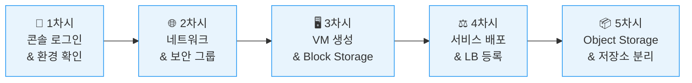
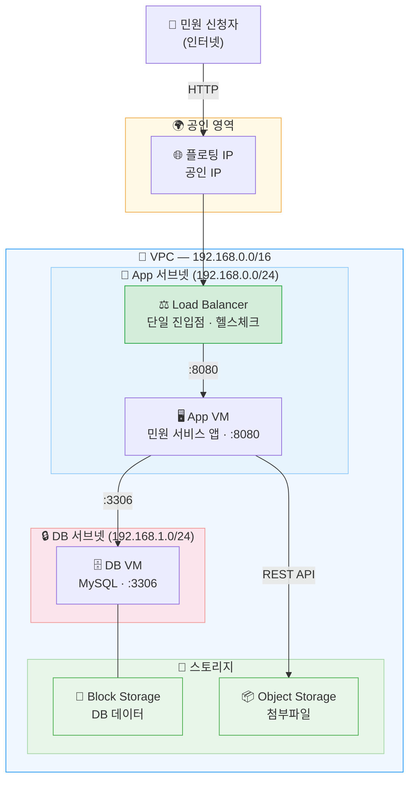
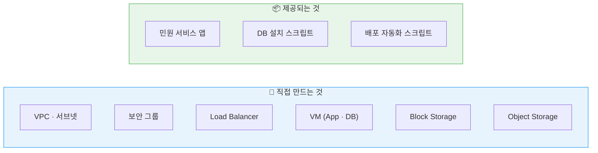

# 온라인 민원 서비스로 배우는 클라우드 & 클라우드 네이티브

NHN Cloud를 활용해 온라인 민원 서비스를 직접 구축하며, 클라우드 인프라의 핵심 개념을 익히는 실습 과정입니다.

## 과정 정보

| 구분 | 내용 |
|------|------|
| 대상 | 공공기관 클라우드 운영자 |
| 일정 | 2일 과정 / 일 6시간 (10:00~16:00) |
| 방식 | 이론 + 콘솔 실습 + 시나리오 미션 |
| 실습 환경 | NHN Cloud 콘솔 (개인 실습 계정) |

## 실습 가이드 목차

| 일차 | 차시 | 주제 |
|------|------|------|
| Day 1 | 1차시 | [콘솔 로그인 & 환경 확인](day1/session1.md) |
| Day 1 | 2차시 | [네트워크 & 보안 그룹 구성](day1/session2.md) |
| Day 1 | 3차시 | [VM 생성 & Block Storage 연결](day1/session3.md) |
| Day 1 | 4차시 | [서비스 배포 & Load Balancer 등록](day1/session4.md) |
| Day 1 | 5차시 | [Object Storage & 저장소 분리](day1/session5.md) |

## 1일차 최종 아키텍처

## 실습 원칙

!!! warning "주의"
    1일차에 만든 DB VM, Block Storage, Object Storage는 2일차에도 사용합니다. 임의로 삭제하지 마세요.
